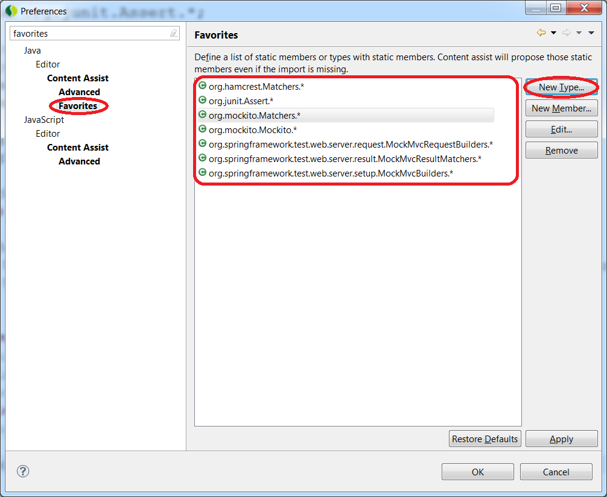
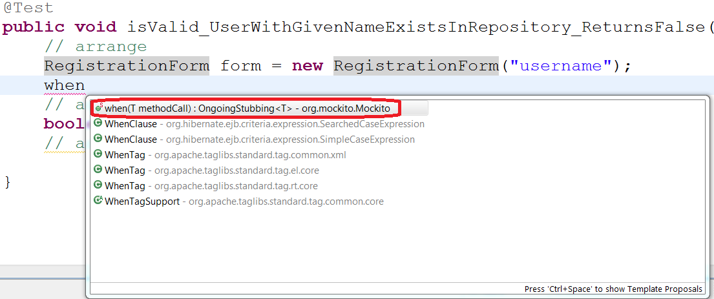
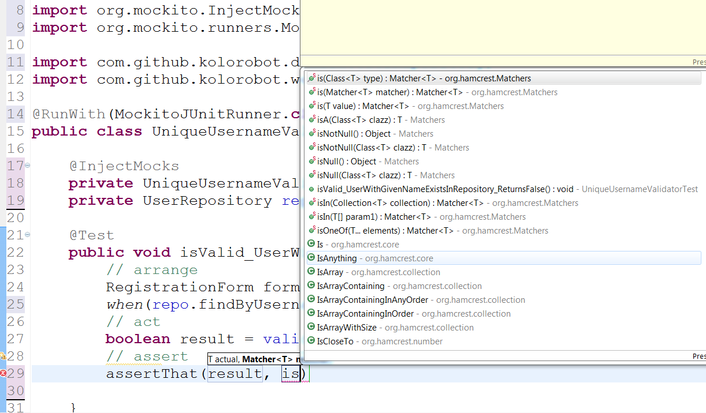

# HOW-TO: Improve content assist for types with static members while creating JUnit tests in Eclipse

Usually while creating JUnit tests we statically import `org.junit.Assert`, `org.hamcrest.Matchers`, `org.mockito.Mockito`, `org.mockito.Matchers` when we want to use static members of these types.

To make that Eclipse proposes members of mentioned types (or any other) without explicit static import we need to define the list in Eclipse's content assist configuration

In order to modify the content assist settings, open Preferences, type **favorites** in the filter and add all types with static members to the list:

Thanks to that simple change we may enjoy improved content assist:

