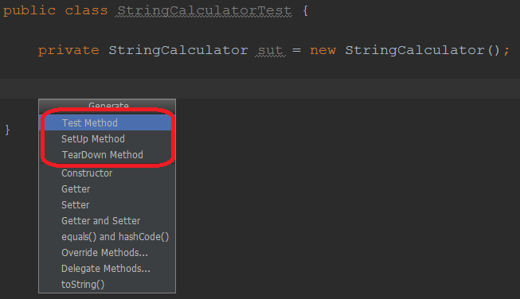
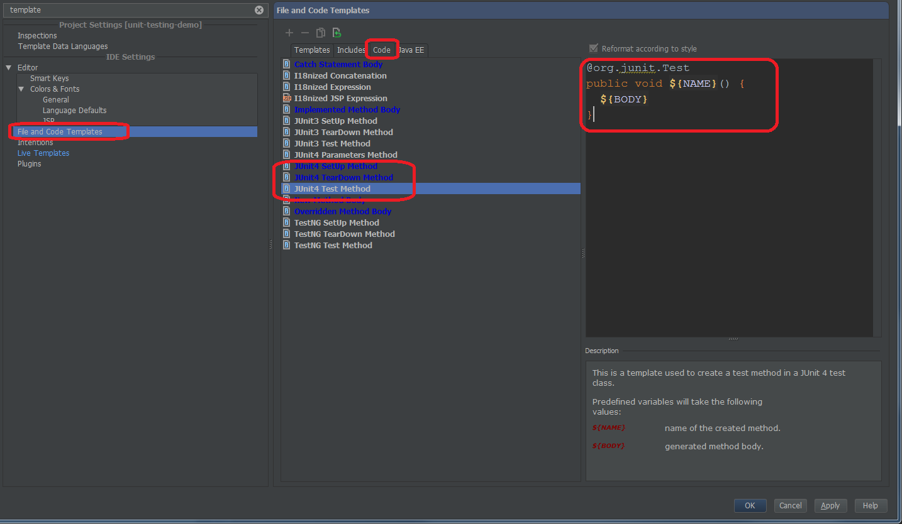

# HOW-TO: Customize code templates for JUnit 4 test, setup and teardown methods quickly in IntelliJ

Read how to customize code templates for JUnit 4 test, setup and teardown methods in IntelliJ.

While working with Junit in IntelliJ you can quickly generate test, setup and teardown method with `Alt+Insert` (Generate):

If the default code generated by IntelliJ does not fit your needs you can quickly change the template. To do so, open settings (`Ctrl+Alt+S`), type `Templates` and find the section `File and Code templates`. On the right, open `Code` tab and change your templates as shown below.

