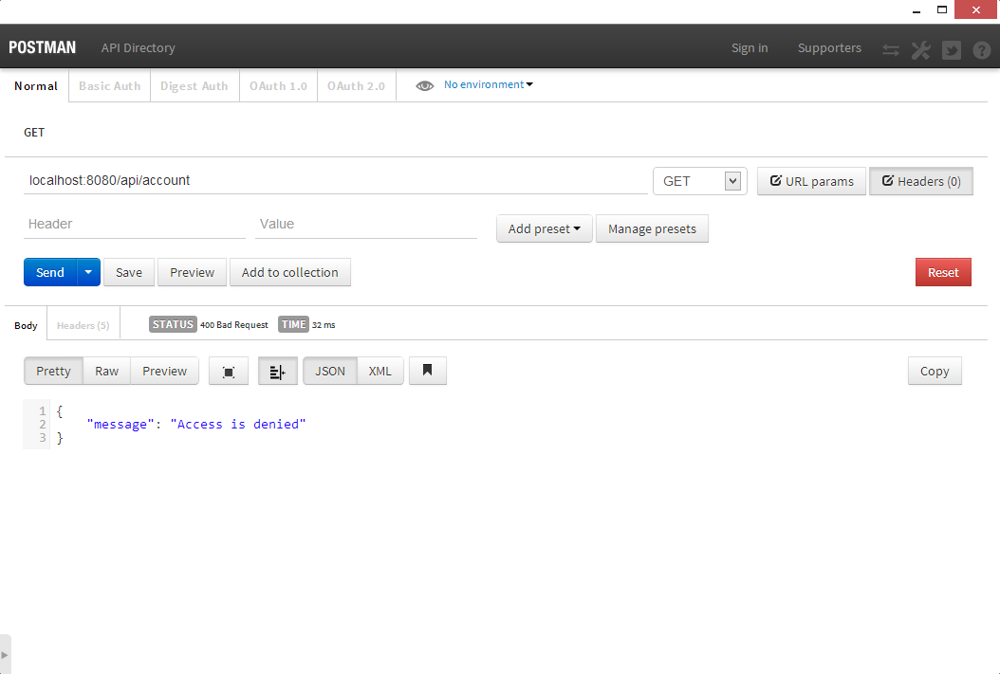
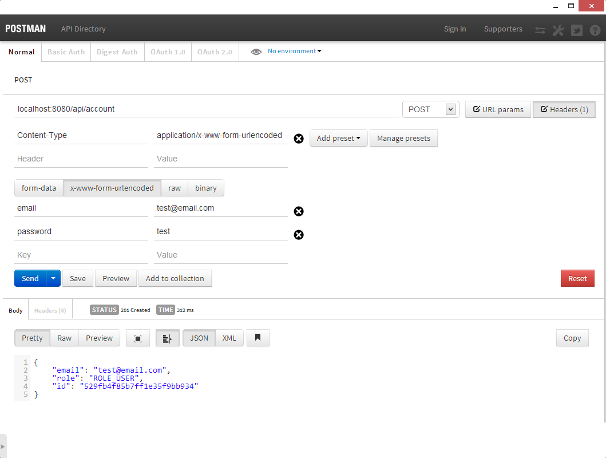
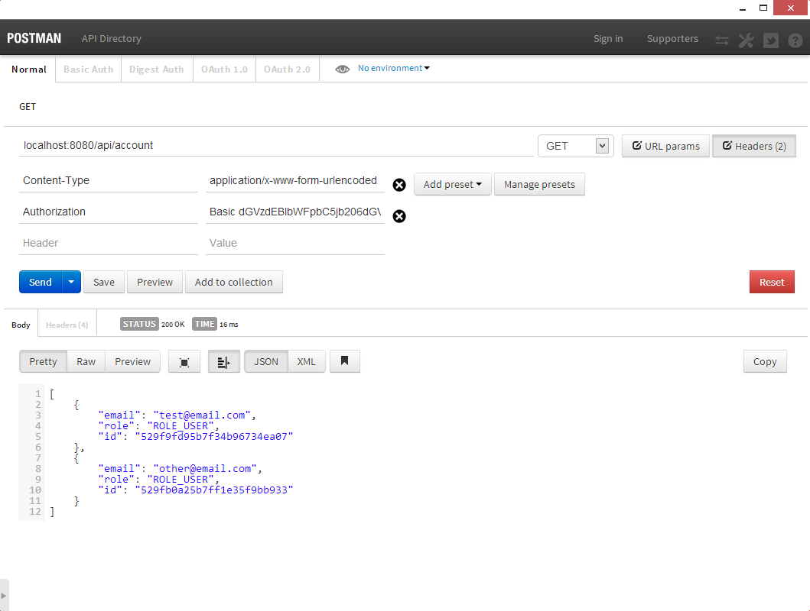
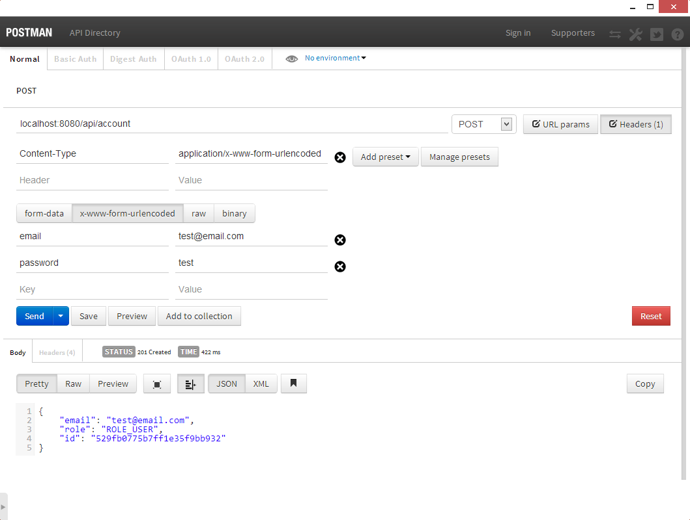

# HOW-TO: Get started quickly with Spring 4.0 to build a simple REST-Like API (walkthrough)

Yet another tutorial about creating Web API with Spring MVC. Not really sophisticated. Just a walkthrough. The resulting app will serve simple API, will use Mongo as its persistence and it will be secured with Spring Security.

### Getting started - POM

Of course, I am still a huge fan of Maven so the project is Maven based. Since there is Spring 4.0 RC2 available, I decided to utilize its new dependency managament which results in the following pom.xml:

```xml
<project
        xmlns="http://maven.apache.org/POM/4.0.0"
        xmlns:xsi="http://www.w3.org/2001/XMLSchema-instance"
        xsi:schemaLocation="http://maven.apache.org/POM/4.0.0 http://maven.apache.org/maven-v4_0_0.xsd"
        >
    <modelVersion>4.0.0</modelVersion>
    <groupId>pl.codeleak</groupId>
    <artifactId>r</artifactId>
    <packaging>war</packaging>
    <version>1.0.0-SNAPSHOT</version>
    <name>Spring MVC Application</name>
    <properties>
        <project.build.sourceEncoding>UTF-8</project.build.sourceEncoding>
        <java-version>1.7</java-version>
        <org.springframework.security-version>3.2.0.RC2</org.springframework.security-version>
        <org.aspectj-version>1.7.4</org.aspectj-version>
        <org.slf4j-version>1.7.5</org.slf4j-version>
        <ch.qos.logback-version>1.0.13</ch.qos.logback-version>
        <org.thymeleaf-version>2.1.0.RELEASE</org.thymeleaf-version>
    </properties>
    <dependencyManagement>
        <dependencies>
            <dependency>
                <groupId>org.springframework</groupId>
                <artifactId>spring-framework-bom</artifactId>
                <version>4.0.0.RC2</version>
                <type>pom</type>
                <scope>import</scope>
            </dependency>
        </dependencies>
    </dependencyManagement>
    <repositories>
        <repository>
            <id>java.net2</id>
            <name>Repository hosting the jee6 artifacts</name>
            <url>http://download.java.net/maven/2</url>
        </repository>
        <repository>
            <id>sonatype-oss-repository</id>
            <url>https://oss.sonatype.org/content/groups/public/</url>
            <releases>
                <enabled>true</enabled>
            </releases>
            <snapshots>
                <enabled>true</enabled>
            </snapshots>
        </repository>
        <repository>
            <id>repository.spring.milestone</id>
            <name>Spring Milestone Repository</name>
            <url>http://repo.spring.io/milestone</url>
        </repository>
    </repositories>
    <dependencies>
        <!-- Spring -->
        <dependency>
            <groupId>org.springframework</groupId>
            <artifactId>spring-context</artifactId>
            <exclusions>
                <!-- Exclude Commons Logging in favor of SLF4j -->
                <exclusion>
                    <groupId>commons-logging</groupId>
                    <artifactId>commons-logging</artifactId>
                </exclusion>
            </exclusions>
        </dependency>
        <dependency>
            <groupId>org.springframework</groupId>
            <artifactId>spring-webmvc</artifactId>
        </dependency>
        <!-- Security -->
        <dependency>
            <groupId>org.springframework.security</groupId>
            <artifactId>spring-security-config</artifactId>
            <version>${org.springframework.security-version}</version>
        </dependency>
        <dependency>
            <groupId>org.springframework.security</groupId>
            <artifactId>spring-security-web</artifactId>
            <version>${org.springframework.security-version}</version>
        </dependency>
        <dependency>
            <groupId>org.springframework.security</groupId>
            <artifactId>spring-security-taglibs</artifactId>
            <version>${org.springframework.security-version}</version>
        </dependency>
        <!-- View -->
        <dependency>
            <groupId>org.springframework.data</groupId>
            <artifactId>spring-data-mongodb</artifactId>
            <version>1.3.1.RELEASE</version>
        </dependency>
        <!-- javax.validation (JSR-303) -->
        <dependency>
            <groupId>javax.validation</groupId>
            <artifactId>validation-api</artifactId>
            <version>1.0.0.GA</version>
        </dependency>
        <dependency>
            <groupId>org.hibernate</groupId>
            <artifactId>hibernate-validator</artifactId>
            <version>4.3.0.Final</version>
        </dependency>
        <!-- AspectJ -->
        <dependency>
            <groupId>org.aspectj</groupId>
            <artifactId>aspectjrt</artifactId>
            <version>${org.aspectj-version}</version>
        </dependency>
        <!-- Logging -->
        <dependency>
            <groupId>org.slf4j</groupId>
            <artifactId>slf4j-api</artifactId>
            <version>${org.slf4j-version}</version>
        </dependency>
        <dependency>
            <groupId>org.slf4j</groupId>
            <artifactId>jcl-over-slf4j</artifactId>
            <version>${org.slf4j-version}</version>
            <scope>runtime</scope>
        </dependency>
        <dependency>
            <groupId>ch.qos.logback</groupId>
            <artifactId>logback-classic</artifactId>
            <version>${ch.qos.logback-version}</version>
        </dependency>
        <!-- @Inject -->
        <dependency>
            <groupId>javax.inject</groupId>
            <artifactId>javax.inject</artifactId>
            <version>1</version>
        </dependency>
        <!-- Servlet -->
        <dependency>
            <groupId>org.apache.geronimo.specs</groupId>
            <artifactId>geronimo-servlet_3.0_spec</artifactId>
            <version>1.0</version>
            <scope>provided</scope>
        </dependency>
        <!-- JSON -->
        <dependency>
            <groupId>org.codehaus.jackson</groupId>
            <artifactId>jackson-mapper-asl</artifactId>
            <version>1.9.9</version>
        </dependency>
        <!-- Utilities -->
        <dependency>
            <groupId>com.google.guava</groupId>
            <artifactId>guava</artifactId>
            <version>14.0.1</version>
        </dependency>
        <!-- Test -->
        <dependency>
            <groupId>junit</groupId>
            <artifactId>junit-dep</artifactId>
            <version>4.11</version>
            <scope>test</scope>
        </dependency>
        <dependency>
            <groupId>org.mockito</groupId>
            <artifactId>mockito-core</artifactId>
            <version>1.9.5</version>
            <scope>test</scope>
        </dependency>
        <dependency>
            <groupId>org.easytesting</groupId>
            <artifactId>fest-assert</artifactId>
            <version>1.4</version>
            <scope>test</scope>
        </dependency>
        <dependency>
            <groupId>org.hamcrest</groupId>
            <artifactId>hamcrest-core</artifactId>
            <version>1.3</version>
            <scope>test</scope>
        </dependency>
        <dependency>
            <groupId>org.hamcrest</groupId>
            <artifactId>hamcrest-library</artifactId>
            <version>1.3</version>
            <scope>test</scope>
        </dependency>
        <dependency>
            <groupId>org.objenesis</groupId>
            <artifactId>objenesis</artifactId>
            <version>1.3</version>
            <scope>test</scope>
        </dependency>
        <dependency>
            <groupId>org.springframework</groupId>
            <artifactId>spring-test</artifactId>
            <scope>test</scope>
        </dependency>
    </dependencies>
    <build>
        <plugins>
            <plugin>
                <groupId>org.apache.tomcat.maven</groupId>
                <artifactId>tomcat7-maven-plugin</artifactId>
                <version>2.0</version>
            </plugin>
            <plugin>
                <groupId>org.apache.maven.plugins</groupId>
                <artifactId>maven-compiler-plugin</artifactId>
                <version>2.3.2</version>
                <configuration>
                    <source>${java-version}</source>
                    <target>${java-version}</target>
                </configuration>
            </plugin>
            <plugin>
                <groupId>org.apache.maven.plugins</groupId>
                <artifactId>maven-war-plugin</artifactId>
                <version>2.1.1</version>
                <configuration>
                    <warName>r-1.0.0-SNAPSHOT</warName>
                </configuration>
            </plugin>
            <plugin>
                <groupId>org.apache.maven.plugins</groupId>
                <artifactId>maven-dependency-plugin</artifactId>
                <executions>
                    <execution>
                        <id>install</id>
                        <phase>install</phase>
                        <goals>
                            <goal>sources</goal>
                        </goals>
                    </execution>
                </executions>
            </plugin>
            <plugin>
                <groupId>org.apache.maven.plugins</groupId>
                <artifactId>maven-resources-plugin</artifactId>
                <version>2.5</version>
                <configuration>
                    <encoding>UTF-8</encoding>
                </configuration>
            </plugin>
        </plugins>
    </build>
</project>
```

It is quite simple as it goes to Spring MVC application. The new thing is the `dependencyManagement` element. More explanation on that can be found here: <http://spring.io/blog/2013/12/03/spring-framework-4-0-rc2-available>

### Configuration

The application is configured using JavaConfig. I divided it into several parts:

##### ServicesConfig

```java
@Configuration
public class ServicesConfig {

    @Autowired
    private AccountRepository accountRepository;

    @Bean
    public UserService userService() {
        return new UserService(accountRepository);
    }

    @Bean
    public PasswordEncoder passwordEncoder() {
        return NoOpPasswordEncoder.getInstance();
    }
}
```

No component scan. Really simple.

##### PersistenceConfig

A MongoDB configuration with all available repositories. In this simple application we have only one repository, so the configuration is really simple.

```java
@Configuration
class PersistenceConfig {

    @Bean
    public AccountRepository accountRepository() throws UnknownHostException {
        return new MongoAccountRepository(mongoTemplate());
    }

    @Bean
    public MongoDbFactory mongoDbFactory() throws UnknownHostException {
        return new SimpleMongoDbFactory(new Mongo(), "r");
    }

    @Bean
    public MongoTemplate mongoTemplate() throws UnknownHostException {
        MongoTemplate template = new MongoTemplate(mongoDbFactory(), mongoConverter());
        return template;
    }

    @Bean
    public MongoTypeMapper mongoTypeMapper() {
        return new DefaultMongoTypeMapper(null);
    }

    @Bean
    public MongoMappingContext mongoMappingContext() {
        return new MongoMappingContext();
    }

    @Bean
    public MappingMongoConverter mongoConverter() throws UnknownHostException {
        MappingMongoConverter converter = new MappingMongoConverter(mongoDbFactory(), mongoMappingContext());
        converter.setTypeMapper(mongoTypeMapper());
        return converter;
    }
}
```

##### SecurityConfig

In theory, Spring Security 3.2 can be fully configured with JavaConfig. For me it is still a theory, so I use XML here:

```java
@Configuration
@ImportResource("classpath:spring-security-context.xml")
public class SecurityConfig {}
```

And the XML:

```xml
<beans xmlns="http://www.springframework.org/schema/beans"
 xmlns:security="http://www.springframework.org/schema/security"
 xmlns:xsi="http://www.w3.org/2001/XMLSchema-instance"
 xsi:schemaLocation="http://www.springframework.org/schema/beans
http://www.springframework.org/schema/beans/spring-beans-4.0.xsd
http://www.springframework.org/schema/security
http://www.springframework.org/schema/security/spring-security-3.2.xsd">

    <security:global-method-security jsr250-annotations="enabled" pre-post-annotations="enabled" secured-annotations="enabled" />

    <security:http create-session="stateless" use-expressions="true">
        <security:http-basic />
    </security:http>

    <security:authentication-manager erase-credentials="true" >
        <security:authentication-provider user-service-ref="userService">
            <security:password-encoder ref="passwordEncoder" />
        </security:authentication-provider>
    </security:authentication-manager>

</beans>
```

As you can see basic authentication will be used for the API.

##### WebAppInitializer

We don't want the web.xml so we use the following code to configure the web application:

```java
@Order(2)
public class WebAppInitializer extends AbstractAnnotationConfigDispatcherServletInitializer {

    @Override
    protected String[] getServletMappings() {
        return new String[]{"/"};
    }

    @Override
    protected Class<?>[] getRootConfigClasses() {
        return new Class<?>[] {ServicesConfig.class, PersistenceConfig.class, SecurityConfig.class};
    }

    @Override
    protected Class<?>[] getServletConfigClasses() {
        return new Class<?>[] {WebMvcConfig.class};
    }

    @Override
    protected Filter[] getServletFilters() {
        CharacterEncodingFilter characterEncodingFilter = new CharacterEncodingFilter();
        characterEncodingFilter.setEncoding("UTF-8");
        characterEncodingFilter.setForceEncoding(true);
        return new Filter[] {characterEncodingFilter};
    }

    @Override
    protected void customizeRegistration(ServletRegistration.Dynamic registration) {        
        registration.setInitParameter("spring.profiles.active", "default");
    }
}
```

##### WebAppSecurityInitializer

New to Spring Security 3.

```java
@Order(1)
public class WebAppSecurityInitializer extends AbstractSecurityWebApplicationInitializer {

}
```

##### WebMvcConfig

The dispatcher servlet configuration. Really basic. Only crucial components to build a simple API.

```java
@Configuration
@ComponentScan(basePackages = { "pl.codeleak.r" }, includeFilters = {@Filter(value = Controller.class)})
public class WebMvcConfig extends WebMvcConfigurationSupport {

    private static final String MESSAGE_SOURCE = "/WEB-INF/i18n/messages";

    @Override
    public RequestMappingHandlerMapping requestMappingHandlerMapping() {
        RequestMappingHandlerMapping requestMappingHandlerMapping = super.requestMappingHandlerMapping();
        requestMappingHandlerMapping.setUseSuffixPatternMatch(false);
        requestMappingHandlerMapping.setUseTrailingSlashMatch(false);
        return requestMappingHandlerMapping;
    }

    @Bean(name = "messageSource")
    public MessageSource messageSource() {
        ReloadableResourceBundleMessageSource messageSource = new ReloadableResourceBundleMessageSource();
        messageSource.setBasename(MESSAGE_SOURCE);
        messageSource.setCacheSeconds(5);
        return messageSource;
    }

    @Override
    public Validator getValidator() {
        LocalValidatorFactoryBean validator = new LocalValidatorFactoryBean();
        validator.setValidationMessageSource(messageSource());
        return validator;
    }

    @Override
    public void configureDefaultServletHandling(DefaultServletHandlerConfigurer configurer) {
        configurer.enable();
    }
}
```

And that's the config. Simple.

### IndexController

To verify the config is fine, I created an IndexController, that serves simple "Hello, World" like text:

```java
@Controller
@RequestMapping("/")
public class IndexController {

    @RequestMapping
    @ResponseBody
    public String index() {
        return "This is an API endpoint.";
    }
}
```

As you run the application, you should see this text in the browser.

### Building the API

##### UserService

To finish up with the Spring Security configuration, one part is actually still needed: UserService which instance was created earlier:

```java
public class UserService implements UserDetailsService {

    private AccountRepository accountRepository;

    public UserService(AccountRepository accountRepository) {
        this.accountRepository = accountRepository;
    }

 @Override
 public UserDetails loadUserByUsername(String username) throws UsernameNotFoundException {
  Account account = accountRepository.findByEmail(username);
  if(account == null) {
   throw new UsernameNotFoundException("user not found");
  }
  return createUser(account);
 }
 
 public void signin(Account account) {
  SecurityContextHolder.getContext().setAuthentication(authenticate(account));
 }
 
 private Authentication authenticate(Account account) {
  return new UsernamePasswordAuthenticationToken(createUser(account), null, Collections.singleton(createAuthority(account)));  
 }
 
 private User createUser(Account account) {
  return new User(account.getEmail(), account.getPassword(), Collections.singleton(createAuthority(account)));
 }

 private GrantedAuthority createAuthority(Account account) {
  return new SimpleGrantedAuthority(account.getRole());
 }

}
```

The requirement was to build an API endpoint that handles 3 methods: gets currently logged in user, gets all users (not really safe), creates a new account. So let's do it.

##### Account

Account will be our first Mongo document. It is really easy one:

```java
@SuppressWarnings("serial")
@Document
public class Account implements java.io.Serializable {

    @Id
    private String objectId;

    @Email
    @Indexed(unique = true)
    private String email;

    @JsonIgnore
    @NotBlank
    private String password;

    private String role = "ROLE_USER";

    private Account() {

    }

    public Account(String email, String password, String role) {
        this.email = email;
        this.password = password;
        this.role = role;
    }

   // getters and setters
}
```

##### Repository

I started with the interface:

```java
public interface AccountRepository {

    Account save(Account account);

    List<Account> findAll();

    Account findByEmail(String email);
}
```

And later with its Mongo implementation:

```java
public class MongoAccountRepository implements AccountRepository {

    private MongoTemplate mongoTemplate;

    public MongoAccountRepository(MongoTemplate mongoTemplate) {
        this.mongoTemplate = mongoTemplate;
    }

    @Override
    public Account save(Account account) {
        mongoTemplate.save(account);
        return account;
    }

    @Override
    public List<Account> findAll() {
        return mongoTemplate.findAll(Account.class);
    }

    @Override
    public Account findByEmail(String email) {
        return mongoTemplate.findOne(Query.query(Criteria.where("email").is(email)), Account.class);
    }
}
```

##### API Controller

So we are almost there. We need to serve the content to the user. So let's create our endpoint:

```java
@Controller
@RequestMapping("api/account")
class AccountController {

    private AccountRepository accountRepository;

    @Autowired
    public AccountController(AccountRepository accountRepository) {
        this.accountRepository = accountRepository;
    }

    @RequestMapping(value = "current", method = RequestMethod.GET)
    @ResponseStatus(value = HttpStatus.OK)
    @ResponseBody
    @PreAuthorize(value = "isAuthenticated()")
    public Account current(Principal principal) {
        Assert.notNull(principal);
        return accountRepository.findByEmail(principal.getName());
    }

    @RequestMapping(method = RequestMethod.GET)
    @ResponseStatus(value = HttpStatus.OK)
    @ResponseBody
    @PreAuthorize(value = "isAuthenticated()")
    public Accounts list() {
        List<Account> accounts = accountRepository.findAll();
        return new Accounts(accounts);
    }

    @RequestMapping(method = RequestMethod.POST)
    @ResponseStatus(value = HttpStatus.CREATED)
    @ResponseBody
    @PreAuthorize(value = "permitAll()")
    public Account create(@Valid Account account) {
        accountRepository.save(account);
        return account;
    }

    private class Accounts extends ArrayList<Account> {
        public Accounts(List<Account> accounts) {
            super(accounts);
        }
    }
}
```

I hope you noticed that we talk directly to the repository, so the passwords will not be encoded. Small detail to be fixed later on, if you wish. For now it is OK.

##### Finishing up

The last think I needed was some error handler so the consumer can see error messages in JSON instead of HTML. This is simple with Spring MVC and @Controller advice.

```java
@ControllerAdvice
public class ErrorHandler {

    @ExceptionHandler(value = Exception.class)
    @ResponseStatus(HttpStatus.BAD_REQUEST)
    @ResponseBody
    public ErrorResponse errorResponse(Exception exception) {
        return new ErrorResponse(exception.getMessage());
    }

}

public class ErrorResponse {
    private String message;
    public ErrorResponse(String message) {
        this.message = message;
    }
    public String getMessage() {
        return message;
    }
}
```

If you want to see more advance usage of @ControllerAdvice in Spring 4 read [this post](../../../2013/11/controlleradvice-improvements-in-spring/index.md).

### Testing the app

As a unit test geek I should have created Unit Tests first. But... I just wanted to test a new tool: Postman (Chrome extension). So I did:

##### Get accounts (not authorized):



##### Post account (does not require authentication:



##### Get accounts (authorized):



##### Get current account (authorized):



##### We are done

That's it for now. Hope you enjoyed as I enjoyed creating the project. The project and this post took me about ~3h in overall. Most of the time I spent on figuring out the security configuration (I wanted it to be fully in Java) and writing this walkthrough.
