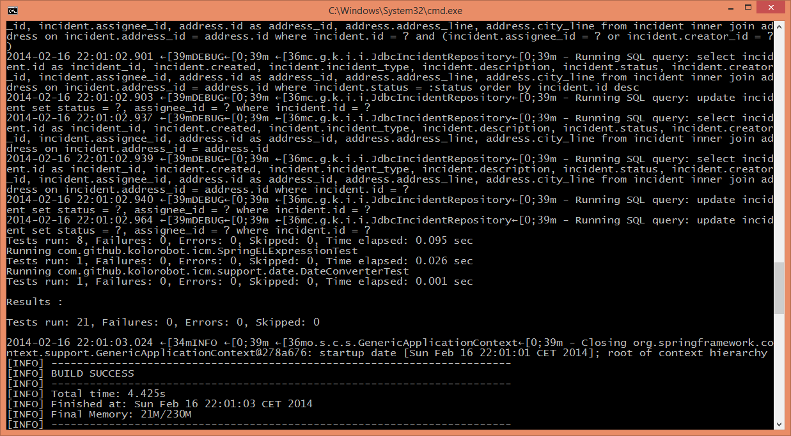

# Colored logs in a console (ANSI styling)

We had recently a big debate about logging in applications at my company. Inspired by my colleague, I decided to check how coloring will work on my **Windows 8 64-bit machine**. The idea is to have the logs colored in the console. Maybe a small detail, but while going through huge amounts of logs - can be handy. So I gave it a try.

### Logback configuration

Configuring a coloring of the logs is pretty straightforward. You can use conversion specifiers like "%highlight", "%red", "%green", "%yellow", "%blue" and surrounding conversion words like in the below example:

```xml
<appender name="STDOUT" class="ch.qos.logback.core.ConsoleAppender">
    <encoder>
        <pattern>
            %d{yyyy-MM-dd HH:mm:ss.SSS} %highlight(%-5level) [%-40.40logger{10}] - %msg%n
        </pattern>
    </encoder>
</appender>
```

The above patter should produce colored logs: level should be highlighted with different color for different level.

### Windows

I needed to slightly modify the above configuration, because ANSI color codes are not supported in Windows. In order to do it I needed to add `useJansi` element in Logback configuration and add `Jansi` dependency to pom.xml:

```xml
<appender name="STDOUT" class="ch.qos.logback.core.ConsoleAppender">
    <useJansi>true</useJansi>
    <encoder>
        <pattern>
            %d{yyyy-MM-dd HH:mm:ss.SSS} %highlight(%-5level) [%-40.40logger{10}] - %msg%n
        </pattern>
    </encoder>
</appender>

<!-- Jansi dependency to be added in pom.xml -->

<dependency>
    <groupId>org.fusesource.jansi</groupId>
    <artifactId>jansi</artifactId>
    <version>1.11</version>
</dependency>
```

This is well explained in Logback documentation: <http://logback.qos.ch/manual/layouts.html#coloring>

But while running the application the output still shows the ANSI codes, instead of colored output (as I expected):

```
2014-02-16 22:57:02.275  [39mDEBUG [0;39m c.g.k.i.c.PersistenceConfig - Populating a database ...
```



I rechecked the configuration and I was sure I did not miss anything. Then I checked the logs again and I saw the following exception thrown by Logback:

```
23:08:13,652 |-INFO in ch.qos.logback.core.ConsoleAppender[STDOUT] - Enabling JANSI WindowsAnsiOutputStream for the console.
23:08:13,707 |-WARN in ch.qos.logback.core.ConsoleAppender[STDOUT] - Failed to create WindowsAnsiOutputStream. Falling back on the default stream. ch.qos.logback.core.util.DynamicClassLoadingException: Failed to instantiate type org.fusesource.jansi.WindowsAnsiOutputStream
 at ch.qos.logback.core.util.DynamicClassLoadingException: Failed to instantiate type org.fusesource.jansi.WindowsAnsiOutputStream

...
```

A quick googling led me to this page <http://jira.qos.ch/browse/LOGBACK-762>. Kaput.

### Additional options - colored console in your IDE

Do you want to color your logs in your IDE? No problem. Use [Grep Console](http://plugins.jetbrains.com/plugin/7125?pr=phpStorm) (IntelliJ) as it "allows you to define a series of regular expressions which will be tested against the console output or currently opened file. Each expression matching a line will affect the style of the entire line, or play a sound. For example, error messages could be set to show up with a red background".   
For Eclipse users:

- [Grep Console](http://marian.schedenig.name/projects/grep-console/)
- [Ansi Console](http://mihai-nita.net/2013/06/03/eclipse-plugin-ansi-in-console/)

### Colored logs in Log4j

In [Log4j 2.0](http://logging.apache.org/log4j/2.x/manual/layouts.html#PatternLayout) coloring is supported. The configuration is very similar to Logback. It also uses `Jansi` on Windows. Feature is **not supported** in Log4j 1.2 natively; it can be done with a separate library: <https://github.com/jcgay/log4j-color> (I did not try it).

### Summary

Although ANSI styling is not fully supported on Windows, it is worth a short moment to configure it for you application as it improves the readability of your logs in the console. Try to make you development more colorful by using IDE plugin as well.
