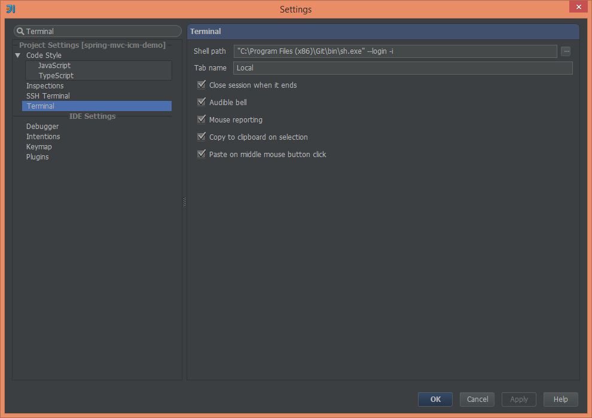
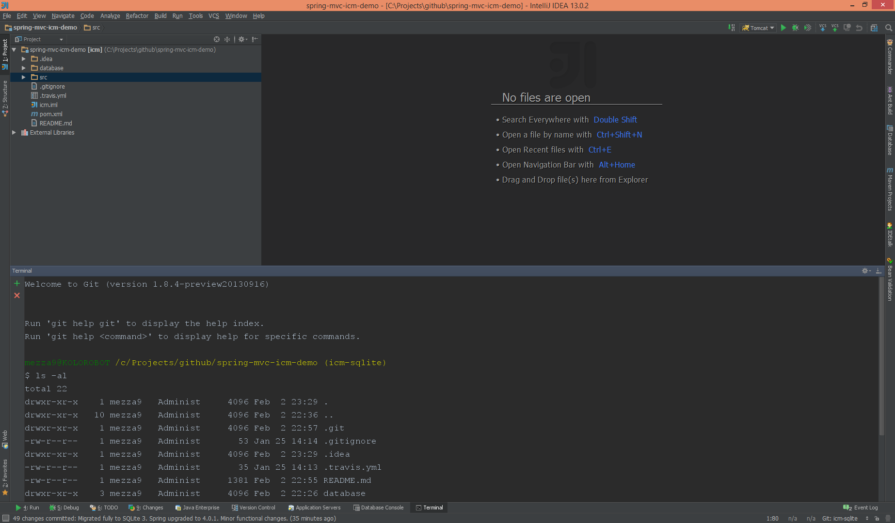

# Git bash in IntelliJ IDEA on Windows

One of the top features of the recent release of IntelliJ IDEA 13 is definitively a built-in command-line interface. For me, this is really great feature - especially local terminal . I don't need to abandon the IDE to work with command-line interface anymore, e.g. while working with source code management systems like Git.

On Windows machines, by default `cmd.exe` is used. To change it, open settings (`Ctrl+Alt+s`) and type `Terminal`:

  
To use Git bash I use the following shell path: `"C:\Program Files (x86)\Git\bin\sh.exe" --login -i`. Please make sure that the path to sh.exe or bash.exe is surrounded by quotes, the arguments are not. Now when I open terminal window (`Alt+F12`) I see Git bash that is opened in the project's folder, so I can immediately start using it:

