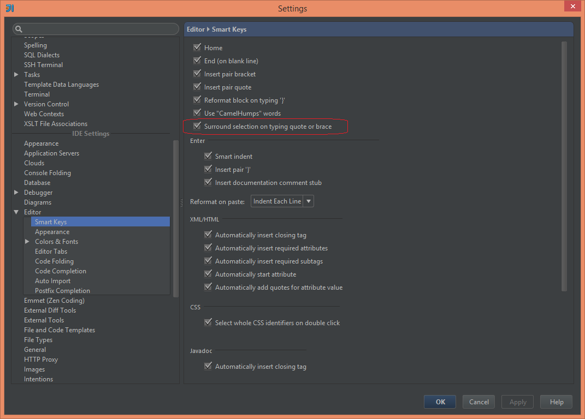

# HOW-TO: Surround text with quote in IntelliJ

A quick tip on how to surround a selection with quote or brace in IntelliJ.

If you wish to be able to easily surround a selected text with quote or brace you have 2 options I know about. You can create a Live Template in `surround` group and then call it with either `Ctrl+Alt+t` or `Ctrl+Alt+j` or you can configure `Smart Keys` properly to achieve it.

You can find this option in `IDE Settings > Editor > Smart Keys > Surround selection on typing quote or brace`. When this option is selected and you type **quote** (single or double) or **brace** (curly, square, parentheses , angle) whilst the text is selected, it will be automatically surrounded with either quote or brace. Pretty handy.

Enjoy!
