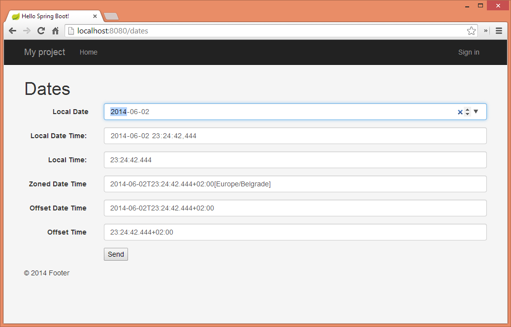

# Spring 4: @DateTimeFormat with Java 8 Date-Time API


`@DateTimeFormat` annotation that was introduced in Spring 3.0 as a part of Formatter SPI can be used to to parse and print localized field values in web applications. In Spring 4.0, `@DateTimeFormat` annotation can be used with Java 8 Date-Time API (`java.time`) out-of-the-box, without extra effort.

In Spring, field formatting can be configured by field type or annotation. To bind an annotation to a formatter `AnnotationFormatterFactory` must be implemented. Spring 4.0 brings `Jsr310DateTimeFormatAnnotationFormatterFactory` that formats Java 8 Date-Time fields annotated with the `@DateTimeFormat`. Supported field types are as follows:

- `java.time.LocalDate`
- `java.time.LocalTime`
- `java.time.LocalDateTime`
- `java.time.ZonedDateTime`
- `java.time.OffsetDateTime`
- `java.time.OffsetTime`

One can utilize all mentioned types in a form like below:

```java
public class DatesForm {

    @DateTimeFormat(iso = ISO.DATE)
    private LocalDate localDate;

    @DateTimeFormat(iso = ISO.TIME)
    private LocalTime localTime;

    @DateTimeFormat(iso = ISO.TIME)
    private OffsetTime offsetTime;

    @DateTimeFormat(iso = ISO.DATE_TIME)
    private LocalDateTime localDateTime;

    @DateTimeFormat(iso = ISO.DATE_TIME)
    private ZonedDateTime zonedDateTime;

    @DateTimeFormat(iso = ISO.DATE_TIME)
    private OffsetDateTime offsetDateTime;
    
}
```

The form can be passed to the view and Spring will take care of proper formatting of the fields.



While specifying the formatting on the fields of types: `java.time.LocalDate`, `java.time.LocalTime`, `java.time.OffsetTime` you need to remember to properly configure `@DateTimeFormat`.

`@DateTimeFormat` declares that a field should be formatted as a **date time** and since `java.time.LocalDate` represents a date, and the other two represent time - you will get `java.time.temporal.UnsupportedTemporalTypeException` (e.g.: Unsupported field: ClockHourOfAmPm, Unsupported field: MonthOfYear) thrown by `java.time.format.DateTimeFormatter`.
