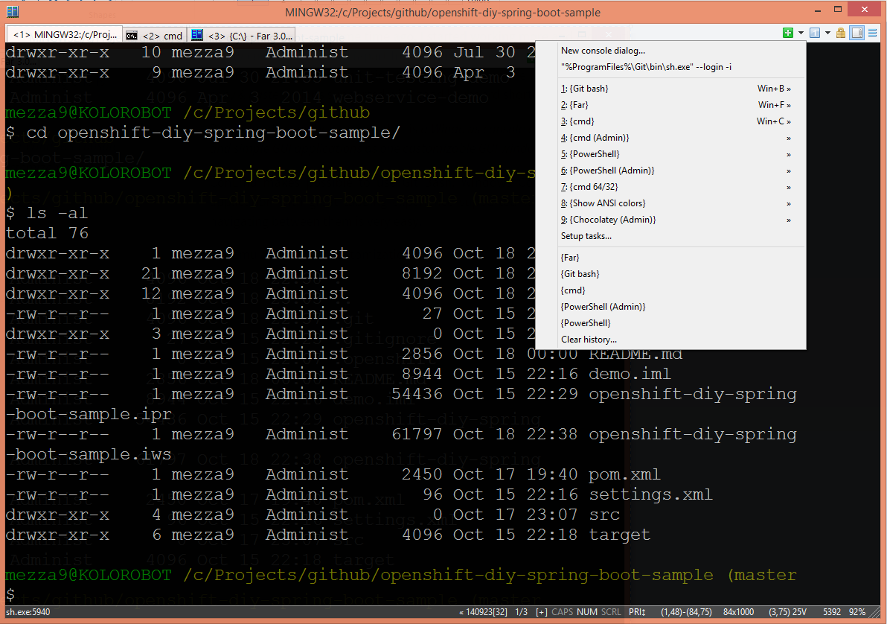
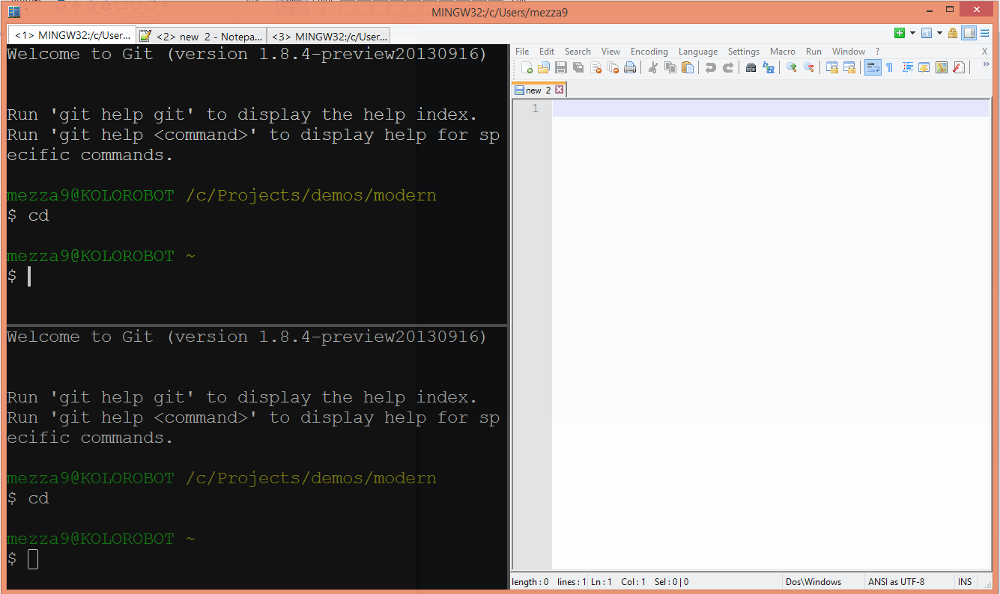
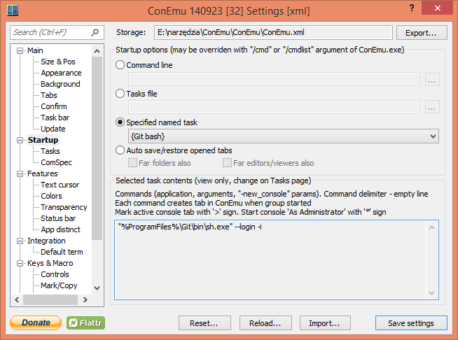
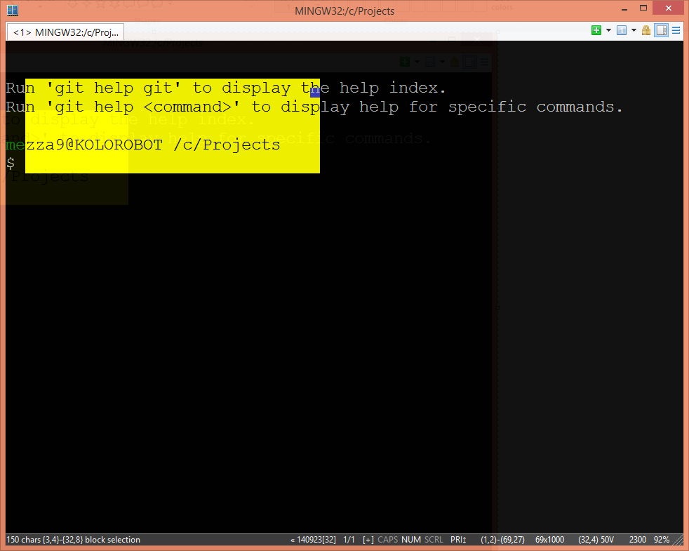

# ConEmu - Windows console emulator with tabs

After switching to Git some time ago, I started working more and more with Git Bash on Windows. Git Bash is pretty cool as it provides (apart from Git) Bash supported with basic Unix tools including *curl* or *ssh*. Git Bash in Windows has some limitation though including limited customization options and lack of good *copy & paste* options supported with keyboard shortcuts. Fortunately, there is ConEmu that not only fills that gap but adds various features that make working with console applications more productive and more enjoyable for me.

# Introduction

ConEmu is *a Windows console emulator with tabs, which presents multiple consoles and simple GUI applications as one customizable GUI window with various features*. And not only working with Git Bash is far better with ConEmu, but with other tools I use too:

- Far Manager - *a program for managing files and archives in Windows* - handy
- Notepad++ - source code editor and Notepad replacement - naturally!
- cmd (Windows command prompt) - I still use it, rarely but still

Practically, running any tool should not be a problem. Let’s say I want to run my favorite password manager in ConEmu I can execute the following command:

```
$ <KeePassHome>/keepass.exe -new_console
```

`-new_console` switch instructs ConEmu to start an application in a new console.

# Working with tabs

## Controlling tabs

I disabled most confirmation on tabs actions (*Settings > Main > Confirm*), so now I can fully control tab creation, closing and switching between them with shortcuts without additional confirmations.

Most commonly used shortcuts for working with tabs:

- `Win + N` - show New Console Dialog (e.g. for running tasks with no shortcuts assigned)
- `Win + X` - new cmd console
- `Win + Delete` - for closing active tab
- `Win + <Num>` - switch between tabs (alternative Ctrl+Tab)



## Split Screen

ConEmu may split any tab into several panes:



The most common shortcuts to work with Split Screen:

- `Win+N` - show New Console Dialog and select Split Screen options
- `Ctrl+Shift+O` - duplicate shell from active pane and split horizontally
- `Ctrl+Shift+E` - duplicate shell from active pane and split vertically

You navigate between screens in Split Screen mode just like you navigate between tabs.

## Tasks

Git Bash is my favorite shell on Windows, therefore I made it a startup task in ConEmu:



In addition I added Far Manager and Notepad++ tasks and I associated hot keys for them:

- `Win+B,F,P` - Git Bash, FAR and Notepad++.

Even if you choose shortcuts that are used by Windows, ConEmu will intercept them (once active).

## Working with text

Highlighting, copying & pasting with mouse and keyboard shortcuts makes it really convenient. This is one of the features I appreciate most in ConEmu.



Shortcuts:

- copying current selection with `Ctrl + C`
- pasting with `Shift+Insert`, `Ctrl+V` (only first line) or with right mouse click,
- selecting text `Shift+Arrow Keys/Home/End` or with right click and drag

Additionally, scrolling buffer is also easy with`Ctrl+Up/Down/PgUp/PgDown` shortcuts.

## Notepad++

Notepad++ is one of my favorite editors for Windows. ConEmu can run Notepad++ in a tab with no problem. I created a task for Notepad++ so I can start it in a new tab whenever I want.

In addition, I made possible to run it in console with the file loaded that is passed as argument. This is very easy with Git Bash.

Make sure Notepad++ is in the *PATH* and create an alias:

```
alias edit="notepad++ -new_console"
```

Now, `edit filename` will run Notepad++ with *filename* loaded in a new tab.


In case you want this alias to be always available, create *.bashrc* file in your home directory (if does not exist) and add the alias so it is automatically loaded on Git Bash startup.

## Summary

I’ve been using ConEmu for several weeks now and I am far from knowing everything about it, but I already can’t imagine my Windows without it! With ConEmu I can use my favorite tools like Git Bash, cmd, Far Manager, and Notepad++ in one application with great tabbing experience supported with shortcuts. Font anti-aliasing, transparency (can be configured for active and inactive window separately), full screen, split screen and great mark, highlight, copy & paste options makes ConEmu is a complete application and a great choice for developers looking for improved productivity in Windows. I truly recommend ConEmu to every professional!

# References

Project home page: <https://code.google.com/p/conemu-maximus5>
