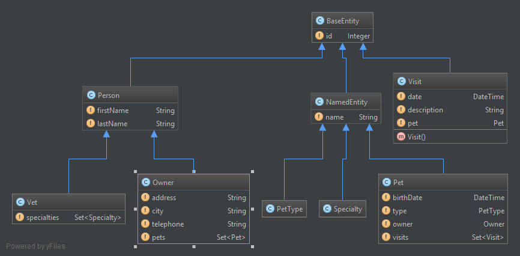

# Spring Boot and Spring Data REST - exposing repositories over REST


Exposing Spring Data repositories over REST is pretty easy with Spring Boot and Spring Data REST. With minimal code one can create REST representations of JPA entities that follow the [HATEOAS](http://pl.wikipedia.org/wiki/HATEOAS) principle. I decided to re-use [Spring PetClinic](https://github.com/spring-projects/spring-petclinic)’s JPA entities (business layer) as the foundation for this article.

### *Change Log*

- **18/12/2016** - Source code updated: Spring Boot to 1.4.2, migrated from Joda to JSR 310 DateTime API

## Application foundation

The PetClinic’s model is relatively simple, but it consist of some unidirectional and bi-directional associations, as well as basic inheritance:



In addition, the Spring’s PetClinic provides SQL scripts for HSQLDB which makes that generating schema and populating it with sample data in my new application was super easy.

## Project dependencies

As a base for the configuration I used [Spring Initializr](http://start.spring.io/) and I generated a basic Gradle project. In order to utilize Spring Data REST in a Spring Boot Application I added the following Boot Starters:

```
compile("org.springframework.boot:spring-boot-starter-web")
compile("org.springframework.boot:spring-boot-starter-data-jpa")
compile("org.springframework.boot:spring-boot-starter-data-rest")
```

In addition, I added HSQLDB dependency to the project:

```
compile("org.hsqldb:hsqldb:2.3.2")
```

The original project uses `org.joda.time.DateTime` for date fields and uses `org.jadira.usertype.dateandtime.joda.PersistentDateTime` that allows persisting it with Hibernate. In order to be able to use it in the new project I needed to add the following dependencies:

```
compile("joda-time:joda-time:2.4")
compile("org.jadira.usertype:usertype.jodatime:2.0.1")
```

While working with the API, I noticed that although the `date` fields in the original project were annotated with Spring’s `@DateTimeFormat` they were not properly serialized. I found out that I need to use `@JsonFormatter`, so another dependency was added to the `build.gradle`:

```
compile("com.fasterxml.jackson.datatype:jackson-datatype-joda:2.4.2");
```

Once in the classpath, Spring Boot auto configures `com.fasterxml.jackson.datatype.joda.JodaModule` via `org.springframework.boot.autoconfigure.jackson.JacksonAutoConfiguration`.

Please note, that if you wanted to serialize Java 8 Date & Time types properly, you would need to add [Jackson Datatype JSR310](http://mvnrepository.com/artifact/com.fasterxml.jackson.datatype/jackson-datatype-jsr310) dependency to project and make org.springframework.data.jpa.convert.threeten.Jsr310JpaConverters available during component scan.

## Initializing the database

To initialize data source I added `schema-hsqldb.sql` and `data-hsqldb.sql` files to `src/main/resources`. Finally, I several properties were added to `application.properties`:

```
   spring.datasource.platform = hsqldb
   spring.jpa.generate-ddl = false
   spring.jpa.hibernate.ddl-auto = none
```

Now, at the application start up, files will be picked up automatically and the data source will be initialized and *discovering* the API will be much easier, as there is data!

## Repositories

The general idea of Spring Data REST is that *builds on top of Spring Data repositories and automatically exports those as REST resources*. I created several repositories, one for each entity (`OwnerRepository`, `PetRepository` and so on). All repositories are Java interfaces extending from `PagingAndSortingRepository`.

No additional code is needed at this stage: no `@Controller`s, no configuration (unless customization is needed). Spring Boot will automagically configure everything for us.

## Running the application

With the whole configuration in place the project can be executed (you will find link to the complete project in the bottom of the article). If you are lucky, the application will start and you can navigate to `http://localhost:8080` that points to a collection of links to all available resources (*root resource*). The response’s content type is .

## HAL

The resources are implemented in a Hypermedia-style and by default Spring Data REST uses [HAL](http://stateless.co/hal_specification.html) with content type `application/hal+json` to render responses. HAL is a simple format that gives an easy way to link resources. Example:

```json
$ curl localhost:8080/owners/1
{
  "firstName" : "George",
  "lastName" : "Franklin",
  "_links" : {
    "self" : {
      "href" : "http://localhost:8080/owners/1"
    },
    "pets" : {
      "href" : "http://localhost:8080/owners/1/pets"
    }
  }
}
```

In terms of Spring Data REST, there are several types of resources: collection, item, search, query method and association and all utilize `application/hal+json` content type in responses.

## Collection and item resource

Collection resource support both `GET` and `POST` methods. Item resources generally support `GET`, `PUT`, `PATCH` and `DELETE` methods. Note that, `PATCH` applies values sent with the request body whereas `PUT` replaces the resource.

## Search and find method resource

The search resource returns links for all query methods exposed by a repository whereas the query method resource executes the query exposed through an individual query method on the repository interface. Both are read-only therefore support only `GET` method.

To visualize that, I added a find method to `OwnerRepository`:

```java
List<Owner> findBylastName(@Param("lastName") String lastName);
```

Which was then exposed under `http://localhost:8080/owners/search`

```json
$ curl http://localhost:8080/owners/search                                     
{                                                                              
  "_links" : {                                                                 
    "findBylastName" : {                                                       
      "href" : "http://localhost:8080/owners/search/findBylastName{?lastName}",
      "templated" : true                                                       
    }                                                                          
  }                                                                            
}                                                                              
```

## Association resource

Spring Data REST exposes sub-resources automatically. The association resource supports `GET`, `POST` and `PUT` methods.

and allow managing them. While working with association you need to be aware of [text/uri-list](http://amundsen.com/hypermedia/urilist/) content type. Requests with this content type contain one or more URIs (*each URI shall appear on one and only one line*) of resource to add to the association.

In the first example, we will look at unidirectional relation in `Vet` class:

```java
@ManyToMany(fetch = FetchType.EAGER)
@JoinTable(name = "vet_specialties", joinColumns = @JoinColumn(name = "vet_id"),
        inverseJoinColumns = @JoinColumn(name = "specialty_id"))
private Set<Specialty> specialties;
```

In order to add existing specialties to the collection of vet’s specialties `PUT` request must be executed:

```
curl -i -X PUT -H "Content-Type:text/uri-list" -d $'http://localhost:8080/specialties/1\nhttp://localhost:8080/specialties/2' http://localhost:8080/vets/1/specialties
```

Removing the association can be done with `DELETE` method as below:

```
curl -i -X DELETE http://localhost:8080/vets/1/specialties/2
```

Let’s look at another example:

```java
// Owner
@OneToMany(mappedBy = "owner", cascade = CascadeType.ALL, orphanRemoval = true)
private Set<Pet> pets;

// Pet
@ManyToOne(cascade = CascadeType.ALL, optional = false)
@JoinColumn(name = "owner_id")
private Owner owner;
```

Setting owner of a pet can be done with the below request:

```
curl -i -X PUT -H "Content-Type:text/uri-list" -d "http://localhost:8080/owners/1" http://localhost:8080/pets/2/owner
```

But what about removing the owner? Since the owner must be always set for the pet, we get `HTTP/1.1 409 Conflict` whilst trying to unset it with the below command:

```
curl -i -X DELETE http://localhost:8080/pets/2/owner
```

## Embedded Entity References

What if creating an object with a reference to existing `@Entity` because of integrity constraints is needed? In the below example vet address has a relation to vet, and vet must be existent:

```java
@Entity
@Table(name = "vet_addresses")
public class VetAddress extends BaseEntity {

    @Column(name = "postal_code")
    @NotBlank
    private String postalCode;

    // Other properties

    @OneToOne(optional = false)
    @JoinColumn(name = "vet_id")
    private Vet vet;
}
```

To create new vet address the existing reference to vet must be provided. And this can be done by providing a link to the reference:

```
curl -i -X POST -H "Content-Type: application/json" -d '{"postalCode": "12345", "city": "Zukowo", "province": "Pomorskie", "vet" : "http://localhost:8080/vets/1"}' localhost:8080/vetAddresses
```

In case the reference is not provided or it does not exist, the appropriate error will be returned.

The above is based on the following article: <https://github.com/spring-projects/spring-data-rest/wiki/Embedded-Entity-references-in-complex-object-graphs>

## Integration Tests

With Spring Boot, it is possible to start a web application in a test and verify it with Spring Boot’s `@IntegrationTest`. Instead of using mocked server side web application context (`MockMvc`) we will use `RestTemplate` and its Spring Boot’s implementation to verify actual REST calls.

As we already know, the resources are of content type `application/hal+json`. So actually, it will not be possible to deserialize them directly to entity object (e.g. `Owner`). Instead, it must be deserialized to `org.springframework.hateoas.Resource` that wraps an entity and adds links to it. And since `Resource` is a generic type `ParameterizedTypeReference` must be used with `RestTemplate`.

The below example visualizes that:

```java
private RestTemplate restTemplate = new TestRestTemplate();

@Test
public void getsOwner() {
    String ownerUrl = "http://localhost:9000/owners/1";

    ParameterizedTypeReference<Resource<Owner>> responseType = new ParameterizedTypeReference<Resource<Owner>>() {};

    ResponseEntity<Resource<Owner>> responseEntity =
            restTemplate.exchange(ownerUrl, GET, null, responseType);

    Owner owner = responseEntity.getBody().getContent();
    assertEquals("George", owner.getFirstName());

    // more assertions

}
```

This approach is well described in the following article: [Consuming Spring-hateoas Rest service using Spring RestTemplate and Super type tokens](http://www.java-allandsundry.com/2014/01/consuming-spring-hateoas-rest-service.html)

## Summary

With couple steps and the power of Spring Boot and Spring Data REST I created API for an existing PetClinic’s database. There is much more one can do with Spring Data REST (e.g. customization) and apart from rather poor documentation, comparing to other Spring projects, it seems like Spring Data REST may speedup the development significantly. In my opinion, this is a good project to look at when rapid prototyping is needed.

## References

- Source code   
  - [Spring Boot PetClinic API](https://github.com/kolorobot/spring-boot-petclinic-api) on GitHub
- Documentation:   
  - [Spring Data REST](http://docs.spring.io/spring-data/rest/docs/current/reference/html/)
  - [Spring HATEOAS](https://github.com/spring-projects/spring-hateoas)
- Articles:   
  - [RESTify your JPA Entities](https://www.openshift.com/blogs/restify-your-jpa-entities)
  - [Consuming Spring-hateoas Rest service using Spring RestTemplate and Super type tokens](http://www.java-allandsundry.com/2014/01/consuming-spring-hateoas-rest-service.html)
