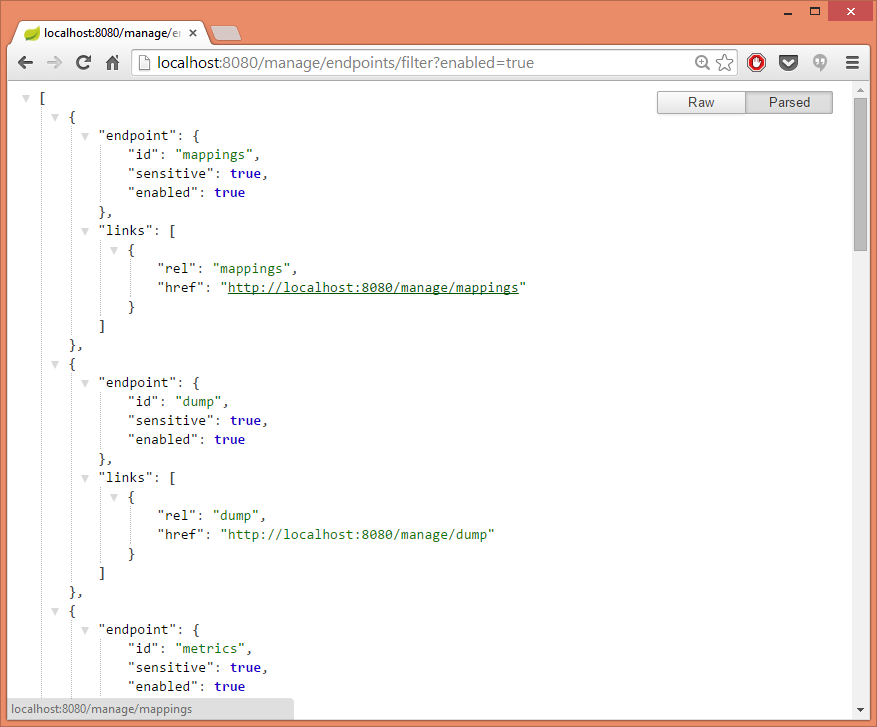

# Spring Boot Actuator: custom endpoint with MVC layer on top of it


*Spring Boot Actuator endpoints allow you to monitor and interact with your application. Spring Boot includes a number of built-in endpoints and you can also add your own.* Adding custom endpoints is as easy as creating a class that extends from `org.springframework.boot.actuate.endpoint.AbstractEndpoint`. But Spring Boot Actuator offers also possibility to decorate endpoints with MVC layer.

# Endpoints endpoint

There are many built-in endpoints, but one there is missing is the endpoint to expose all endpoints. By default endpoints are exposed via HTTP where ID of an endpoint is mapped to a URL. In the below example, the new endpoint with ID `endpoints` is created and its `invoke` method returns all available endpoints:

```java
@Component
public class EndpointsEndpoint extends AbstractEndpoint<List<Endpoint>> {

    private List<Endpoint> endpoints;

    @Autowired
    public EndpointsEndpoint(List<Endpoint> endpoints) {
        super("endpoints");
        this.endpoints = endpoints;
    }

    @Override
    public List<Endpoint> invoke() {
        return endpoints;
    }
}
```

`@Component` annotation adds endpoint to the list of existing endpoints. The `/endpoints` URL will now expose all endpoints with `id`, `enabled` and `sensitive` properties:

```json
[
    {
        "id": "trace",
        "sensitive": true,
        "enabled": true
    },
    {
        "id": "configprops",
        "sensitive": true,
        "enabled": true
    }
]
```

New endpoint will be also registered with JMX server as MBean: `[org.springframework.boot:type=Endpoint,name=endpointsEndpoint]`

# MVC Endpoint

Spring Boot Actuator offers an additional feature which is *a strategy for the MVC layer on top of an Endpoint* through `org.springframework.boot.actuate.endpoint.mvc.MvcEndpoint` interfaces. The `MvcEndpoint` can use `@RequestMapping` and other Spring MVC features.

Please note that `EndpointsEndpoint` returns all available endpoints. But it would be nice if user could filter endpoints by its `enabled` and `sensitive` properties.

In order to do so a new `MvcEndpoint` must be created with a valid `@RequestMapping` method. Please note that using `@Controller` and `@RequestMapping` on the class level is not allowed, therefore `@Component` was used to make the endpoint available:

```java
@Component
public class EndpointsMvcEndpoint extends EndpointMvcAdapter {

    private final EndpointsEndpoint delegate;

    @Autowired
    public EndpointsMvcEndpoint(EndpointsEndpoint delegate) {
        super(delegate);
        this.delegate = delegate;
    }

    @RequestMapping(value = "/filter", method = RequestMethod.GET)
    @ResponseBody
    public Set<Endpoint> filter(@RequestParam(required = false) Boolean enabled,
                          @RequestParam(required = false) Boolean sensitive) {

    }
}
```

The new method will be available under `/endpoints/filter` URL. The implementation of this method is simple: it gets optional `enabled` and `sensitive` parameters and filters the delegate’s `invoke` method result:

```java
@RequestMapping(value = "/filter", method = RequestMethod.GET)
@ResponseBody
public Set<Endpoint> filter(@RequestParam(required = false) Boolean enabled,
                            @RequestParam(required = false) Boolean sensitive) { 

    Predicate<Endpoint> isEnabled =
        endpoint -> matches(endpoint::isEnabled, ofNullable(enabled));

    Predicate<Endpoint> isSensitive =
        endpoint -> matches(endpoint::isSensitive, ofNullable(sensitive));

    return this.delegate.invoke().stream()
                 .filter(isEnabled.and(isSensitive))
                 .collect(toSet());
}

private <T> boolean matches(Supplier<T> supplier, Optional<T> value) {
    return !value.isPresent() || supplier.get().equals(value.get());
}
```

Usage examples:

- All enabled endpoints: `/endpoints/filter?enabled=true`
- All sensitive endpoints: `/endpoints/filter?sensitive=true`
- All enabled and sensitive endpoints: `/endpoints/filter?enabled=true&sensitive=true`

# Make endpoints discoverable

`EndpointsMvcEndpoint` utilizes MVC capabilities, but still returns plain endpoint objects. In case Spring HATEOAS is in the classpath the `filter` method could be extended to return `org.springframework.hateoas.Resource` with links to endpoints:

```java
class EndpointResource extends ResourceSupport {

    private final String managementContextPath;
    private final Endpoint endpoint;

    EndpointResource(String managementContextPath, Endpoint endpoint) {
        this.managementContextPath = managementContextPath;
        this.endpoint = endpoint;

        if (endpoint.isEnabled()) {

            UriComponentsBuilder path = fromCurrentServletMapping()
                    .path(this.managementContextPath)
                    .pathSegment(endpoint.getId());

            this.add(new Link(path.build().toUriString(), endpoint.getId()));    
        }
    }

    public Endpoint getEndpoint() {
        return endpoint;
    }
}
```

The `EndpointResource` will contain a link to each enabled endpoint. Note, that the constructor takes a `managamentContextPath` variable. This variable contains a Spring Boot Actuator `management.contextPath` property value. Used to set a prefix for management endpoint.

The changes required in `EndpointsMvcEndpoint` class:

```java
@Component
public class EndpointsMvcEndpoint extends EndpointMvcAdapter {

    @Value("${management.context-path:/}") // default to '/'
    private String managementContextPath;

    @RequestMapping(value = "/filter", method = RequestMethod.GET)
    @ResponseBody
    public Set<Endpoint> filter(@RequestParam(required = false) Boolean enabled,
                          @RequestParam(required = false) Boolean sensitive) {

        // predicates declarations

        return this.delegate.invoke().stream()
                .filter(isEnabled.and(isSensitive))
                .map(e -> new EndpointResource(managementContextPath, e))
                .collect(toSet());
    }
}
```

The result in my Chrome browser with JSON Formatter installed:



But why not returning the resource directly from `EndpointsEnpoint`? In `EndpointResource` a `UriComponentsBuilder` that extracts information from an `HttpServletRequest` was used which will throw an exception while calling to MBean’s `getData` operation (unless JMX is not desired).

# Manage endpoint state

Endpoints can be used not only for monitoring, but also for management. There is already built-in `ShutdownEndpoint` (disabled by default) that allows to shutdown the `ApplicationContext`. In the below (hypothetical) example, user can change state of selected endpoint:

```java
@RequestMapping(value = "/{endpointId}/state")
@ResponseBody
public EndpointResource enable(@PathVariable String endpointId) {
    Optional<Endpoint> endpointOptional = this.delegate.invoke().stream()
            .filter(e -> e.getId().equals(endpointId))
            .findFirst();
    if (!endpointOptional.isPresent()) {
        throw new RuntimeException("Endpoint not found: " + endpointId);
    }

    Endpoint endpoint = endpointOptional.get();        
    ((AbstractEndpoint) endpoint).setEnabled(!endpoint.isEnabled());

    return new EndpointResource(managementContextPath, endpoint);
}
```

While calling a `disabled` endpoint user should receive the following response:

```json
{
    "message": "This endpoint is disabled"
}
```

# Going further

The next step could be adding a user interface for custom (or existing) endpoints, but it is not in scope of this article. If you are interested you may have a look at [Spring Boot Admin](https://blog.codecentric.de/en/2014/08/spring-boot-admin-2) that is a simple admin interface for Spring Boot applications.

# Summary

Spring Boot Actuator *provides all of Spring Boot’s production-ready features* with a number of built-in endpoints. With minimal effort custom endpoints can be added to extend monitoring and management capabilities of the application.

# References

<http://docs.spring.io/spring-boot/docs/current/reference/htmlsingle/#production-ready>
