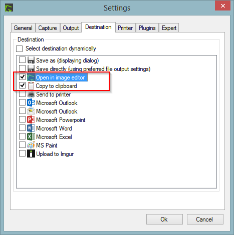
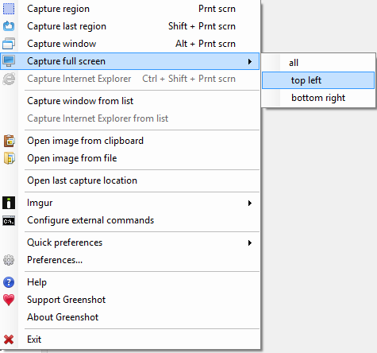
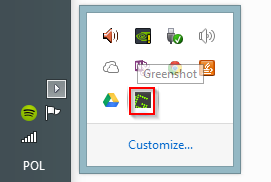
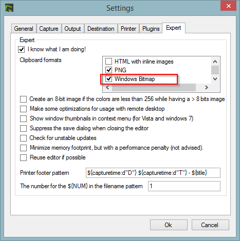
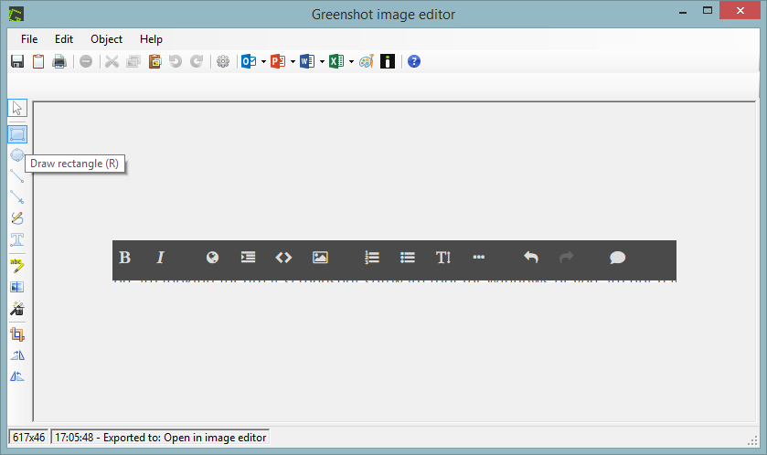
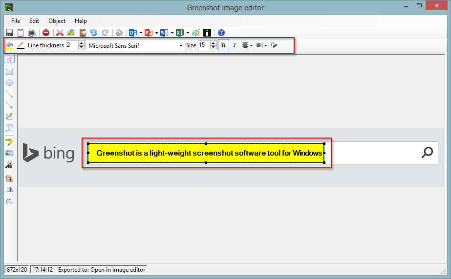
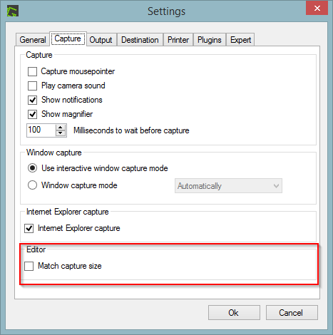
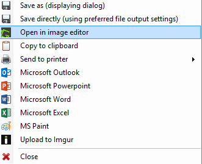

# Greenshot - productive screenshot tool for Windows

If you are looking for a screenshot software tool for Windows or you are not happy with your current one just give it a try to [Greenshot](http://getgreenshot.org/). In this short blog post, I share how I work with Greenshot in Windows 8.1 and hopefully encourage the reader to give it a try.

## Introduction

Greenshot is a light-weight screenshot software tool for Windows with tons of features but still simple to use. And that is one of the key aspects why I decided to use it several years ago and this is why I am still using it also in Windows 8.1.

When installed/run it will show up in the tray:

Right clicking the icon will bring the following menu:

When Capture full screen (`Ctrl+PrtScn`) is used Greenshot by default captures the active screen (while working on two monitors), but can capture both screens as well (although I do not use this options very often).

## Some usage scenarios

### Copy to clipboard

One of the most used scenario for me is copying the screenshot to clipboard and pasting it e.g. either to JIRA issue or to Skype chat or Word document.

#### Example case

`PrtScn` (or `Alt+PrtScn` or `Ctrl+PrtScn`) > Copy to clipboard > `Ctrl+V` to Skype / JIRA / Word

**Tip**: Clipboard format in advanced settings must be changed:

### Print Screen, edit in image editor and copy to clipboard

The editor that comes with Greenshot is rather simple but does the work. It provides most needed tools including draw shapes, text, obfuscate, highlight, crop and more. In addition, all the tools have keyboard shortcuts assigned so editing is a matter of seconds if you master them:

#### Example case

- `PrtScn` (or `Alt+PrtScn` or `Ctrl+PrtScn`) > Open in image editor > Edit image > `Shift+C` (copy to clipboard) > `Ctrl+V` to Skype / JIRA / Word

Tip: Change match capture size setting when opening editor:

Thanks to the above option, the Image Editor position and size will not change between launches.

### Copy and paste text to Image Editor

Whilst in Image Editor, you can freely copy text to clipboard and paste it directly to Image Editor:

### Configure default destination

Currently Greenshot allows to either select destination for the copied image dynamically via a menu:

or it can be configured to select the destination automatically:

Note: The destination list may be different depending on the installed plugins.

When both destinations selected, both will be used. So looking at the above setting, each screenshot will be copied to clipboard and opened in Image Editor.

I miss two options to make it fully productive: I would like to be able to configure the dynamic destinations, so the list can contain the options I want (minor) and I would like to be able to use keyboard shortcuts while dynamically selecting a destination.

## Summary

Greenshot is just a great tool that can be used by anyone who want to speed up his working with screen capture. It is pretty much flexible and improves the productivity a lot. And all of this for free.
