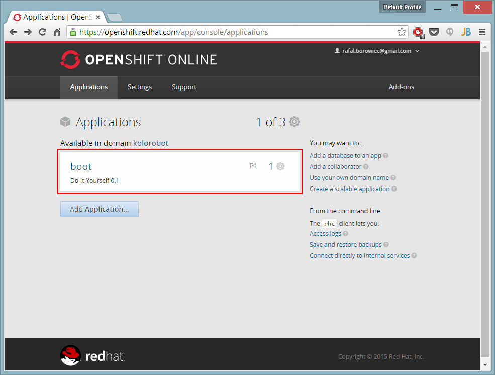

# OpenShift DIY: Build Spring Boot / Undertow application with Gradle


Gradle 1.6 was the last supported Gradle version to run on OpenShift due to this [bug](https://issues.gradle.org/browse/GRADLE-2871). But as of Gradle 2.2 this is no more an issue, so running newest Gradle on OpenShift should not be a problem anymore with Do It Yourself cartridge. DIY cartridge is an experimental cartridge that provides a way to test unsupported languages on OpenShift. It provides a minimal, free-form scaffolding which leaves all details of the cartridge to the application developer.

This blog post illustrates the use of Spring Boot 1.2 and Java 8 running on Undertow, that is supported as a lightweight alternative to Tomcat. It should not take more than 10 minutes to get up and running.

# Prerequisite

Before we can start building the application, we need to have an OpenShift free account and client tools installed.

# Step 1: Create DIY application

To create an application using client tools, type the following command:

```
rhc app create <app-name> diy-0.1
```

This command creates an application  using *DIY* cartridge and clones the repository to  directory.

# Step 2: Delete Template Application Source code

OpenShift creates a template project that can be freely removed:

```
git rm -rf .openshift README.md diy misc
```

Commit the changes:

```
git commit -am "Removed template application source code"
```

# Step 3: Pull Source code from GitHub

```
git remote add upstream https://github.com/kolorobot/openshift-diy-spring-boot-gradle.git
git pull -s recursive -X theirs upstream master
```

# Step 4: Push changes

The basic template is ready to be pushed to OpenShift:

```
git push
```

The initial deployment (build and application startup) will take some time (up to several minutes). Subsequent deployments are a bit faster:

```
remote: BUILD SUCCESSFUL
remote: Starting DIY cartridge
remote: XNIO NIO Implementation Version 3.3.0.Final
remote: b.c.e.u.UndertowEmbeddedServletContainer : Undertow started on port(s) 8080 (http)
remote: Started DemoApplication in 15.156 seconds (JVM running for 17.209)
```

You can now browse to: `http://<app-name>.rhcloud.com/manage/health` and you should see:

```
{
    "status": "UP",
}
```

When you login to your OpenShift web account and navigate to `Applications` you should see the new one:



# Under the hood

## Why DIY?

Spring Boot application can be deployed to Tomcat cartridge on OpenShift. But at this moment no Undertow and Java 8 support exists, therefore DIY was selected. DIY has limitations: it cannot be scaled for example. But it is perfect for trying and playing with new things.

## Application structure

The application is a regular Spring Boot application, that one can bootstrapped with <http://start.spring.io>. Build system used is Gradle, packaging type is Jar.

As of Spring Boot 1.2 Undertow lightweight and performant Servlet 3.1 container is supported. In order to use Undertow instead of Tomcat, Tomcat dependencies must be exchanged with Undertow ones:

```groovy
buildscript {
    configurations {
        compile.exclude module: "spring-boot-starter-tomcat"
    }
}    

dependencies {
    compile("org.springframework.boot:spring-boot-starter-undertow")
}
```

OpenShift specificic configuration - `application-openshift.properties` - contains the logging configuration at the moment:

```
logging.file=${OPENSHIFT_DATA_DIR}/logs/app.log
```

## OpenShift action_hooks

OpenShift executes action hooks script files at specific points during the deployment process. All hooks are placed in the .openshift/action_hooks directory in the application repository. Files must have be executable. In Windows, in Git Bash, the following command can be used:

```
git update-index --chmod=+x .openshift/action_hooks/*
```

### Deploying the application

The deploy script downloads Java 8 and Gradle 2.2, creates some directories. Downloading Gradle is done the following way:

```bash
if [ ! -d $OPENSHIFT_DATA_DIR/gradle-2.2.1 ]
        then
                cd $OPENSHIFT_DATA_DIR
                wget https://services.gradle.org/distributions/gradle-2.2.1-bin.zip
                unzip gradle-2.2.1-bin.zip
                rm -f gradle-2.2.1-bin.zip
fi
```

After running the script the following directories will be created in `$OPENSHIFT_DATA_DIR`:

```
gradle  gradle-2.2.1  jdk1.8.0_20  logs
```

In addition, the script exports couple of environment variables required to properly run Java 8 / Gradle build. `GRADLE_USER_HOME` is most important one as it sets the home directory where all the Gradle runtime files will be stored, including downloaded dependencies used to build the application.

The final command of the `deploy` script is to run Gradle task to create an jar archive that can be executed from the command line using `java -jar` commnad (see next paragraph):

```
gradle bootRepackage
```

### Starting the application

When `deploy` script finishes successfully, the `build` directory will contain a single jar with the Spring Boot application assembled. The application is started and bound to the server address and port provided by OpenShift. In addition, the profile name is provided, so additional properties file can be loaded. The final command that runs the application is as follows:

```
nohup java -Xms384m -Xmx412m -jar build/*.jar --server.port=${OPENSHIFT_DIY_PORT} --server.address=${OPENSHIFT_DIY_IP} --spring.profiles.active=openshift &
```

# References

- The project source code, used throughout this article, can be found   
  on GitHub: <https://github.com/kolorobot/openshift-diy-spring-boot-gradle>
- Spring Boot documentation: <http://docs.spring.io/spring-boot/docs/current/reference/htmlsingle/#cloud-deployment-openshift>
- Some OpenShift references used while creating this article:

  - <https://blog.openshift.com/run-gradle-builds-on-openshift>
  - <https://blog.openshift.com/tips-for-creating-openshift-apps-with-windows>

# See also

[Spring Boot / Java 8 / Tomcat 8 on OpenShift DIY](../../../2014/10/spring-boot-java-8-tomcat-8-on-openshift/index.md)
