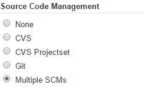
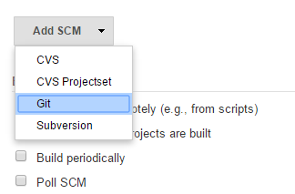
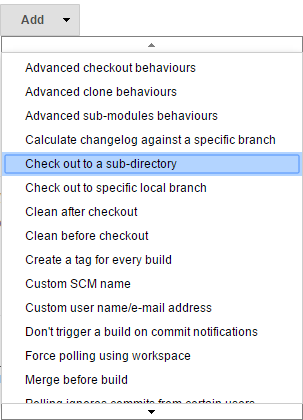
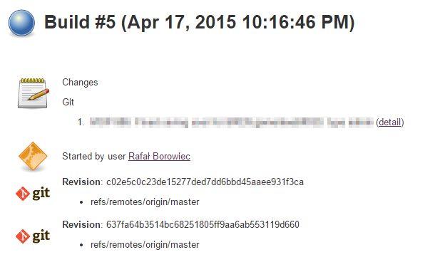

# Jenkins HOW-TO: build a project from multiple (Git) repositories

Recently I have been working on a project that has two main modules: Backend and Frontend. The Backend is a Spring Boot application and the Frontend is an AngularJS 1.3 application. While preparing the build we are using Grunt for building AngularJS code and Gradle for building the Spring Boot application. Grunt is creating a JAR file containing all resources and copies it to Spring Boot application. Then Gradle takes the JAR and adds it to the resulting WAR. Long story made short.

Both Backend and Frontend are different Git repositories, initially managed by different teams. Both needs to be checked to the same root folder, so the building process will properly run. In order to do the it on Jenkins, [Multiple SCMs Plugin Jenkins](https://wiki.jenkins-ci.org/display/JENKINS/Multiple+SCMs+Plugin) plugin can be used. The plugin simplifies the configuration of such a build.

The Jenkins task is updating both repositories and then it exectues a shell shell script that does the work of assembling and deploying the application. The configuration of Multiple SCMs is really simple:

- Install the plugin: Jenkins > Manage Jenkins > Manage Plugins
- Create new task: Jenkins > New Item
- Choose Multiple SCMs in Source Code Management section:

- Add 1 repository (I am using Git). Choose: Add SCM

- Enter repository details
- Add additional behavior. Choose: Add and from dropdown menu select Check out to a sub-directory

- Provide the sub-directory name
- Repeat steps 4 to 7 for the second (and other repositories)

Now you can configure other sections of the task, save it and enjoy your new build from multiple repositories.

