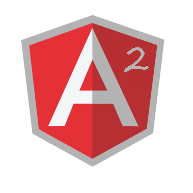

# Angular2 a gentle introduction

# Angular 1.x

Angular 1.x is the most popular Front-end framework these days. Last year we decided to adopt it in some of [Goyello](http://blog.goyello.com/) new projects. Today we have some experience to share. At the same time we are closely looking at the next generation of the framework.

> Update (1/4/2016) - If you want to learn how to use up-to-date Angular2 with TypeScript and Gulp, please read my this blog post (regularly updated): [Quickstart: Angular2 with TypeScript and Gulp](../../../2016/03/quickstart-angular2-with-typescript-and/index.md)

# Game changer

It is extremely easy to get started with Angular 1.x. It provides clear separation of presentation, data and application logic which is greatly appreciated especially by back-end developers as myself. Two-way data binding is one of the most appreciated features of the framework. The dependency injection makes it possible to modularize the code and test it in isolation. Directives are great way of creating reusable components and use them across the application with ease. As a result, people love and admire the framework since the very beginning.

# All that glitters is not gold

There is no doubt Angular 1.x is a great framework. However it is incredibly difficult to master. The complex API and many concepts introduced since its launch make understanding the framework and thus using it effectively really hard.

Angular 1.x has started in 2009, so it is not so fresh anymore and it is criticized more and more, mostly for the features that made the framework so popular.

Two way data binding looks great at first sight, but it introduces coupling: everything can update everything. This makes debugging and tracking errors really difficult. In addition, the performance of the applications drops significantly with growing number of objects on the pages.

Directives are great, but have you tried to understand its API? How much time did you need to master directives? Restrict, isolating the scope, link (pre-link, post-link), compile, transclusion, directive communication (and more) makes developers really suffer.

The Angular team also noticed many issues with Angular 1.x. They decided to create the next version of the framework almost from scratch.

# What’s new in [Angular 2](http://www.angular.io)?

Angular 2 is built on top of modern web standards like Web Components or ECMAScript 6. Many of these standards are not yet natively supported by browsers but they can be used thanks to polyfills.

Angular 2 is a new opening: no controllers, no DDO, no $scope, no angular.module and ~~no two-way data binding.~~

The new version of the framework should also be much simpler to learn thanks to easier and more concise concepts like component-based architecture. The built-in modularity will make it possible to create complex applications easier. Moreover, Angular 2 should be significantly faster than its ancestor thanks to completely rewritten data binding and change detection.
