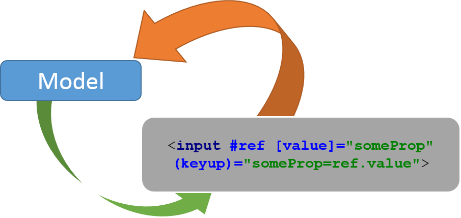
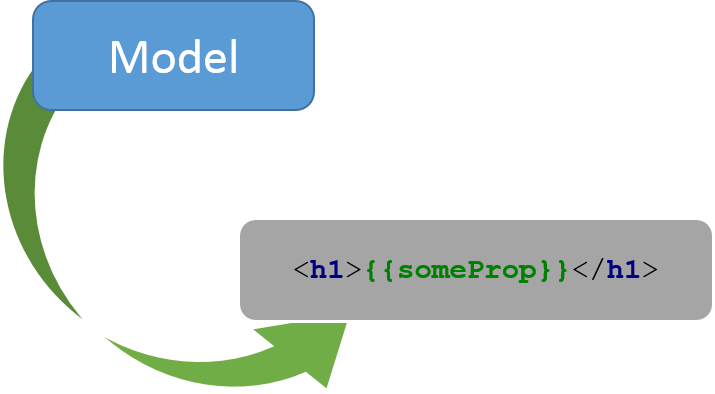

# [Angular2]="{{'Hello, World!'}}"


As I mentioned in my recent [blog post](../../../2015/06/angular-2-hello-world/index.md) Angular 2 is a complete rewrite. Many concepts that are known from Angular 1.x are gone or changed dramatically. Angular 2 looks like a completely different framework: no *DDO*, no *$scope*, no *angular.module* and completely rewritten binding and change detection (no *ng-model*).

> Update (1/4/2016) - This blog post is not maintained. The concepts are still valid, but the code may be outdated. If you want to learn how to use up-to-date Angular2 with TypeScript and Gulp, please read this blog post (regularly updated): [Quickstart: Angular2 with TypeScript and Gulp](../../../2016/03/quickstart-angular2-with-typescript-and/index.md)

Although Angular 2 is still work in progress many new features have already been revealed. In this blog post I will share some basic concepts of the framework via code samples that I presented during my lecture at InfoShare 2015.

Please note the code is created with [Angular 2 Alpha 26](https://github.com/angular/angular/releases/tag/2.0.0-alpha.26).

# Angular 2 is built with… TypeScript (1.5)

> TypeScript is a typed superset of JavaScript that compiles to plain JavaScript.

We could say it is ECMAScript 6 on steroids, as it offers what ECMAScript 6 has to offer. But it adds many more features: type checking, interfaces, generics, enums or decorators to name just a few.

Let’s see some sample code created in TypeScript:

```typescript
import {Greeter} from "greeter";

class HtmlGreeter implements Greeter {

    constructor(public greeting:string) {
    }

    greet() {
        return "<h1>" + this.greeting + "</h1>";
    }
}

var greeter = new HtmlGreeter("Hello, world!");
var greetings = greeter.greet();
```

TypeScript is optional for Angular 2 applications and although it is a recommended approach, developers have choice. They can choose from: ES5, ES6, CoffeScript or any other language that compiles to JavaScript.

Want to learn more about TypeScript? Visit <http://www.typescriptlang.org/>

# Hello, World!

Let’s see two “Hello, World!” Angular 2 applications written in TypeScript and ECMAScript 5 accordingly.

TypeScript (1.5):

```typescript
// TypeScript
import {Component, View, bootstrap} from 'angular2/angular2';

@Component({
    selector: 'hello-angular2'
})
@View({
    template: "<h1>Hello {{ name | lowercase }}</h1>"
})
class HelloAngular2Cmp {
    name:string = "Angular2";
}

bootstrap(HelloAngular2Cmp);
```

JavaScript (ES5):

```javascript
// ES5
function HelloAngular2Cmp() {
    this.name = 'Angular2'
}

HelloAngular2Cmp.annotations = [
    new angular.ComponentAnnotation({
        selector: 'hello-angular2'
    }),
    new angular.ViewAnnotation({
        template: '<h1>Hello, {{ name }}!</h1>'
    })
];

document.addEventListener('DOMContentLoaded', function () {
    angular.bootstrap(HelloAngular2Cmp);
});
```

As you can see the TypeScript version is a bit less verbose and decorators (*@*) clearly separate the code from meta data information.

# Angular 2 Building Blocks

As you could notice, the the above code did not contain much of what you learned about Angular 1.x: no angular.module, no Directive Definition Object (DDO), no $scope.

## Component

A component is the main UI building block of Angular 2 app: Angular 2 is a tree of components. Every Angular 2 application must have at least one component. A component class is an execution context for the template or it is a *component controller*. A component requires a single `@Component` decorator and at least one `@View` decorator.

Let’s see a really basic component in Angular 2:

```typescript
@Component({
    selector: 'hello-angular2'
})
@View({
    templateUrl: 'template.html',
    directives: [NgIf]
})
class HelloAngular2Cmp {

    private text:string;
    private clickCount:number = 0;

    onClick(input, $event) {
        this.text = input.value;
        if ($event instanceof MouseEvent) {
            this.clickCount++;
        }
    }
}

// let component be rendered on a page
bootstrap(HelloAngular2Cmp);
```

`HelloAngular2Cmp` has two properties: `text` and `clickCount` that are bound to a view defined by a template attribute of a `@View` decorator. Templates have access to any properties or functions of a component controller.

## View

The template itself looks like this:

```html
<!-- local variable input -->
<input type="text" #input>
<!-- event binding -->
<button (click)="onClick(input, $event)"
        [disabled]="text === 'Angular2'">Click me!</button>

<!-- property binding -->
<p>Angular2 says: {{ text }}</p>

<!-- Conditional -->
<div *ng-if="clickCount >= 5">Clicking too much, man!</div>
```

The syntax is very easy:

- `{{ expression | pipe }}` - Angular 2 interpolation,
- `#variable` – local variables available in the scope of the component. The variable can be later referred in the component’s template,
- `(event)` - binding to events of element or directive,
- `[property]` - binding to properties of element.

## Bindings

Every time the `text` property of a component changes, the change is automatically reflected in the template. The properties of elements are accessed with square brackets (`[property]`) syntax. In the above example the button will be disabled once the `text` property of a component is equal to “Angular 2”. This is a property binding in Angular 2.



To propagate changes from DOM to a component event binding must be utilized. Event bindings in Angular 2 are represented by brackets syntax: *(event)*. In the above example when a click event occurs on a button, `onClick` function of a component will be executed.



To sum up, in Angular 2:

> Property bindings are executed automatically,   
> Event bindings allow propagation of DOM changes.

Watch this video to better understand the data binding in Angular 2: <https://angularu.com/Video/2015sf/misko-hevery-talks-about-databinding-in-angular-2>

## Forms

Property and event bindings makes two two-way data binding possiblebut an additional effort is required in order to achieve it. Fortunately, Angular 2 will be shipped with Angular 2 Forms module. This module will be used for handling user input, by defining and building a control objects and mapping them onto the DOM. Control objects can then be used to read information from the form elements.

Read more about Angular 2 Forms: <http://angularjs.blogspot.com/2015/03/forms-in-angular-2.html>

## Directive

A component is not the only UI building block in Angular 2. There are also directives which allow you to attach behavior to elements in the DOM.

> The difference between a component and a directive in Angular 2 is that a component is a directive with a view whereas a directive is a decorator with no view.

A directive requires a single `@Directive` decorator and a directive class:

```typescript
import {Directive, ElementRef} from 'angular2/angular2';

@Directive({
    selector: "[highlight]",
    hostListeners: {
        'mouseenter': 'onMouseEnter()',
        'mouseleave': 'onMouseLeave()'
    }
})
class Highlight {

    constructor(private element:ElementRef) {

    }

    onMouseEnter() {
        this.outline('#f00 solid 1px');
    }

    onMouseLeave() {
        this.outline();
    }

    private outline(outline:string = "") {
        this.element.domElement.style.outline = outline;
    }
}
```

The above directive, when used on an element, adds an outline effect to the host element – the element it is used on. `ElementRef` is automatically provided by Angular 2 Dependency Injection module.

Usage example:

```html
<div highlight>Lorem ipsum...</div>
```

## Dependency Injection

In Angular 2 there is a single way to inject dependencies into a directive or a component. In the below example a user-defined service is injected into a component. `MessageService` declares some business logic:

```typescript
// messageService.ts
export class MessageService {

    private messages:Array<string> = [
        "Hello, Angular2",
        "Angular2 is cool!",
        "Damn it! Stop doing this!"];

    public getMessage() {
        return this.messages[Math.floor(
            Math.random() * this.messages.length)];
    }
}
```

The component is requesting framework to provide a required dependency via its constructor:

```typescript
import {Component, View, bootstrap} from 'angular2/angular2';
import {MessageService} from 'messageService'

@Component({
    selector: 'hello-angular2'
})
@View({
    template: '<h1 (click)="onClick()">{{message}}</h1>',
})
class HelloAngular2Cmp {

    private message:string;

    constructor(private messageService:MessageService) {

    }

    onClick() {
        this.message = this.messageService.getMessage();
    }
}
```

The `MessageService` is imported from an external module and later it must be made available to Angular 2. One way to make dependencies available is to register them globally with a `bootstrap()` function like the one below:

```typescript
bootstrap(HelloAngular2Cmp, [MessageService]);
```

Please note that framework services, directives or components, an iterable live list of components (`@Query`) and attributes (`@Attribute`) can be injected in the same, uniform way. The new DI module is designed the way it supports easy extending (`DependencyAnnotation`) so even custom dependency injection annotation can be created. In addition, Angular 2 supports injecting promises (`@InjectPromise`), lazy dependencies (`@InjectLazy`) or optional dependencies (`@Optional`).

Read more about Angular 2 Dependency Injection in this great article: <http://blog.thoughtram.io/angular/2015/05/18/dependency-injection-in-angular-2.html>

# Summary

As you can see Angular 2 is much different from Angular 1.x. No DDO, no $scope, no angular.module, new change detection and binding, uniform template syntax, new dependency injection, new forms module, new router and much more.

The new version of the framework should also be much simpler to learn thanks to easier and more concise concepts like component-based architecture. Moreover, Angular 2 should be significantly faster than its ancestor thanks to completely rewritten data binding and change detection.

Is there a way to migrate from Angular 1.x? In my opinion it will not be easy. But there are some tips out there that may help in migration:

- Prefer one-way data-bindings to two-way data-bindings,
- Use ControllerAs syntax for easier migration to components,
- Do not update application state inside watch functions,
- Follow the newest releases (1.4, 1.5) and upgrade,
- Think of using New Router when available (<https://angular.github.io/router/>),
- Think of using TypeScript in Angular 1.x applications.

# References

- [Official Angular 2 Website](http://angular.io)
- [Angular 2 Source code](https://github.com/angular/angular)
- [Learning source on GitHub with tons of useful links](https://github.com/timjacobi/angular2-education)
