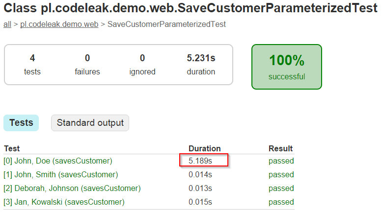

# Parameterized integration tests with Spring JUnit Rules


Spring 4.2 comes with brand new JUnit rules: `SpringClassRule` and `SpringMethodRule`. The main advantage of using JUnit rules is to let developers get rid of `SpringJUnit4ClassRunner` and utilize different JUnit runners in Spring integration tests. I think the biggest opportunity with Spring JUnit Rules is the ease of creating parameterized integration tests.

## The code to be tested

For the purpose of this article I used existing Spring Boot Jersey Demo application: <https://github.com/kolorobot/spring-boot-jersey-demo>. The application exposes simple REST API to work with customer objects.

## Integration test - the “old” way

Prior to Spring 4.2 the integration test could look like this:

```java
@RunWith(SpringJUnit4ClassRunner.class)
@ApplicationTest
public class SaveCustomerTest {

    private RestTemplate restTemplate = new TestRestTemplate("demo", "123");

    @Test
    public void savesCustomer() {
        // act
        URI uri = restTemplate.postForLocation("http://localhost:9000/customer",
                new Customer("John", "Doe"));
        // assert
        ResponseEntity<Customer> responseEntity =
                restTemplate.getForEntity(uri, Customer.class);

        Customer customer = responseEntity.getBody();

        assertThat(customer.getFirstname())
                .isEqualTo("John");
        assertThat(customer.getLastname())
                .isEqualTo("Doe");
    }
}
```

`@ApplicationTest` is a grouping annotation that wraps several Spring’s annotation:

```java
@Documented
@Inherited
@Retention(RetentionPolicy.RUNTIME)
@Target(ElementType.TYPE)
@SpringApplicationConfiguration(classes = Application.class)
@WebAppConfiguration
@org.springframework.boot.test.IntegrationTest("server.port=9000")
@ActiveProfiles("web")
@Sql(scripts = "classpath:data.sql", executionPhase = Sql.ExecutionPhase.BEFORE_TEST_METHOD)
public @interface ApplicationTest {

}
```

As you may notice, the above test uses standard `SpringJUnit4ClassRunner`, a custom runner that adds Spring Framework’s support in JUnit integration tests. And since multiple runners cannot be used in JUnit we need to find a workaround to create a parameterized test with Spring and JUnitParams (which is not that hard BTW).

## Parameterized test with Spring JUnit Rules

Fortunatelly, Spring 4.2 comes with a handy alternative to `SpringJUnit4ClassRunner`: Spring JUnit Rules. Let’s see an example:

```java
@RunWith(JUnitParamsRunner.class)
@ApplicationTest
public class SaveCustomerParameterizedTest {

    @ClassRule
    public static final SpringClassRule SCR = new SpringClassRule();

    @Rule
    public final SpringMethodRule springMethodRule = new SpringMethodRule();

    private RestTemplate restTemplate = new TestRestTemplate("demo", "123");

    @Test
    @Parameters
    public void savesCustomer(String first, String last) {
        // act
        URI uri = restTemplate.postForLocation("http://localhost:9000/customer",
            new Customer(first, last));
        // assert
        ResponseEntity<Customer> responseEntity =
            restTemplate.getForEntity(uri, Customer.class);

        Customer customer = responseEntity.getBody();

        assertThat(customer.getFirstname())
            .isEqualTo(first);
        assertThat(customer.getLastname())
            .isEqualTo(last);
    }

    public Object[] parametersForSavesCustomer() {
        return $(
            $("John", "Doe"),
            $("John", "Smith"),
            $("Deborah", "Johnson"),
            $("Jan", "Kowalski")
        );
    }
}
```

There are not much changes to the original code, but most important are:

- `JUnitParamsRunner` - JUnitParams is an alternative to a standard JUnit parameterized tests. I blogged about it here: [http://blog.codeleak.pl/2013/12/parametrized-junit-tests-with.html](../../../2013/12/parametrized-junit-tests-with/index.md) and here: [http://blog.codeleak.pl/2014/11/unit-testing-excercise-with-fizzbuzz.html](../../../2014/11/unit-testing-excercise-with-fizzbuzz/index.md).
- `SpringClassRule` - supports the class-level features of the `SpringJUnit4ClassRunner` and must be combined with `SpringMethodRule`. The name of the field doesn’t matter but it must be public, static and final.
- `SpringMethodRule`- supports the instance-level and method-level features of the `SpringJUnit4ClassRunner` therefore it must be combined with `SpringClassRule`
- `@Parameters` - the annotation for the test parameters. By default, requires `parametersFor<methodName>` method.

Running the test with `gradle test --tests *SaveCustomerParameterizedTest` will result in this report:



As you can see, there were 4 tests executed. The first one took most of the time, as the Spring context was initialized, the latter tests were pretty fast.

## Summary

The addition of Spring JUnit Rules to Spring Test Framework can improve integration tests significantly especially as it goes to parameterized tests. Not only JUnitParams can be used for that purpose, though. You can try with standard JUnit `org.junit.runners.Parameterized` too.

## References

- Spring Framework Reference - <http://docs.spring.io/spring/docs/current/spring-framework-reference/htmlsingle/#testcontext-junit4-rules>
- Parametrized JUnit tests with JUnitParams - [http://blog.codeleak.pl/2013/12/parametrized-junit-tests-with.html](../../../2013/12/parametrized-junit-tests-with/index.md)
- JUnitParams - <https://github.com/Pragmatists/JUnitParams>
- Unit Testing exercise with FizzBuzz and JUnitParams - [http://blog.codeleak.pl/2014/11/unit-testing-excercise-with-fizzbuzz.html](../../../2014/11/unit-testing-excercise-with-fizzbuzz/index.md)
