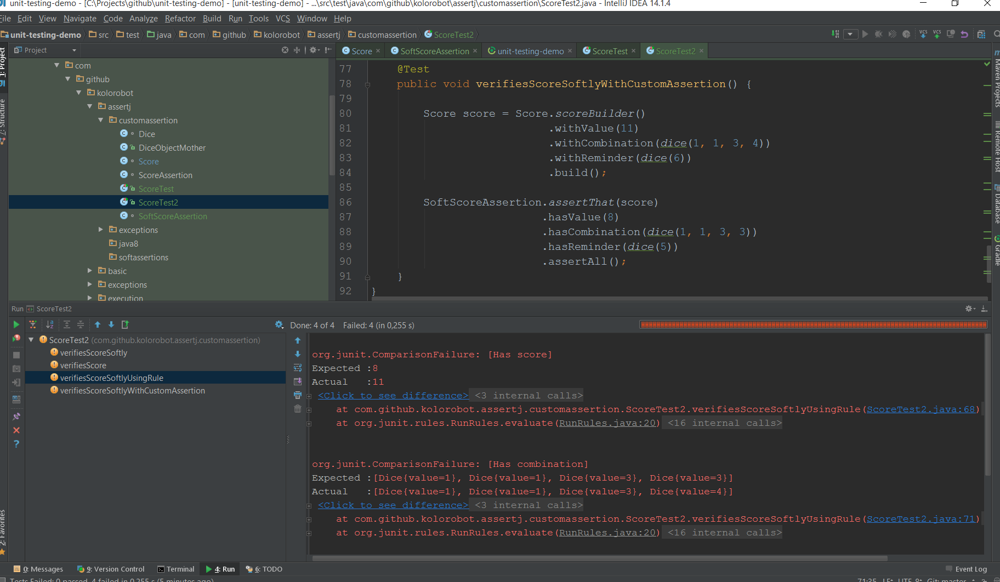

# AssertJ's SoftAssertions - do we need them?

One of the rules of writing good unit test is that it should fail for one reason, so unit test should test one logical concept. Sometime it is quite tough to have a single assertion per test. To follow the rule, we may have having multiple assertions per object in a single test.

The problem with multiple assertions in a single test though, is that if the first one fails for any reason we actually don’t know about other assertions as they will not be executed. And you know the drill: you check assertion failure reason, you fix it and re-run the test. Maybe you are lucky and the test will pass. But maybe it will fail with another assertion. With really fast unit tests this is not a big issue but when it comes to, for example, Selenium tests analysis and failure detection can become cumbersome and for sure time consuming.

Fortunately, we can re-think the way we create assertions in our tests thanks to AssertJ’s `SoftAssertions`.

## One assertion to rule them all!

In a hypothetical `Dice` game there is a `Score` object that holds a score value, dice combination and the reminder. In unit tests we may want to verify how the score is calculated for a different dice combination.

In the below example, a single concept - score object - is validated:

```java
@Test
public void verifiesScore() {
    Score score = Score.scoreBuilder()
                       .withValue(11)
                       .withCombination(dice(1, 1, 3, 4))
                       .withReminder(dice(6))
                       .build();

    assertThat(score.getValue())
        .as("Has score")
        .isEqualTo(8);

    assertThat(score.getCombination())
        .as("Has combination")
        .isEqualTo(dice(1, 1, 3, 3));

    assertThat(score.getReminder())
        .as("Has reminder")
        .isEqualTo(dice(5));
}
```

As you can see all three assertions fail, but we will see only the result of the first failure as the execution of the test stops after first failure:

```
org.junit.ComparisonFailure: [Has score] 
Expected :8
Actual   :11
```

## Introducing `SoftAssertions`

To fix this we can employ `SoftAssertions` that will collect the result of all assertions at once upon calling `assertAll()` method:

```java
@Test
public void verifiesScoreSoftly() {
    Score score = Score.scoreBuilder()
                       .withValue(11)
                       .withCombination(dice(1, 1, 3, 4))
                       .withReminder(dice(6))
                       .build();

    SoftAssertions softAssertions = new SoftAssertions();

    softAssertions.assertThat(score.getValue())
                  .as("Has score")
                  .isEqualTo(8);
    softAssertions.assertThat(score.getCombination())
                  .as("Has combination")
                  .isEqualTo(dice(1, 1, 3, 3));
    softAssertions.assertThat(score.getReminder())
                  .as("Has reminder")
                  .isEqualTo(dice(5));

    softAssertions.assertAll();
}
```

Now we can verify all assertion failures in the test:

```
org.assertj.core.api.SoftAssertionError: 
The following 3 assertions failed:
1) [Has score] expected:<[8]> but was:<[11]>
2) [Has combination] expected:<...alue=3}, Dice{value=[3]}]> but was:<...alue=3}, Dice{value=[4]}]>
3) [Has reminder] expected:<[Dice{value=[5]}]> but was:<[Dice{value=[6]}]>
```

## JUnitSoftAssertions `@Rule`

Instead of manually creating `SoftAssertions` and calling its `assertAll()` we can use JUnit `@Rule`:

```java
@Rule
public JUnitSoftAssertions softAssertions = new JUnitSoftAssertions();

@Test
public void verifiesScoreSoftlyUsingRule() {
    Score score = Score.scoreBuilder()
                       .withValue(11)
                       .withCombination(dice(1, 1, 3, 4))
                       .withReminder(dice(6))
                       .build();

    softAssertions.assertThat(score.getValue())
                  .as("Has score")
                  .isEqualTo(8);
    softAssertions.assertThat(score.getCombination())
                  .as("Has combination")
                  .isEqualTo(dice(1, 1, 3, 3));
    softAssertions.assertThat(score.getReminder())
                  .as("Has reminder")
                  .isEqualTo(dice(5));
}
```

Not only we do not need to remember about calling `assertAll()` but we can also see potential failures in a comparison editor in IntelliJ:



## Custom `SoftScoreAssertion`

To improve the readability and reusability of the score validation we can create a custom assertion so it can be used as follows:

```java
@Test
public void verifiesScoreSoftlyWithCustomAssertion() {

    Score score = Score.scoreBuilder()
                       .withValue(11)
                       .withCombination(dice(1, 1, 3, 4))
                       .withReminder(dice(6))
                       .build();

    SoftScoreAssertion.assertThat(score)
                      .hasValue(8)
                      .hasCombination(dice(1, 1, 3, 3))
                      .hasReminder(dice(5))
                      .assertAll();
}
```

The `SoftScoreAssertion` uses `SoftAssertions` and therefore we will still see all assertion errors at once. And the code:

```
class SoftScoreAssertion extends AbstractAssert<SoftScoreAssertion, Score> {

    private SoftAssertions softAssertions = new SoftAssertions();

    protected SoftScoreAssertion(Score actual) {
        super(actual, SoftScoreAssertion.class);
    }

    public static SoftScoreAssertion assertThat(Score actual) {
        return new SoftScoreAssertion(actual);
    }

    public SoftScoreAssertion hasValue(int scoreValue) {
        isNotNull();
        softAssertions.assertThat(actual.getValue())
                      .as("Has score")
                      .isEqualTo(scoreValue);
        return this;
    }

    public SoftScoreAssertion hasReminder(List<Dice> expected) {
        isNotNull();
        softAssertions.assertThat(actual.getReminder())
                      .as("Has reminder")
                      .isEqualTo(expected);
        return this;
    }

   public SoftScoreAssertion hasCombination(List<Dice> expected) {
        isNotNull();
        softAssertions.assertThat(actual.getCombination())
                      .as("Has combination")
                      .isEqualTo(expected);
        return this;
    }

    @Override
    public SoftScoreAssertion isNotNull() {
        softAssertions.assertThat(actual).isNotNull();
        return this;
    }

    public void assertAll() {
        this.softAssertions.assertAll();
    }
}
```

## References

- <http://joel-costigliola.github.io/assertj/assertj-core-features-highlight.html#soft-assertions>
- <https://github.com/joel-costigliola/assertj-core/wiki/Creating-specific-assertions>

## Source code

The source code for this article can be found in my unit-testing-demo project at GitHub: <https://github.com/kolorobot/unit-testing-demo>.
