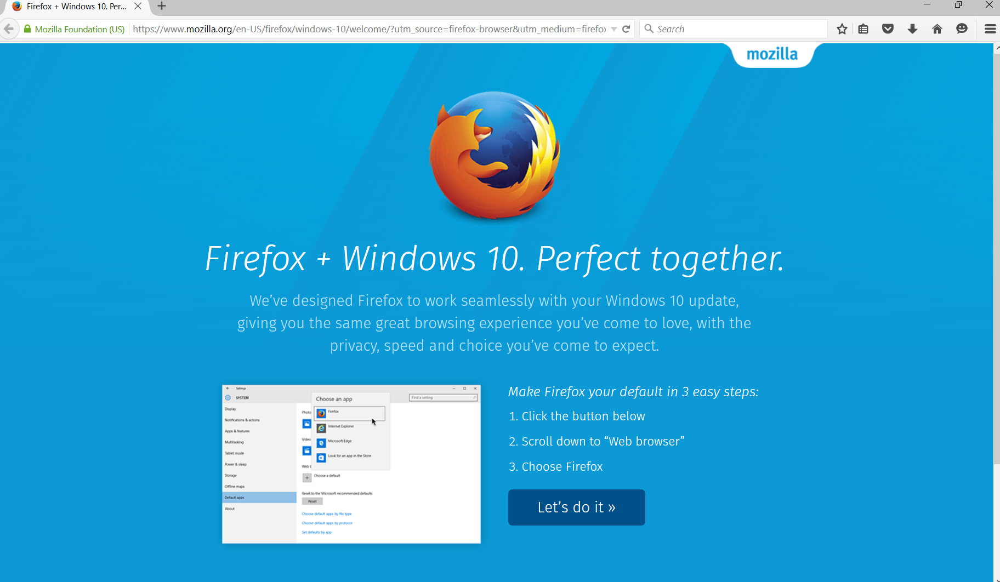
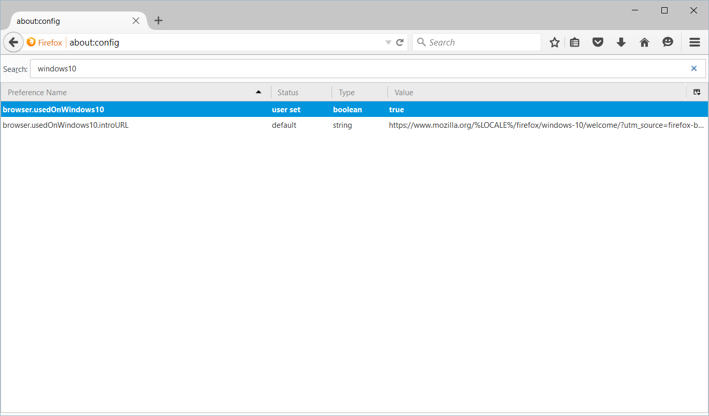

# Selenium + Firefox on Windows 10 - get rid of the Windows 10 intro URL being loaded

Recently I moved to Windows 10 and upgraded to the newest Firefox. When I executed my integration tests on my PC with Selenium and Firefox for the first time I saw an extra page was loaded: “Firefox + Windows 10. Perfect together.” Maybe for you - I said to myself - and I immediately looked how to disable it.



I checked `browser.startup.homepage` and it points to `about:blank`. Perfectly fine. But still unwanted page is loaded. I looked for another key by simply typing `windows` in the `about:config` page and I saw two properties: `browser.usedOnWindows10` and `browser.usedOnWindows10.introURL`:



Changing the the properties in the browser directly did not help much as every time the driver is created the page is loaded again (and the properties are restored).

Therefore, I updated the `FirefoxProfile` in the code so every time a new driver is created the properties are properly updated:

```java
FirefoxProfile profile = new FirefoxProfile();
profile.setPreference("browser.usedOnWindows10", false);
profile.setPreference("browser.usedOnWindows10.introURL", "about:blank");
```

Back to normal!
