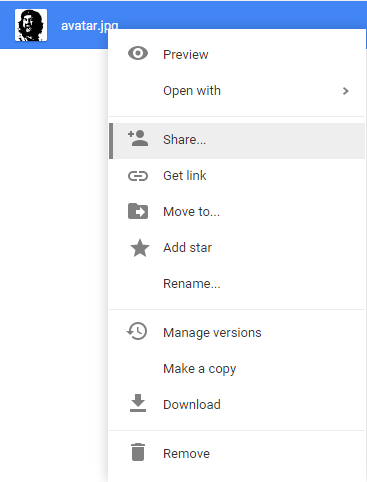
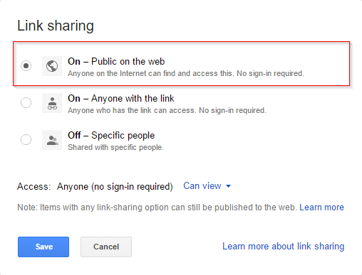
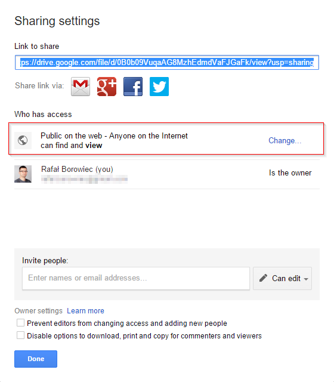

# Generate direct link to Google Drive image

If you want to create a direct link to a public image on Google Drive you may use Permanent link generator that I crated for my personal use.

*Note (28/09/2016):*  Google does not support this anymore!

## Where is it?

The tool is available as a simple HTML page here: [Permalink](http://kolorobot.github.io/permalink/)

The source code: [Permalink Source Code](https://github.com/kolorobot/permalink)

## How to use it?

- Upload an image to the Google Drive, locate it, right click and select *Share* option

- Click *Advanced* and make sure the image can be viewed by anyone on the web

- Copy the *Link to share* and paste in the Permalink tool

- Click *Generate Permalink* to get links to the image
- Share the link or use it on your website!

## References

The way the links are generated is described here: <http://googlesystem.blogspot.com/2013/02/permalinks-for-google-drive-images.html>
