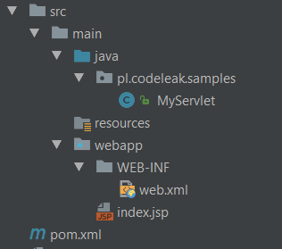
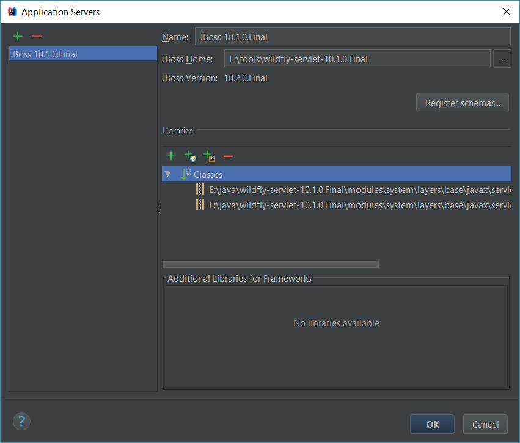
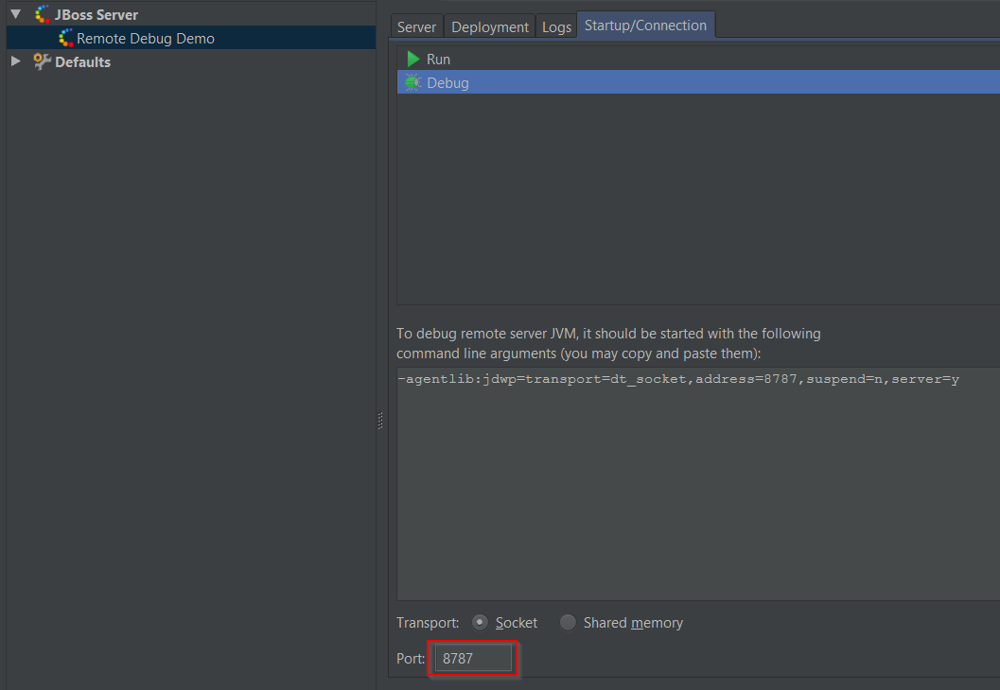
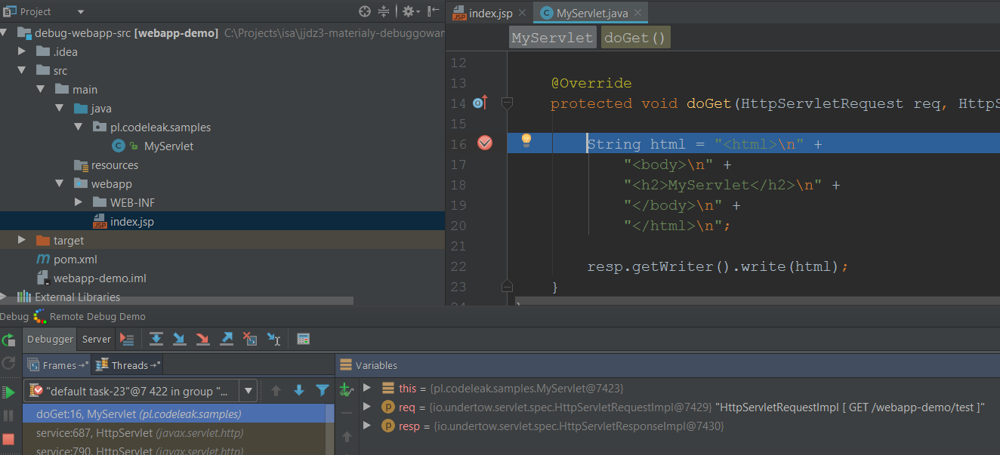
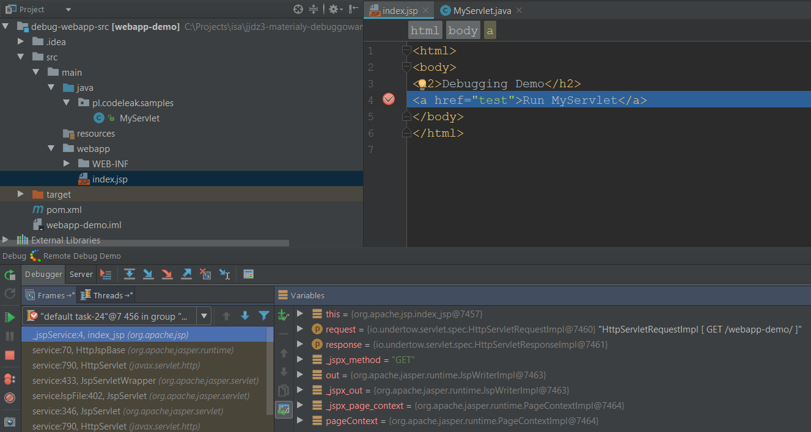

# Remote debugging Wildfly application in IntelliJ

Remote debugging a Java application means connecting to the remotely running application using your local development environment. Java supports remote debugging out of the box: the target application must be executed with `-agentlib:jdwp[=options]` option which loads Java Debug Wire Protocol (jdwp) library that allows remote debugging using for example socket connection. In this short article you will learn how to get started with debugging web application deployed to Wildfly server by using IntelliJ.

## The application

For the demo purposes a very simple application can be used: it contains a single (entry) JSP file and a single Java Servlet:



## Wildfly Application Server

In this sample you can use Wildfly Servlet-Only Distribution. Get it from here: <http://wildfly.org/downloads/>

## Configure Wildfly for remote debugging

Once the server is downloaded and extracted follow the below steps:

- Edit `WILDFLY_HOME/standalone/configuration/standalone.xml` and change the socket binding port for management console from `9990` to `9991` (this can be found in `socket-binding-group` element). With the default port setting you will see an exception while running the server:

```code
ERROR [org.jboss.msc.service.fail] (MSC service thread 1-2) MSC000001: Failed to start service jboss.serverManagement.controller.management.http: org.jboss.msc.service.StartException in service jboss.serverManagement.controller.management.http: java.net.BindException: Address already in use: bind /127.0.0.1:9990
```

- Navigate to `WILDFLY_HOME/bin` and run `standalone.bat` (Windows) or `standalone.sh` (Linux) with `--debug` parameter. This parameter will force the server to run in debug mode hence enables remote debugging. The extra parameters passed to the `JVM` you will notice during the startup in the console:

```
JAVA_OPTS: "-client -Dprogram.name=standalone.bat -Xms64M -Xmx512M -XX:MetaspaceSize=96M -XX:MaxMetaspaceSize=256m -Djava.net.preferIPv4Stack=true -Djboss.modules.system.pkgs=org.jboss.byteman -agentlib:jdwp=transport=dt_socket,address=8787,server=y,suspend=n"
```

The command: `agentlib:jdwp=transport=dt_socket,address=8787,server=y,suspend=n` loads `jwdp` library and listens on port `8787` for the socket connection.

- Deploy the application (e.g. `webapp-demo.war`) by copying the `WAR` file to `WILDFLY_HOME/standalone/deployments`. Verify the application was deployed.

## Remote debugging Wildfly application in IntelliJ

Assuming that the application is running properly, open the source code for this app in IntelliJ to remotely debug it. In order to do so, you need to create a run configuration for the project.

- Open `Run > Edit configurations` and add new configuration. Find `JBoss` on the list of available configurations and select `Remote`. In case application server is not yet configured, please configure it by pointing JBoss home to the directory of your Wildfly installation (`WILDFLY_HOME`):



- Now change some default settings of the configuration and save. Set `Management port` to `9991` in `Server` tab, set `Port` to `8787` in `Startup/Connection` tab for `Debug` configuration:



- Run the debug configuration and wait until IntelliJ connects to Wildfly server.
- Set the breakpoint in the Java Servlet you want to debug (e.g. `MyServlet.java`) or in any of your JSP files and execute the code on the server e.g. by calling a valid servlet URL. Wait for the debugger to hit your breakpoints:





Enjoy remote debugging Wildfly application in IntelliJ!
