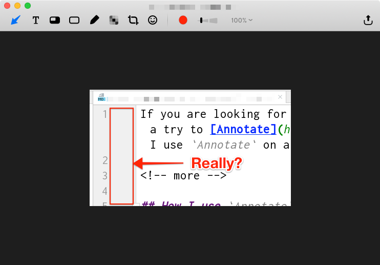
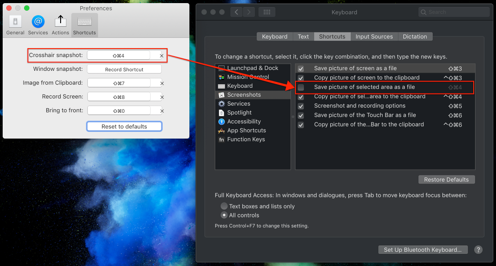
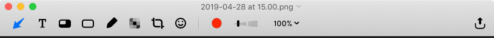

# macOS: Annotate - simple yet productive screenshots tool

After switching from Windows to macOS I was looking for a simple screenshots taking tool to support my daily workflow. The built-in tools offered by macOS are not sufficient for me, mainly because of the image annotating tools and limited keyboard shortcuts support. For couple of days I used [Skitch](https://evernote.com/intl/en/products/skitch), but then I found [Annotate](https://itunes.apple.com/app/annotate-capture-and-share/id918207447?mt=12), a light-weight and simple app with quite good keyboard shortcuts support. In this short blog post, I share how I currently work with `Annotate` app.

> Note: Looking for a powerful screenshots taking tool for Windows? Checkout [Greenshot](../../../2014/12/greenshot-productive-screenshot-tool/index.md).

## Why built-in tool are not sufficient?

What is my usual screenshots workflow?

- Take a screenshot, annotate it quickly with tools like arrow, shape and text, copy to clipboard and paste it anywhere (e.g. Slack, JIRA, e-mail or a document editor)
- Open an image from clipboard, annotate it quickly, copy to clipboard and paste it anywhere

With `Annotate` this is all possible and it can be done pretty quickly with **keyboard shortcuts**.

### Taking screenshots with keyboard shortcuts

In my workflow, I disabled standard macOS `CMD+SHIFT+4` shortcut (`Save picture of selected area as a file`) and set it as `Crosshair snapshot` shortcut in `Annotate`. I also disabled `Windows snapshot` shortcut in `Annotate`, as the crosshair snapshot is powerful enough and provides possibility to select window (just press `spacebar` while in a crosshair mode to capture any window).

My settings:

With the above, I can use standard macOS screenshots shortcuts while having the option to use `Annotate` - after screenshot is taken it won't be saved, but opened by `Annotate`.

> Note: Don't forget to run the tool at login.

### Annotate with keyboard shortcuts

When the screenshot is opened in `Annotate` you can annotate with some basic tools like arrow, text, shape, pencil. You can also blur selected area or you can crop the image.

All of these tools can be accessed with the keyboard shortcuts:

- `A` - arrow
- `T` - text
- `O` - overlay
- `S` - shape
- `P` - pencil
- `C` - crop
- `B` - blur

### Copy to clipboard

One of the most used scenario for me is copying the screenshot to clipboard and pasting it e.g. either to `JIRA` issue or to `Slack` etc. Simply use `CMD+SHIFT+C` to copy the image to clipboard. Of course, with `Annotate` you can save the image to disk as well as include it in the message or email.

> Note: There are issues with external services like Facebook, Twitter or Dropbox at this moment.

### Open from clipboard

If you want to open any image from clipboard with `Annotate` use `CMD+SHIFT+7` shortcut (can be changed in settings). I find this option very useful, as in many cases I copy the image from the website, a chat etc. and then I can quickly open it and annotate.

### Most common workflow for me

1. Create a screenshot:`CMD+SHIFT+4`
2. Add a rectangle using `S`
3. Add an arrow with `A`
4. Add some text with `T`
5. Blur selected part of the screen with `B`
6. Copy the image to clipboard with `CMD+SHIFT+C`
7. Close the window with `CMD+W`

> Note: Using a mouse or trackpad is still required.

## Drawbacks

As I stated earlier, there are issues related to using `Annotate` with external services like `Facebook`, `Twitter` or `Dropbox` and it looks like they may not be addressed by the developers as the app is not actively maintained: last update on `Sep 20, 2016`!

## Summary

I really enjoy using `Annotate` so far and not working integration with external services is not an issue for me at this moment. For sure I keep my eyes opened and if I find something better I may run away from `Annotate`.

## More macOS tips:

[macOS: Preview source code files in Finder with Quick Look plugins](../../../2019/10/macos-preview-source-code-files/index.md)
