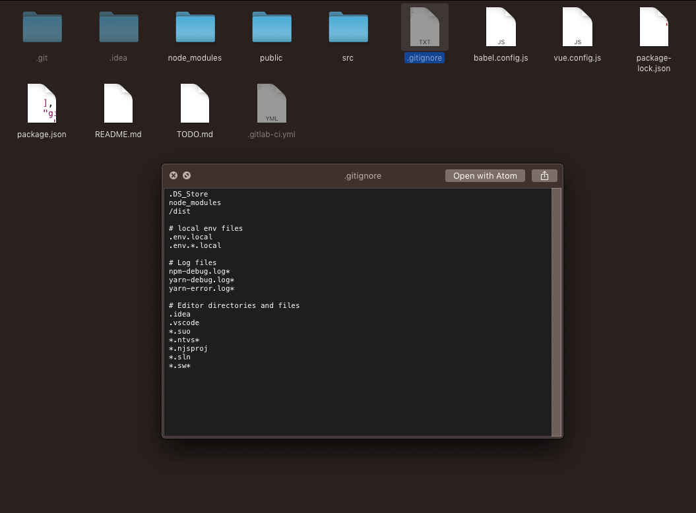
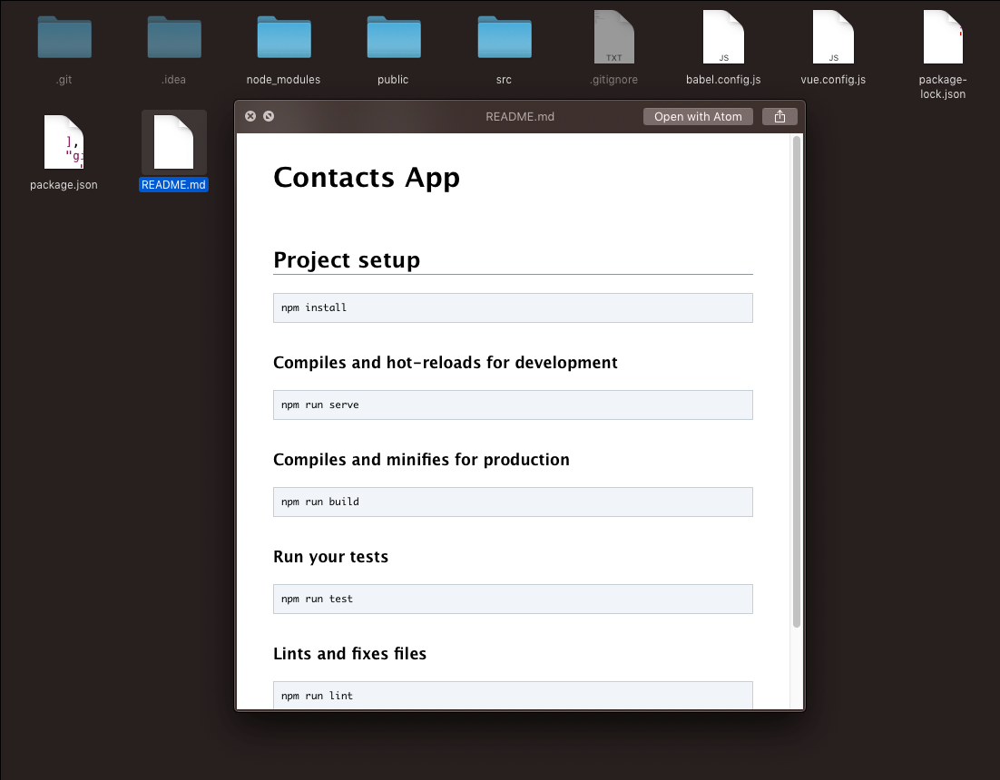
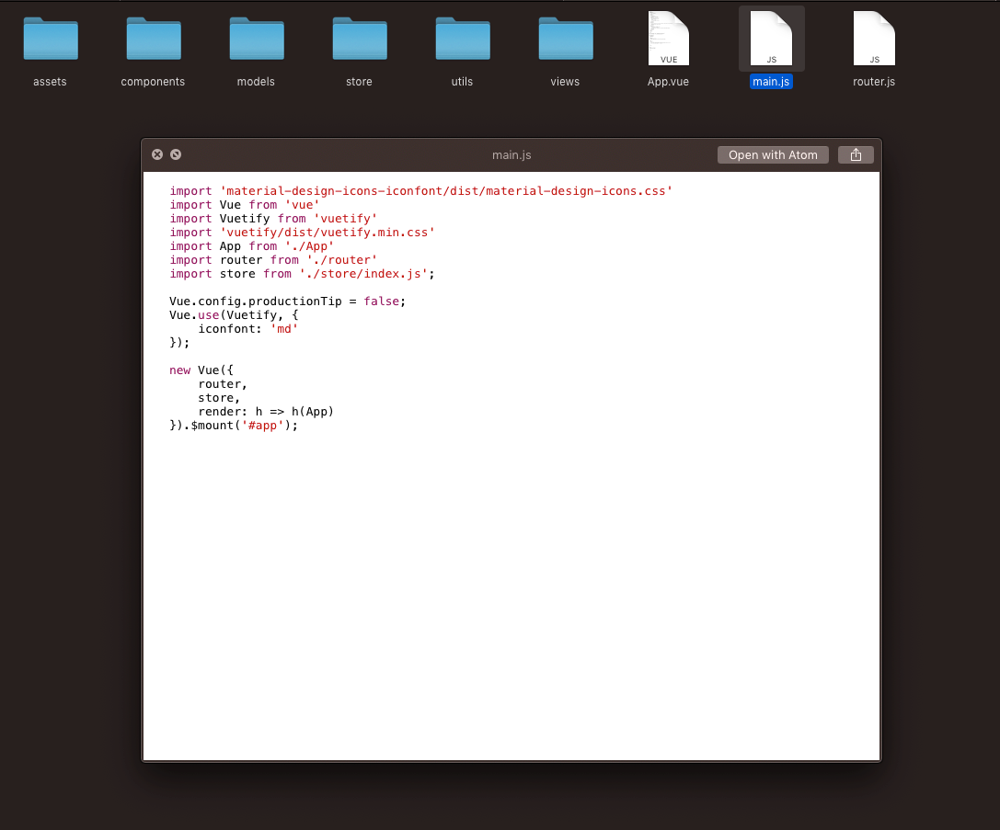
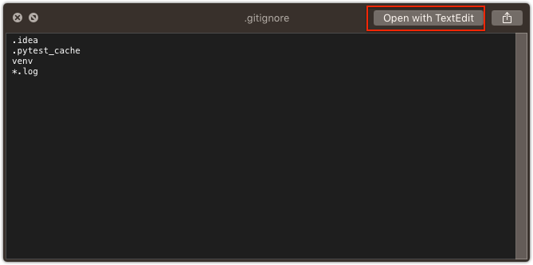
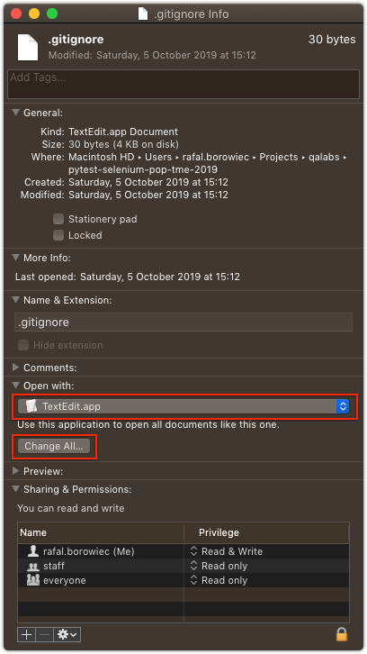

# macOS: Preview source code files in Finder with Quick Look plugins

macOS Finder offers a possibility to preview the files of any type without opening them with *Quick Look*. By default *Quick Look* [supports](https://en.wikipedia.org/wiki/Quick_Look#Supported_file_types_by_default) most commonly used file formats which may not be enough if you are a developer and you want to preview source code files i.e. Java or Python or any other un-common file types.

## Quick Look plugins

*Quick Look* can be extended with plugins to allow previewing the content of any file format. Plugins can also add additional functionality to *Quick Look* like for example syntax highlighting.

The list of freely available *Quick Look* plugins for developers can be found here: <https://github.com/sindresorhus/quick-look-plugins>

The most useful ones from my point of view:

- Preview files with no extension with [QLStephen](https://github.com/whomwah/qlstephen):

  `brew cask install qlstephen`

**Example**: preview `.gitignore`:

- Preview Markdown files in Finder with [QLMarkdown](https://github.com/toland/qlmarkdown):

  `brew cask install qlmarkdown`

**Example**: preview `README.md`:

- Syntax highlighting for source code files with [QLColorCode](https://github.com/anthonygelibert/QLColorCode)

  `brew cask install qlcolorcode`

**Example**: preview `JavaScript` file:

> Note: Are looking for tools to help you being more productive? Read about tools that are essential to me on macOS: [macOS: essential tools for (Java) developer](../../../2020/01/macos-essential-tools-for-java-developer/index.md)

## Tips and Tricks

### *Quick Look* in fullscreen

The default key binding for *Quick Look* is `Spacebar` If you you want to preview the file in fullscreen press `Option+Spacebar`. To leave the fullscreen press `Esc`.

### Change default editor for selected file types

To change the default app for the selected file type (also in *Quick Look*):

1. Select the file in Finder
2. Show file info with `Command+I`
3. Set `Open With` to your application (e.g. Atom)
4. Click `Change All` to apply changes to all files of that type

Now when you for example preview the file with *Quick Look* your default editor will be the one you just selected.

## More macOS tips:

[macOS: essential tools for (Java) developer](../../../2020/01/macos-essential-tools-for-java-developer/index.md)  
[macOS: Annotate - simple yet productive screenshots tool](../../../2019/04/annotate-simple-yet-productive/index.md)
