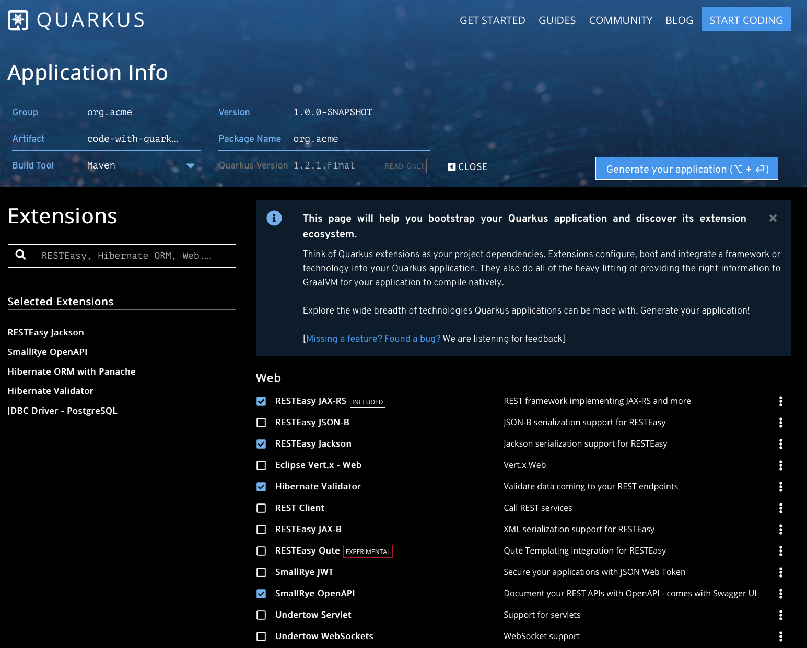
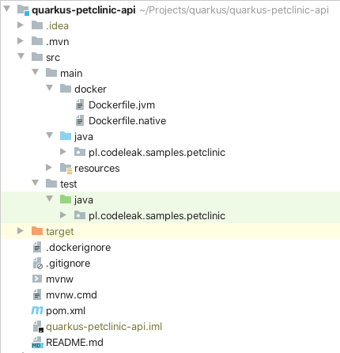
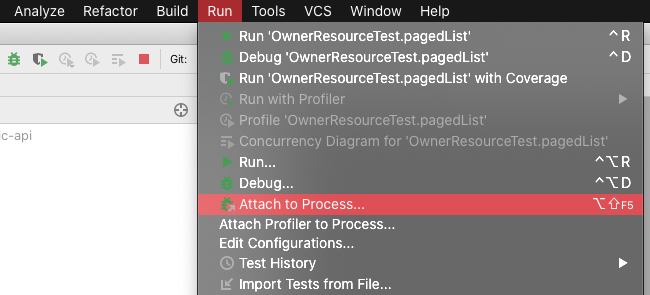
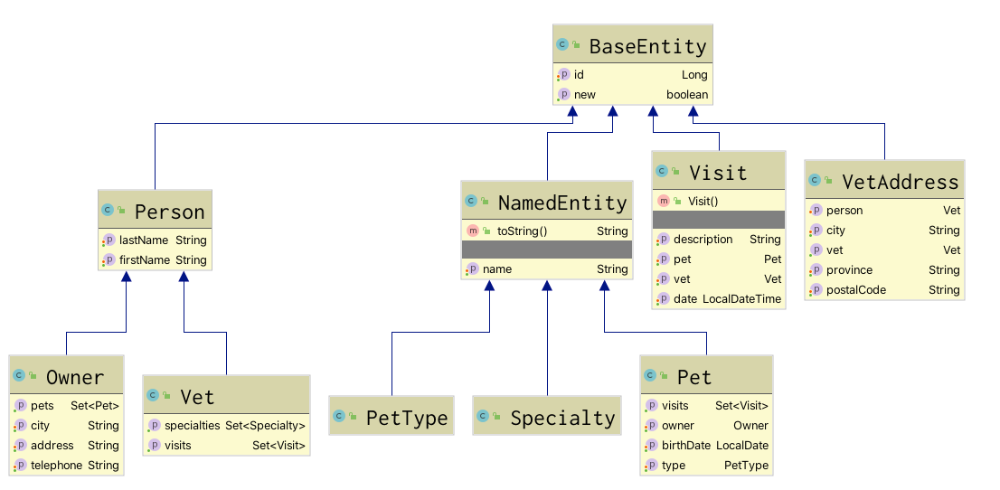
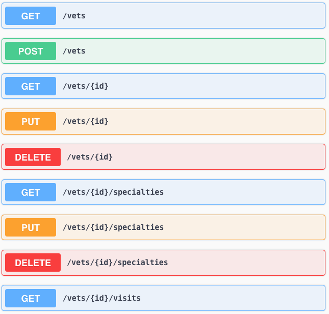

# Getting started with Quarkus - build PetClinic REST API

Quarkus - *A Kubernetes Native Java stack tailored for OpenJDK HotSpot and GraalVM, crafted from the best of breed Java libraries and standards.* - is a container-first framework optimized for fast boot times and low memory consumption. The framework is build on top of many popular Java libraries and it provides support for building standard *REST* as well as *reactive* and *message-driven* microservices. Thanks to the fast startup times and low memory usage Quarkus can also be used to implement functions in serverless environment. Quarkus gives a lot of possibilities to develop apps faster thanks to unified configuration, amazing live reloading features and tooling support.

Learn how to get started with Quarkus and build a PetClinic REST API.

*This blog post covers:*

- Requirements for development environment
- Creating new project
- Developing, building and running the application with Java 11
- Datasource configuration with Postgres and Flyway
- CRUD service with pagination
- Creating integration tests
- Live reload and debugging
- Dockerizing the application (both native and non-native)
- Deploying the application to Elastic Beanstalk

*Revision History*

- 15/03/2020 - deploying the application to Elastic Beanstalk. See detailed descdiption in this blog post: [Deploy Quarkus application to AWS Elastic Beanstalk](../../../2020/03/deploy-quarkus-application-to-elastic-beanstalk/index.md).
- 27/02/2020 - improved test code configuration with Testcontainers based on: [Quarkus tests with Testcontainers and PostgreSQL](../../../2020/02/testcontainers-with-quarkus-tests/index.md).

*Table of Contents*

- [About PetClinic API](#about-petclinic-api)
- [Prerequisities](#prerequisities)
  - [Docker](#docker)
  - [JDK 11 with GraalVM](#jdk-11-with-graalvm)
  - [Terminal](#terminal)
  - [IntelliJ](#intellij)
- [Run PostgreSQL with Docker](#run-postgresql-with-docker)
  - [Dev database](#dev-database)
  - [Prod database](#prod-database)
- [Getting started](#getting-started)
  - [Bootstrap the application](#bootstrap-the-application)
  - [Set Java version to 11 in `pom.xml` as well as in Docker files](#set-java-version-to-11-in-pomxml-as-well-as-in-docker-files)
  - [Run the project in development mode](#run-the-project-in-development-mode)
- [Developing in IntelliJ](#developing-in-intellij)
  - [Debugging](#debugging)
  - [Live Reload](#live-reload)
- [Data source configuration](#data-source-configuration)
  - [Default data source properties (`prod`)](#default-data-source-properties-prod)
  - [Dev data source properties (`dev`)](#dev-data-source-properties-dev)
  - [Test data source properties (`test`)](#test-data-source-properties-test)
- [Flyway migration](#flyway-migration)
- [JPA Entities](#jpa-entities)
- [Hibernate ORM with Panache](#hibernate-orm-with-panache)
- [Creating REST API](#creating-rest-api)
  - [JAX-RS Resources](#jax-rs-resources)
  - [Pagination](#pagination)
  - [Transactions](#transactions)
  - [Validation](#validation)
  - [Java 8 Date & Time support](#java-8-date--time-support)
  - [OpenAPI / Swagger support](#openapi--swagger-support)
- [Integration tests](#integration-tests)
- [Packaging and running the application](#packaging-and-running-the-application)
  - [Create a Docker container that runs the application in JVM mode](#create-a-docker-container-that-runs-the-application-in-jvm-mode)
- [Create native executable](#create-native-executable)
  - [Create a Docker container that runs the application in native mode](#create-a-docker-container-that-runs-the-application-in-native-mode)
- [Deploy to Elastic Beanstalk](#deploy-to-elastic-beanstalk)
  - [Create new application in Elastic Beanstalk console](#create-new-application-in-elastic-beanstalk-console)
  - [Preapare application package](#preapare-application-package)
  - [Upload application to Elastic Beanstalk](#upload-application-to-elastic-beanstalk)
- [Source code](#source-code)
- [See also](#see-also)

## About PetClinic API

I decided to re-use the PetClinic model I used in this blog post [Spring Boot and Spring Data REST](../../../2014/10/exposing-spring-data-repositories-over-rest/index.md).

Basically, it is a basic *CRUD* service for managing an imaginary PetClinic: pets, vets, visits etc.

## Prerequisities

### Docker

Docker will be used for running the dockerized version of the service itself but it will be also used to run the *PostgreSQL* server.

### JDK 11 with GraalVM

The PetClinic API will be built with Java 11 therefore JDK 11 must be installed. For building native executables GraalVM 19.3+ must be present and since it is build on top of OpenJDK 11 this will be the best choice for this tutorial. The easiest way to install (and manage multiple versions of) Java SDKs is with SDKMAN!

> Learn how to [manage multiple Java SDKs with SDKMAN! with ease](../../../2020/01/manage-multiple-java-sdks-with-sdkman/index.md)

To support native images, make sure to install all needed dependencies. More info can be found in the GraalVM documentation: <https://www.graalvm.org/docs/reference-manual/native-image/>

> GraalVM official documentation: [GraalVM](https://www.graalvm.org/docs/getting-started/)

### Terminal

The service was developed on macOS with *iTerm2* and *oh-my-zsh*. I also use *httpie* as my default HTTP client.

### IntelliJ

My prefered IDE is IntelliJ and I used this while working on this project.

> Learn more about the tools I used on macOS in this article: [macOS: essential tools for (Java) developer](../../../2020/01/macos-essential-tools-for-java-developer/index.md)

## Run PostgreSQL with Docker

The application will connect to Postgres server and depending on the profile (`dev`, `test`, `prod`) different configuration will be applied. For `dev` and `prod` profiles we will need servers to be running: each with different database name, port and credentials. For `test` profile, that is used in tests, we will use Testcontainers.

### Dev database

- Create and run the container:

```
$ docker run --name petclinic-db-dev -p 5433:5432 -e POSTGRES_DB=petclinic-dev -e POSTGRES_USER=petclinic-dev -e POSTGRES_PASSWORD=petclinic-dev -d postgres:alpine
```

- Run previously stopped container:

```
$ docker start petclinic-db-dev
```

### Prod database

- Create and run the container:

```
$ docker run --name petclinic-db -p 5432:5432 -e POSTGRES_DB=petclinic -e POSTGRES_USER=petclinic -e POSTGRES_PASSWORD=petclinic -d postgres:alpine
```

- Run previously stopped container:

```
$ docker start petclinic-db
```

## Getting started

### Bootstrap the application

You can bootstrap the application using *Maven* in command line or you can use the online generator. The online generator allows exploring the extensions and technologies that Quarkus application can be made of and it does not require local *Maven* installation. You can access the generator here: <https://code.quarkus.io>

The following extensions are needed to build PetClinic API service:

- **RESTEasy JAX-RS** - REST framework implementing JAX-RS and more
- **RESTEasy Jackson** - Jackson serialization support for RESTEasy
- **SmallRye OpenAPI** - Document your REST APIs with OpenAPI - comes with Swagger UI
- **Hibernate ORM with Panache** - Define your persistent model in Hibernate ORM with Panache
- **Hibernate Validator** - Validate data coming to your REST endpoints
- **JDBC Driver - PostgreSQL** - PostgreSQL database connector
- **Flyway** - Handle your database schema migrations



Once the dependencies are selected, you can download the zip, extract it and start developing the service.

The downloaded project has a standard *Maven* project layout. It contains the *Maven Wrapper* so no local *Maven* installation is required to develop the project. You will also notice `src/main/docker` with Docker files for both native and JVM image.

The main configuration file - `application.properties` - is located in `src/main/resources`. This folder also holds `META-INF/resources` folder for static resources of the application, like `index.html` file.

### Set Java version to 11 in `pom.xml` as well as in Docker files

The online generator generates project with Java 8 by default, so in order to use Java 11 some adjustments are needed.

- In `pom.xml` of the generated project change the Java version:

```xml
    <maven.compiler.source>11</maven.compiler.source>
    <maven.compiler.target>11</maven.compiler.target>
```

- In `src/main/docker/Dockerfile.jvm` set `ARG JAVA_PACKAGE=java-11-openjdk-headless`

### Run the project in development mode

Once the changes are made you can start the application. Open your terminal, navigate to project’s folder and run the following command:

```
$ ./mvnw compile quarkus:dev
```

> Note: Quarkus has three buit-in modes: `dev`, `test` and `prod` depending on how you run the application.

## Developing in IntelliJ

In IntelliJ you simply open the project’s folder or the `pom.xml`. (`File > Open`). The project can be started only with *Maven*. This can be done with *Maven* run configurations as there is no *main* class to start the application like for example in *Spring Boot*.



For me the best expierience while developing with Quarkus was when I was running the application in the terminal, outside the IntelliJ.

### Debugging

When Quarkus application is executed in *dev* mode it starts with the debug protocol enabled (on port 5005). To debug Quarkus application in IntelliJ you need to attach a debugger to a running proces via `Run > Attach to Process`. I had no troubles with debugging the application.


> Note: You can run the application in a dev mode with debugging disabled: `./mvnw quarkus:dev -Ddebug=false`, but honestly I did not notice any performance issues with debugger enabled by default.

### Live Reload

Live reload is one of the coolest features of Quarkus in my opinion. It works amazing. Basically you can change anything you want in the source code, execute the request and the application re-loads in a blink of an eye. I was refacoring classes and packages, moving files around, adding and removing endpoints and all of this with no single restart.

## Data source configuration

All properties go to `src/main/resources/application.properties`.

### Default data source properties (`prod`)

```
quarkus.datasource.url=jdbc:postgresql://localhost:5432/petclinic
quarkus.datasource.driver=org.postgresql.Driver
quarkus.datasource.username=petclinic
quarkus.datasource.password=petclinic
```

### Dev data source properties (`dev`)

To set mode (or profile) specific properties use the `%mode`:

```
%dev.quarkus.datasource.url=jdbc:postgresql://localhost:5433/petclinic-dev
%dev.quarkus.datasource.username=petclinic-dev
%dev.quarkus.datasource.password=petclinic-dev
```

### Test data source properties (`test`)

We will use Testcontainers in our tests. In order to do so, add the following dependencies to the `pom.xml`:

```xml
<properties>
    <testcontainers.version>1.12.5</testcontainers.version>
</properties>

<dependency>
    <groupId>org.testcontainers</groupId>
    <artifactId>testcontainers</artifactId>
    <version>${testcontainers.version}</version>
    <scope>test</scope>
</dependency>
<dependency>
    <groupId>org.testcontainers</groupId>
    <artifactId>postgresql</artifactId>
    <version>${testcontainers.version}</version>
    <scope>test</scope>
</dependency>
```

Add the following configuration properties to the `application.properties`:

```
# Tests with Testcontainers

# initializes container for driver initialization
%test.quarkus.datasource.driver=org.testcontainers.jdbc.ContainerDatabaseDriver
# dialect must be set explicitly
%test.quarkus.hibernate-orm.dialect=org.hibernate.dialect.PostgreSQL9Dialect
# Testcontainers JDBC URL
%test.quarkus.datasource.url=jdbc:tc:postgresql:latest:///petclinic
%test.quarkus.datasource.username=petclinic
%test.quarkus.datasource.password=petclinic
```

Learn more on how to use Testcontainers in Quarkus tests in this blog post: [Quarkus tests with Testcontainers and PostgreSQL](../../../2020/02/testcontainers-with-quarkus-tests/index.md)

> See also: <https://quarkus.io/guides/datasource>

## Flyway migration

To utilize Flyway create `db/migration` folder in `src/main/resources` and add you migration files. My first migration file is called `V1.0.0__PetClinic.sql` and it contains all the schema (DDL) and the sample data for the service.

> Note: Quarkus supports SQL import that can be configured via `quarkus.hibernate-orm.sql-load-script` for each profile, but I could not make it work. See the issue I reported on Github: <https://github.com/quarkusio/quarkus/issues/7358>

> See also: <https://quarkus.io/guides/flyway>

## JPA Entities

The PetClinic’s domain model is relatively simple, but it consists of some unidirectional and bi-directional associations, as well as basic inheritance which makes it a bit better than simple *Hello World* kind of model.



Please note that in this example the JPA entities are returned directly in JAX-RS resources by corresponding *Panache* repositories (see below), therefore entities classes contain a mix of JPA and Jackson annotations.

For example:

```java
@Entity
@Table(name = "visits")
public class Visit extends BaseEntity {

    @Column(name = "visit_date")
    @JsonFormat(pattern = "yyyy/MM/dd HH:mm")
    private LocalDateTime date;

    @NotEmpty
    @Column(name = "description")
    private String description;

    @ManyToOne
    @JoinColumn(name = "pet_id")
    private Pet pet;

    @ManyToOne
    @JoinColumn(name = "vet_id")
    private Vet vet;

    public Visit() {
        this.date = LocalDateTime.now();
    }
}

@Entity
@Table(name = "vets",
        uniqueConstraints =
        @UniqueConstraint(columnNames = {"first_name", "last_name"})
)
public class Vet extends Person {

    @ManyToMany(fetch = FetchType.EAGER)
    @JoinTable(name = "vet_specialties", joinColumns = @JoinColumn(name = "vet_id"),
            inverseJoinColumns = @JoinColumn(name = "specialty_id"))
    @JsonIgnore
    private Set<Specialty> specialties;

    @OneToMany(cascade = CascadeType.ALL, mappedBy = "vet", fetch = FetchType.EAGER)
    @JsonIgnore
    private Set<Visit> visits;
}
```

> All the entities are located in [`pl.codeleak.samples.petclinic.model`](https://github.com/kolorobot/quarkus-petclinic-api/tree/master/src/main/java/pl/codeleak/samples/petclinic/model) package.

## Hibernate ORM with Panache

If you are familiar with Spring, I guess you have heard of Spring Data project. [Hibernate ORM with Panache](https://quarkus.io/guides/hibernate-orm-panache) has similar goal in my opinion: it simplifies JPA development by removing the need of doing repeative and tedious work. Panache supports sorting, pagination, `java.util.Optional` and `java.utitl.stream.Stream` etc.

You have two approaches to work with Panache: creating entities with `PanacheEntity` or creating repositories with `PanacheRepository`. I tried both approaches in this project, but due to some issues with inheritance in entities I decided to stick to *old-fashioned* way.

A basic repository definition with Hibernate ORM with Panache:

```java
public class OwnerRepository implements PanacheRepository<Owner> {
    List<Owner> findByLastName(String lastName) {
        return list("lastName", lastName);
    }
}
```

> All the repositories are located in [`pl.codeleak.samples.petclinic.repository`](https://github.com/kolorobot/quarkus-petclinic-api/tree/master/src/main/java/pl/codeleak/samples/petclinic/repository) package.

> See also: <https://quarkus.io/guides/hibernate-orm-panache>

## Creating REST API

### JAX-RS Resources

Quarkus utilizes JAX-RS with RESTEasy. To create API endpoints we need to create JAX-RS resources:

```java
@Path(OwnerResource.RESOURCE_PATH)
@Produces(MediaType.APPLICATION_JSON)
public class OwnerResource {

    public static final String RESOURCE_PATH = "/owners";

    @Context
    UriInfo uriInfo;

    @Inject
    OwnerRepository ownerRepository;

    @Inject
    PetRepository petRepository;

    @GET
    public Response getAll(@BeanParam PageRequest pageRequest) {
        
    }

    @GET
    @Path("{id}")
    public Response getOne(@PathParam("id") Long id) {

    }

    @GET
    @Path("{id}/pets")
    public List<Pet> getPets(@PathParam("id") Long id) {
    
    }

    @POST
    @Consumes(MediaType.APPLICATION_JSON)
    @Transactional
    public Response create(@Valid Owner owner) {
    
    }
}
```

Dependency injection is done with *CDI - Context and Dependency Injection*. The resource objects will be automatically configured by Quarkus. All other dependencies must be configured for dependency injection with CDI annotations.

For example, the repositories can be annotated with `@ApplicationScoped` and then injected with `@Inject`:

```java
@ApplicationScoped
public class OwnerRepository implements PanacheRepository<Owner> {
    List<Owner> findByLastName(String lastName) {
        return list("lastName", lastName);
    }
}

@ApplicationScoped
public class PetRepository implements PanacheRepository<Pet> {

}
```

> All the resources are located in [`pl.codeleak.samples.petclinic.api`](https://github.com/kolorobot/quarkus-petclinic-api/tree/master/src/main/java/pl/codeleak/samples/petclinic/api) package.

> See also: <https://quarkus.io/guides/cdi-reference>

### Pagination

As mentioned earlier, Panache provides support for paginated results. We can easily utilize this in our resources easily:

```java
@GET
public Response getAll(@BeanParam PageRequest pageRequest) {
    return Response.ok(((PanacheRepository) petRepository).findAll()
                    .page(Page.of(pageRequest.getPageNum(), pageRequest.getPageSize()))
                    .list()).build();
}
```

The `PageRequest` is a bean that holds the `pageNum` and `pageSize` query parameters:

```java
public class PageRequest {

    @QueryParam("pageNum")
    @DefaultValue("0")
    private int pageNum;

    @QueryParam("pageSize")
    @DefaultValue("10")
    private int pageSize;

}
```

Executing paginated request can be done easily with httpie:

```
$ http get :8080/owners pageNum==0 pageSize==2

HTTP/1.1 200 OK
Content-Length: 250
Content-Type: application/json

[
    {
        "address": "110 W. Liberty St.",
        "city": "Madison",
        "firstName": "George",
        "id": 1,
        "lastName": "Franklin",
        "telephone": "6085551023"
    },
    {
        "address": "638 Cardinal Ave.",
        "city": "Sun Prairie",
        "firstName": "Betty",
        "id": 2,
        "lastName": "Davis",
        "telephone": "6085551749"
    }
]
```

### Transactions

Creating a new object in JPA requires an active transaction. In order to bind the transaction to current method in a resource object use `@Transactional`, otherwise an exception will be thrown during the execution of the method:

```java
@POST
@Consumes(MediaType.APPLICATION_JSON)
@Transactional
public Response create(@Valid Owner owner) {

    ownerRepository.persist(owner);

    var location = uriInfo.getAbsolutePathBuilder()
            .path("{id}")
            .resolveTemplate("id", owner.getId())
            .build();

    return Response.created(location).build();
}
```

Create new resource with httpie:

```
$ http post :8080/owners <<< '
{
    "address": "110 W. Liberty St.",
    "city": "Madison",
    "firstName": "George",
    "lastName": "Franklin",
    "telephone": "6085551023"
}'

HTTP/1.1 201 Created
Content-Length: 0
Location: http://localhost:8080/owners/1042
```

### Validation

The project uses Hibernate Validator extension. With this extension you can use standard Hibernate validation annotations (e.g. `@NotBlank`) and when the input parameter to the resource methods is annotated with `@Valid` the validation will be automatically triggerred and an error response will be returned to the client calling that method.

Example response for the following request:

```
$ http post :8080/owners <<< '{}'

HTTP/1.1 400 Bad Request
Content-Length: 626
Content-Type: application/json
validation-exception: true

{
    "classViolations": [],
    "exception": null,
    "parameterViolations": [
        {
            "constraintType": "PARAMETER",
            "message": "must not be empty",
            "path": "create.owner.address",
            "value": ""
        },
        
        ...

        {
            "constraintType": "PARAMETER",
            "message": "must not be empty",
            "path": "create.owner.telephone",
            "value": ""
        }
    ],
    "propertyViolations": [],
    "returnValueViolations": []
}
```

> Note on live reload fumctionality: you can make any change to the source code and execute new request with httpie. The application reloads quickly and you get immediate results. No restarts are needed.

> See also: <https://quarkus.io/guides/validation>

### Java 8 Date & Time support

`java.util.time` types are supported during JSON serialization and deserialization when the RESTEasy Jackson extension is in the project.

In the below example a visit date with be serialized and deserialized in the format provided by `@JsonFormat` annotation:

```java
@Entity
@Table(name = "visits")
public class Visit extends BaseEntity {

    @Column(name = "visit_date")
    @JsonFormat(pattern = "yyyy/MM/dd HH:mm")
    private LocalDateTime date;

}
```

Check how date is serialized using htppie:

```
$ http get :8080/visits/1

HTTP/1.1 200 OK
Content-Length: 174
Content-Type: application/json

{
    "date": "2013/01/01 00:00",
    "description": "rabies shot",
    "id": 1,
    "pet": {
        "birthDate": "2012/09/04",
        "id": 7,
        "name": "Samantha"
    },
    "vet": {
        "firstName": "Helen",
        "id": 2,
        "lastName": "Leary"
    }
}
```

You can also store the visit using the required datetime format in the request body:

```
$ http post :8080/visits <<< ' 
{
    "date": "2020/01/01 00:00",
    "description": "lorem ipsum",
    "pet": {
        "id": 7
    },
    "vet": {
        "id": 2
    }
}'

HTTP/1.1 201 Created
Content-Length: 0
Location: http://localhost:8080/visits/1042
```

### OpenAPI / Swagger support

SmallRye OpenAPI extension takes care of providing API documentation and SwaggerUI is enabled in the dev mode.

The default endpoints are:

- OpenAPI documentaion - `/openapi`
- SwaggerUI - `/swaggerui`


> See also: <https://quarkus.io/guides/openapi-swaggerui>

## Integration tests

Quarkus uses JUnit 5 and RESTAssured for integration testing. Tests can be created using `@QuarkusTest` annotations and they are executed with `test` profile active by default.

```java
@QuarkusTest
public class PetResourceTest {

    @Test
    public void pagedList() {
        given()
                .when().get("/pets?pageNum=0&pageSize=2")
                .then()
                .statusCode(200)
                .body(
                        "$.size()", is(2),
                        "name", containsInAnyOrder("Leo", "Basil")
                );
    }
}
```

Quarkus tests require the application to be running. There are possibilities to replace selected beans in test by using CDI `@Alternate` beans definitions. The alternate beans must be placed in `src/test/java`.

> Note: Thanks to the profiles support you can easily configure the datasource for the `test` profile with a seperate database container. See [Test data source properties](#test-data-source-properties-test).

> See also: <https://quarkus.io/guides/getting-started-testing>

## Packaging and running the application

The application can be packaged `./mvnw package`.

It produces the executable `quarkus-petclinic-api-1.0.0-runner.jar` file in `/target` directory with the dependencies are copied into the `target/lib` directory.

```
[INFO] [io.quarkus.deployment.pkg.steps.JarResultBuildStep] Building thin jar: /Users/rafal.borowiec/Projects/quarkus/quarkus-petclinic-api/target/quarkus-petclinic-api-1.0.0-runner.jar
[INFO] [io.quarkus.deployment.QuarkusAugmentor] Quarkus augmentation completed in 1888ms
[INFO] ------------------------------------------------------------------------
[INFO] BUILD SUCCESS
[INFO] ------------------------------------------------------------------------
[INFO] Total time:  15.868 s
[INFO] Finished at: 2020-02-23T19:18:25+01:00
[INFO] ------------------------------------------------------------------------
```

The application is now runnable using `java -jar target/quarkus-petclinic-api-1.0.0-runner.jar`.

```
2020-02-23 19:19:10,169 INFO  [io.quarkus] (main) quarkus-petclinic-api 1.0.0 (running on Quarkus 1.2.1.Final) started in 2.011s. Listening on: http://0.0.0.0:8080
2020-02-23 19:19:10,171 INFO  [io.quarkus] (main) Profile prod activated.
2020-02-23 19:19:10,171 INFO  [io.quarkus] (main) Installed features: [agroal, cdi, flyway, hibernate-orm, hibernate-orm-panache, hibernate-validator, jdbc-postgresql, narayana-jta, rest-client, resteasy, resteasy-jackson, smallrye-openapi]
```

> Note: The *uber-jar* can be packaged with `./mvnw clean package -DskipTests=true -Dquarkus.package.uber-jar=true`

### Create a Docker container that runs the application in JVM mode

```
$ ./mvnw clean package
$ docker build -f src/main/docker/Dockerfile.jvm -t quarkus/petclinic-api-jvm .

Successfully built 1a5d963fedfa
Successfully tagged quarkus/petclinic-api-jvm:latest
```

Run the container with a link do the Postgres database container and override the datasource url with environment variable:

```
$ docker run -i --rm -p 8080:8080 --link petclinic-db -e QUARKUS_DATASOURCE_URL='jdbc:postgresql://petclinic-db/petclinic' quarkus/petclinic-api-jvm

2020-02-23 20:39:18,949 INFO  [io.quarkus] (main) quarkus-petclinic-api 1.0.0 (running on Quarkus 1.2.1.Final) started in 3.475s. Listening on: http://0.0.0.0:8080
2020-02-23 20:39:18,949 INFO  [io.quarkus] (main) Profile prod activated.
2020-02-23 20:39:18,949 INFO  [io.quarkus] (main) Installed features: [agroal, cdi, flyway, hibernate-orm, hibernate-orm-panache, hibernate-validator, jdbc-postgresql, narayana-jta, rest-client, resteasy, resteasy-jackson, smallrye-openapi
```

> Note: `petclinic-db` is a name of the Postgres container created here: [Prod database](#prod-database). We also need to pass the datasource url. Read more about overriding the configuration properties at runtime: [Overriding properties at runtime](https://quarkus.io/guides/config#overriding-properties-at-runtime)

## Create native executable

You can create a native executable using the following command:

```
$ ./mvnw package -Pnative

[INFO] [io.quarkus.deployment.pkg.steps.NativeImageBuildStep] Building native image from /Users/rafal.borowiec/Projects/quarkus/quarkus-petclinic-api/target/quarkus-petclinic-api-1.0.0-native-image-source-jar/quarkus-petclinic-api-1.0.0-runner.jar

...

[quarkus-petclinic-api-1.0.0-runner:50503]   (typeflow):  72,535.72 ms
[quarkus-petclinic-api-1.0.0-runner:50503]    (objects):  49,325.68 ms
[quarkus-petclinic-api-1.0.0-runner:50503]   (features):   3,115.04 ms
[quarkus-petclinic-api-1.0.0-runner:50503]     analysis: 135,220.10 ms
[quarkus-petclinic-api-1.0.0-runner:50503]     (clinit):   1,966.77 ms
[quarkus-petclinic-api-1.0.0-runner:50503]     universe:   6,919.51 ms
[quarkus-petclinic-api-1.0.0-runner:50503]      (parse):  13,679.33 ms
[quarkus-petclinic-api-1.0.0-runner:50503]     (inline):  18,193.40 ms
[quarkus-petclinic-api-1.0.0-runner:50503]    (compile):  70,849.75 ms
[quarkus-petclinic-api-1.0.0-runner:50503]      compile: 111,062.75 ms
[quarkus-petclinic-api-1.0.0-runner:50503]        image:   8,843.46 ms
[quarkus-petclinic-api-1.0.0-runner:50503]        write:   1,789.58 ms
[quarkus-petclinic-api-1.0.0-runner:50503]      [total]: 282,727.03 ms
[INFO] [io.quarkus.deployment.QuarkusAugmentor] Quarkus augmentation completed in 287304ms
[INFO] ------------------------------------------------------------------------
[INFO] BUILD SUCCESS
[INFO] ------------------------------------------------------------------------
[INFO] Total time:  04:58 min
[INFO] Finished at: 2020-02-23T19:25:10+01:00
[INFO] ------------------------------------------------------------------------
```

The process of creating the native executable takes quite some time but it is worth waiting for it to finish to see the startup time of application:

```
$ ./target/quarkus-petclinic-api-1.0.0-runner

2020-02-23 19:26:03,959 INFO  [io.quarkus] (main) quarkus-petclinic-api 1.0.0 (running on Quarkus 1.2.1.Final) started in 0.066s. Listening on: http://0.0.0.0:8080
2020-02-23 19:26:03,959 INFO  [io.quarkus] (main) Profile prod activated.
2020-02-23 19:26:03,959 INFO  [io.quarkus] (main) Installed features: [agroal, cdi, flyway, hibernate-orm, hibernate-orm-panache, hibernate-validator, jdbc-postgresql, narayana-jta, rest-client, resteasy, resteasy-jackson, smallrye-openapi]
```

0.67 seconds for native executable to start comparing to 2 seconds for the JVM version.

### Create a Docker container that runs the application in native mode

By default, the native executable is created in the format supported by your operating system. Because the container may not use the same executable format as the one produced by your operating system, Maven build can produce an executable from inside a container:

```
$ ./mvnw package -Pnative -Dquarkus.native.container-build=true
```

To adjust the version of the builder image you need to set `quarkus.native.builder-image` property:

```
$ ./mvnw clean package -Pnative -DskipTests=true -Dquarkus.native.container-build=true -Dquarkus.native.builder-image=quay.io/quarkus/ubi-quarkus-native-image:20.0.0-java11
```

And now, build and run the container:

```
$ docker build -f src/main/docker/Dockerfile.native -t quarkus/petclinic-api .

$ docker run -i --rm -p 8080:8080 quarkus/petclinic-api
```

> Note: More on building native executables can be found in the Quarkus documentation: <https://quarkus.io/guides/building-native-image>

## Deploy to Elastic Beanstalk

### Create new application in Elastic Beanstalk console

> If you’re not already an AWS customer, you need to create an AWS account. Signing up enables you to access Elastic Beanstalk and other AWS services that you need.

- Open the Elastic Beanstalk console using this link: [https://us-west-2.console.aws.amazon.com/elasticbeanstalk/home?region=us-west-2#/gettingStarted?applicationName=Pet Clinic API](https://us-west-2.console.aws.amazon.com/elasticbeanstalk/home?region=us-west-2#/gettingStarted?applicationName=Pet%20Clinic%20API)
- For the `Platform` choose `Docker`
- For the `Application Code` choose `Sample Application`
- Select `Configure more options`
  - Find `Database` on the list and click `Modify`
  - For `Engine` choose `postgres`
  - For `Engine version` choose `11.6`
  - Set `username` and `password` of your choice
  - For `Retention` choose `Delete` if you don’t snaphost to be created.
  - Click `Save`.
- Click `Create app`

Elastic Beanstalk will create the sample application for you with all required resources (including RDS).

The link to the application will be visible to you once the application is created.

### Preapare application package

```
./mvnw clean package assembly:single -Dquarkus.package.uber-jar=true
```

The above command creates the package with the following contents:

```
$ unzip -l target/quarkus-petclinic-api-1.0.1-eb.zip

Archive:  target/quarkus-petclinic-api-1.0.1-eb.zip
  Length      Date    Time    Name
---------  ---------- -----   ----
        0  03-15-2020 13:35   config/
     2059  03-15-2020 13:34   Dockerfile
      369  03-15-2020 13:34   config/application.properties
 38604205  03-15-2020 13:35   quarkus-petclinic-api-1.0.1-runner.jar
---------                     -------
 38606633                     4 files
```

### Upload application to Elastic Beanstalk

- Upload the package using Elastic Beanstalk console
  - Navigate to <https://console.aws.amazon.com/elasticbeanstalk>
  - Navigate to the application dashboard
  - Click `Upload and Deploy`
  - Select the package create in the previous step and click `Deploy`
  - Wait for the application to be deployed

That’s it. If you want to know more how this is configured, see my blog post: [Deploy Quarkus application to AWS Elastic Beanstalk](../../../2020/03/deploy-quarkus-application-to-elastic-beanstalk/index.md)

## Source code

The source code for this article can be found on Github: <https://github.com/kolorobot/quarkus-petclinic-api>

## See also

- [Quarkus tests with Testcontainers and PostgreSQL](../../../2020/02/testcontainers-with-quarkus-tests/index.md)
- [Deploy Quarkus application to AWS Elastic Beanstalk](../../../2020/03/deploy-quarkus-application-to-elastic-beanstalk/index.md)
