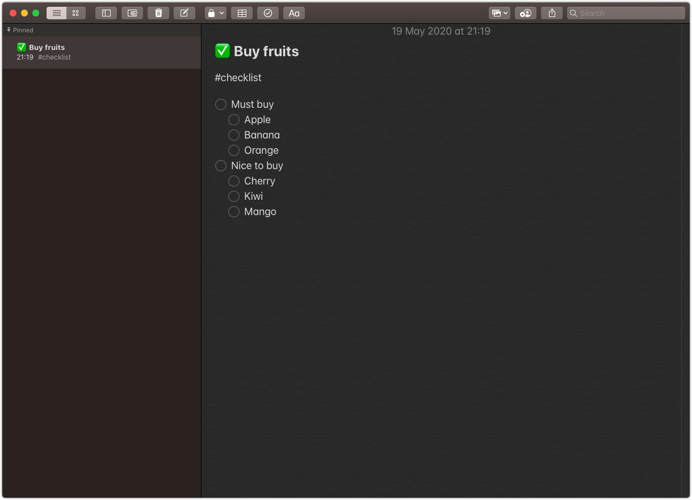
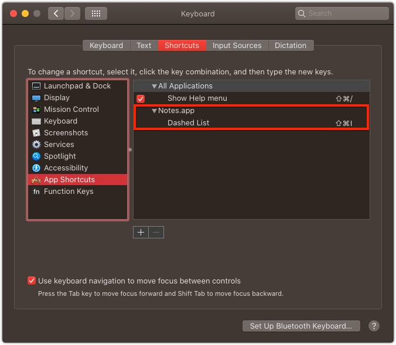
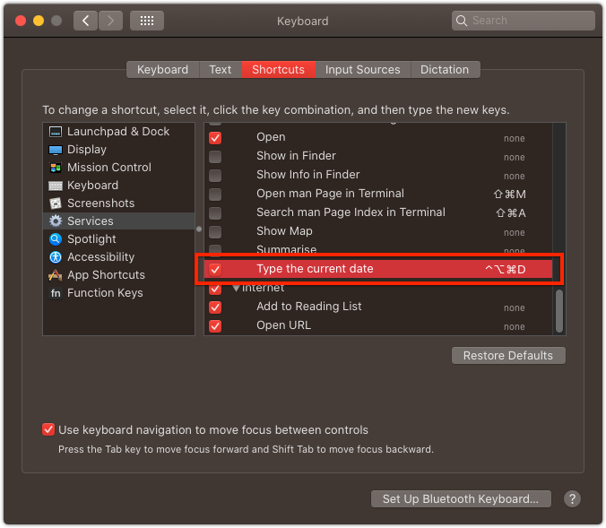
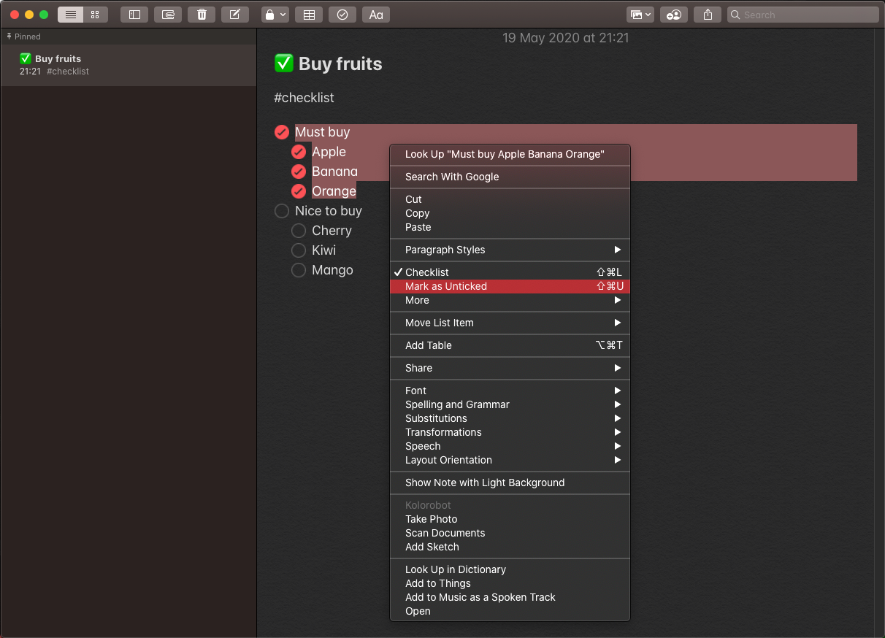

# macOS - Notes app tips that may improve your daily workflow

After switching from Windows to macOS in 2019 I also changed my default note taking app from OneNote to macOS built-in Notes.app. I wasn't sure this is the right move, so I switched gradually with carefully selected topics only. But after several weeks of using both OneNote and Notes app I switched fully and after using Notes for several months now I would like to share some of my tips I find useful in my daily workflow.

Note: This blog post is focused on macOS version of the app as I use it most of the time.

## Changes

- *2023-02* - Minimal adjustments.

*Table of Contents*

- [Organizing with folders](#organizing-with-folders)
- [Pinning notes](#pinning-notes)
- [Browsing notes](#browsing-notes)
- [Shortcuts](#shortcuts)
  - [Dashed list shortcut](#dashed-list-shortcut)
  - [Insert current date shortcut](#insert-current-date-shortcut)
- [Checklists](#checklists)
- [Image resize](#image-resize)
- [Features I lack](#features-i-lack)
- [Summary](#summary)
- [See also](#see-also)

# Organizing with folders

*Folders* - folder allow better organization of the notes and basically they can be freely nested. My folder structure is relatively simple, as I have just three top-level folders (apart from default *All iCloud*, *Notes* and *Recently Deleted*):

- *Work* - work related notes, split into sub-folders.
- *Personal* - personal related notes, split in several sub-folders related to different projects I am engaged with.
- *Archive* - this is the place I move unneeded or not relevant notes. The only disadvantage with *Archive* folder is that if I search globally I also get results from this one.

> Tip: Global search shortcut: `⌘+⌥+F`

# Pinning notes

In several top-level folders I have pinned some notes, mostly those notes are either my checlists (e.g. daily routine), my goals or any other important notes I want to be on top. Usually, when I pin a note in a folder, I start the note title with the emoji which improves browsing the notes and make the note list look more appealing (I don't use the gallery view of notes as the classical list view reads faster to me).



> Tip: Emoji browser shortcut: `⌘+⌃+␣`. It you start a note with the body, use `⌘+T` to insert the title and add emojii in front of the title.

# Browsing notes

I browse and read (or scan) my note **every day**. I do it always when I plan my week or my day. For that reason, my default note sorting is by **date edited**. This setting can be adjusted in *Settings*.

> Tip: You can override default sorting for individual folders.

I also use the top-level *All iCloud* folder as it gives me quick overview of all notes, from all my folders sorted by modfied date.

When I found irrelevant notes, I delete immediately, if I find outdated and not important anymore notes - I move them to the *Archive* folder. My rule of a thumb is to have as little active as possible.

# Shortcuts

Learn and use the shortcuts. Period.

I use shortcuts a lot, mostly for formatting text, working with lists and checklists, searching, creating and deleting notes.

## Dashed list shortcut

I needed a shortcut for creating a dashed list so I added a global `⌘+⇧+I` shortcut in *System Preferences > Keyboard > Shortcuts > App Shortcuts*. Very useful, especially if you have several lines that you want to convert to a (dashed list).



## Insert current date shortcut

I have several notes which I use as kind of journal where I store notes with dates. Unfortunately, there is no built-in feature to insert current date into a note, so I created a little script to do that for me. I bound this action to a global `⌃+⌥+⌘+D` shortcut.

### Using Automator app

> Detracted. I switched to using `Shortcuts` app. See below.

How to do it?

- In *Automator* crate new *Action*
- Add *Run Apple Script*
- Add the following contents to the script:

```
on run {input, parameters}
    return (do shell script "date +'%d/%m/%Y'")
end run
```

- Save the action under e.g. *Type the current date*
- In *System Preferences > Keyboard > Shortcuts > Services* find *Type the current date* action and bind a shortcut: `⌃+⌥+⌘+ D`



### Using Shortcuts app

[Here's](../../../2023/02/macos-insert-current-date-shortcut-with/index.md) a step-by-step tutorial on how to create `Insert Date` shortcut using `Shortcuts.app` in macOS.

# Checklists

Checklists are really handy (`⌘+⇧+L`), but what is more handy is a possiblity to change the state of selected item with `⌘+⇧+U`. I used this very often.



# Image resize

Sometimes it happens I insert an image that I want to be smaller. It is not that easy to resize the image inside the note. It should be as easy as dragging the corner of the image and simply resizing it. But it is not. Instead:

- In *Notes*, Right*-click and select *Open with Preview*
- In *Preview*, choose *Tools > Change Size*
- In *Preview*, copy the image to clipboard (`⌘+C`)
- In *Notes*, replace the image (`⌘+V`)

*What else you can do with an image?*

- You can view images as small in your note
- You can annotate image with built-in markup tools in place

# Features I lack

- Linking notes - most missed feature in Notes by me is an easy way to link notes together. There is a hack, but it is so counterproductive that I don't use it at all.
- Locking folders - you can lock individual notes only, folder can't be locked as a whole.
- Easy image resize - resizing the image pasted in the note is taking ageas and requires to many actions. It should be as easy as dragging the corner of the image and simply resizing it.

# Summary

Notes is not a perfect app. But overall it is light and fast and despite some missing features it integrates well with my daily workflow.

# See also

- [macOS: essential tools for (Java) developer](../../../2020/01/macos-essential-tools-for-java-developer/index.md)
- [macOS: sync files between two volumes using launchd and rsync](../../../2020/05/macos-sync-files-between-two-volumes/index.md)
- [macOS: Preview source code files in Finder with Quick Look plugins](../../../2019/10/macos-preview-source-code-files/index.md)
- [macOS: Insert current date shortcut with Shortcuts.app](../../../2023/02/macos-insert-current-date-shortcut-with/index.md)
