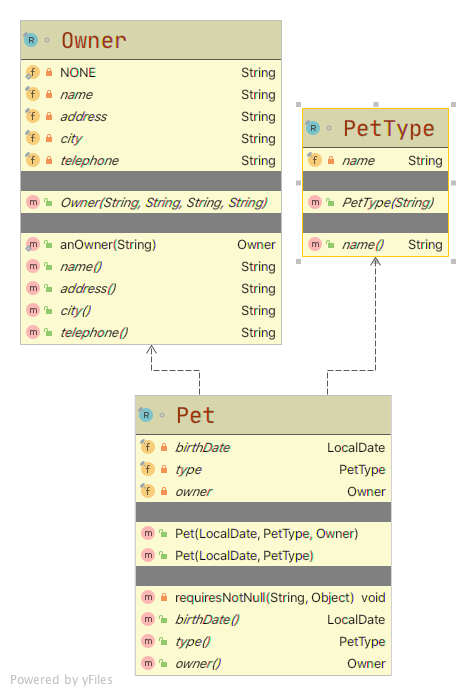

# Record type in Java

JDK 14, released in March 2020, introduced *records* (preview language feature) which provide a compact syntax for declaring classes whose main purpose is to hold data. In *records*, all low-level, repetitive and error-prone code is like constructors, accessor and utlity methods such as `equals()`, `hashCode()`, `toString()` are automatically derived based on the *record’s* state description.

## Prerequisites

You will need JDK 14 with preview features enabled.

> Learn how to [manage multiple Java SDKs with SDKMAN! with ease](../../../2020/01/manage-multiple-java-sdks-with-sdkman/index.md)

## What will we *build*?



## Record declaration

*Record* has a name and state description. The state description declares the *components* of the *record* and optionaly a body:

```java
record Owner(String name, String address, String city, String telephone) {}

record PetType(String name) {}

record Pet(LocalDate birthDate, PetType type, Owner owner) {}
```

The representation of a *record* is derived mechanically and completely from the state description with the following members:

- a `private` `final` field for each component
- a `public` read accessor method for each component, with the same name and type as the component (e.g. `owner.name()`, `owner.address()`)
- a `public` constructor
- an implementations of `equals()` and `hashCode()`
- an implementation of `toString()`.

The basic behavior is demonstrated with the below test:

```java
class Java14RecordTests {

    @Test
    void recordAccessors() {

        var owner = new Owner("John Doe", "110 W. Liberty St.", "Madison", "6085551023");

        assertThat(owner.name()).isEqualTo("John Doe");
        assertThat(owner.address()).isEqualTo("110 W. Liberty St.");
        assertThat(owner.city()).isEqualTo("Madison");
        assertThat(owner.telephone()).isEqualTo("6085551023");

    }

    @Test
    void recordEqualsAndHashCode() {

        var pet1 = new Pet(
                LocalDate.of(2019, 1, 1), 
                new PetType("dog"), 
                new Owner("John Doe", null, null, null)
        );
        var pet2 = new Pet(
                LocalDate.of(2019, 1, 1), 
                new PetType("dog"), 
                new Owner("John Doe", null, null, null)
        );

        assertThat(pet1).isEqualTo(pet2);
        assertThat(pet1.hashCode()).isEqualTo(pet2.hashCode());

    }

    @Test
    void recordToString() {
        var pet = new PetType("dog");
        assertThat(pet.toString()).isEqualTo("PetType[name=dog]");
    }
}
```

## Restrictions

*Record* is a restricted form of class and the restrictions are:

- *Record* cannot extend any other class
- Any other fields which are declared must be static
- The components of a *record* are implicitly final

## Additional behavior

Apart from the above restrictions, *record* behave like regular class and:

- *Record* may declare instance and static methods, static fields, static initializers:

```java
record Owner(String name, String address, String city, String telephone) {
    /* Static initializer */
    static {
        NONE = "N/A";
    }
    /* Static fields are allowed, both private and public */
    private static String NONE;

    /* Records may have static methods */
    public static Owner anOwner(String name) {
        return new Owner(name, NONE, NONE, NONE);
    }
}
```

- *Record* may declare constructors and also *compact* constructors. The compact constructor has access to the *record’s* components:

```java
record Pet(LocalDate birthDate, PetType type, Owner owner) {
    /* `Compact` constructor */
    public Pet {
        requiresNotNull("birthDate", birthDate);
        requiresNotNull("type", type);
        requiresNotNull("owner", owner);
    }
    
    public Pet(LocalDate birthDate, PetType type) {
        this(birthDate, type, null);
    }

    /* Records may have instance methods */
    private void requiresNotNull(String name, Object obj) {
        if (Objects.isNull(obj)) {
            throw new IllegalArgumentException(name + " can't be null");
        }
    }
}
```

- *Record* can override all standard methods: `equals()`, `hashCode()`, `toString()`
- *Record* can implement interfaces
- *Record* can be annotated

… and more.

## Source code

The source code for this article can be found on Github: <https://github.com/kolorobot/java9-and-beyond>

## References

- <https://openjdk.java.net/jeps/359>
