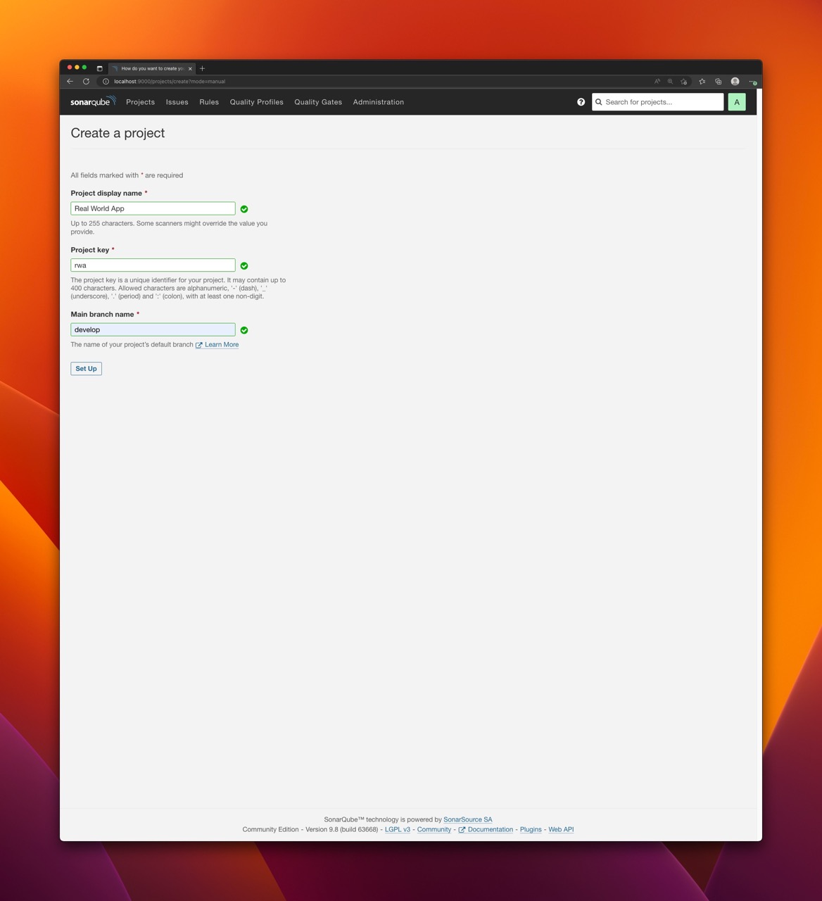
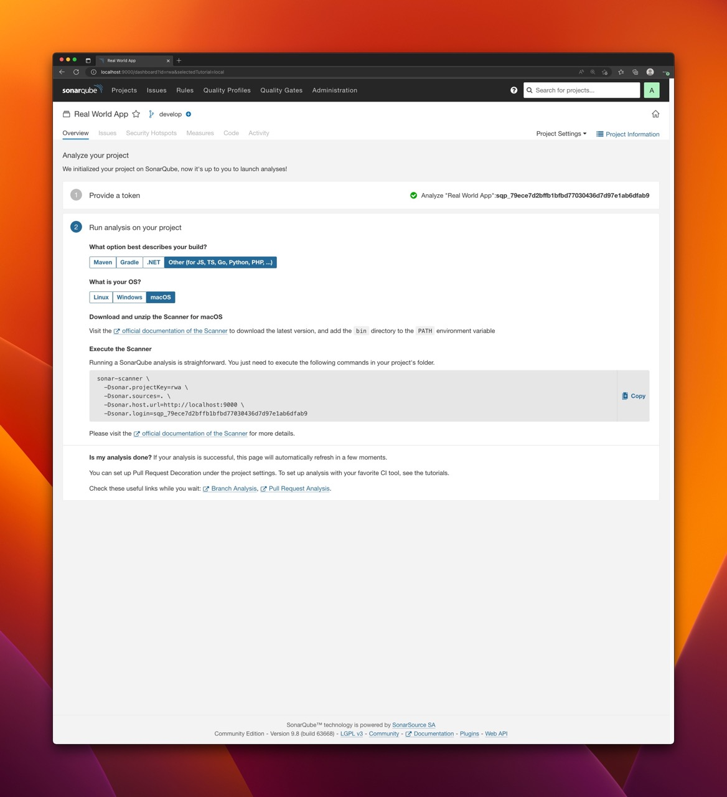
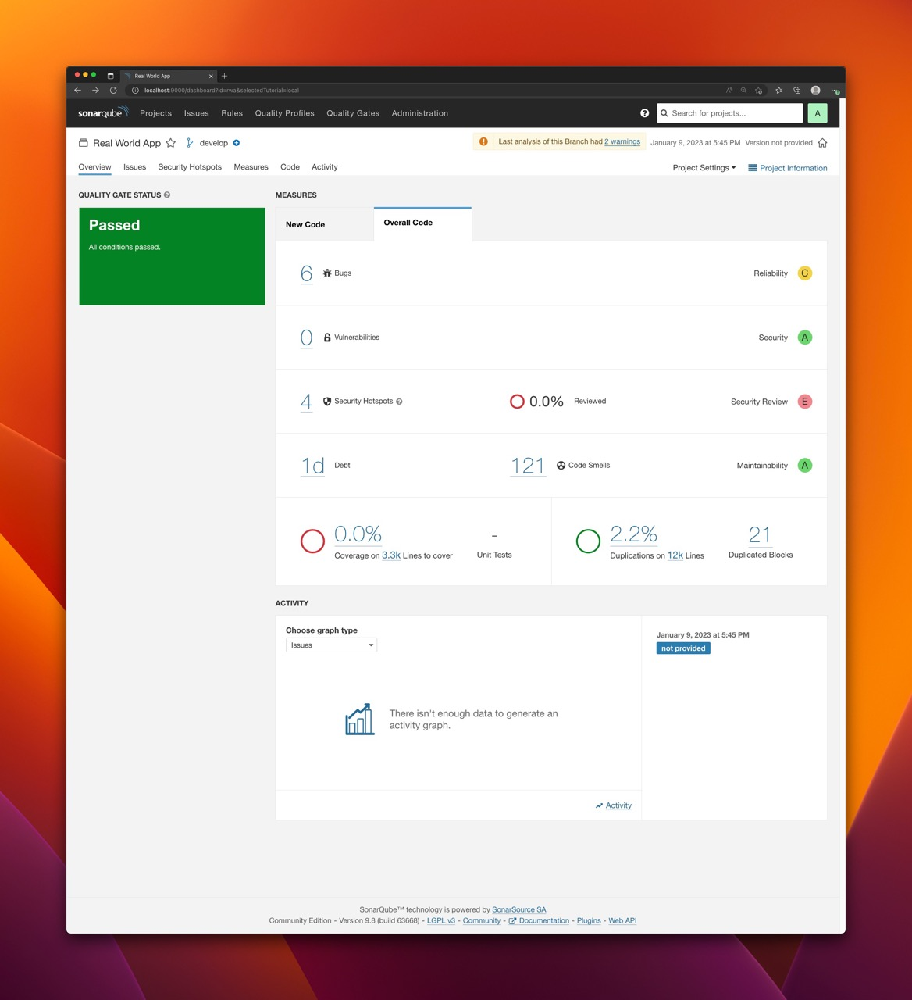
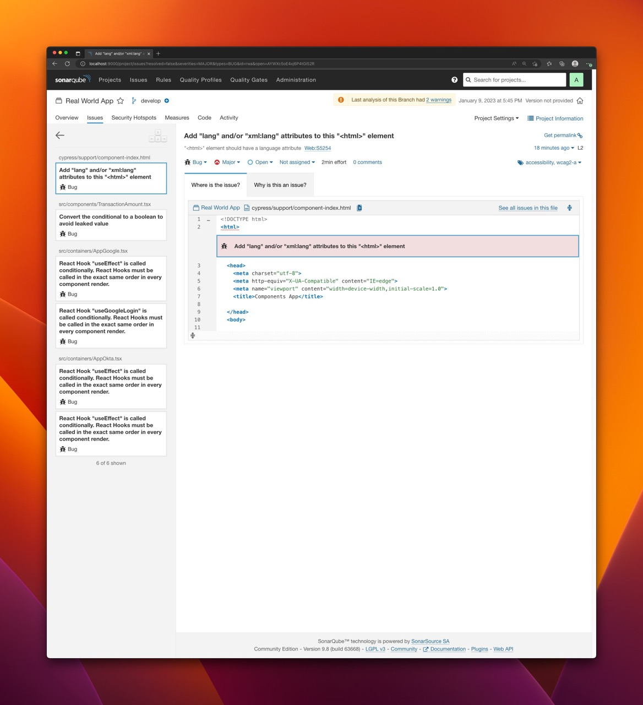
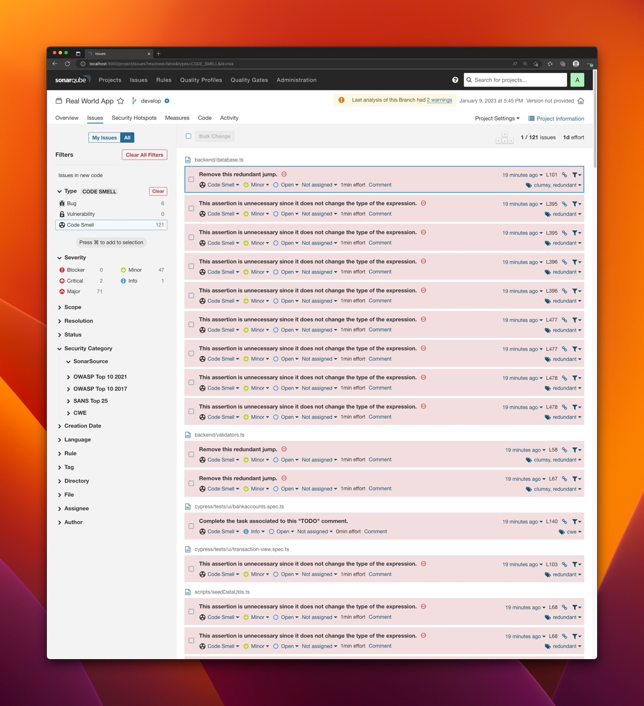

# Frontend code analysis with SonarQube

`SonarQube` is an open-source tool for continuous code quality inspection that analyzes code for defects, vulnerabilities, and code smells. It helps developers and teams to improve the quality of their code by identifying problems early in the development process and providing actionable feedback to fix them.

`SonarQube` can analyze code in a variety of programming languages, including `Java`, `Python`, `Go`, `JavaScript/TypeScript` and many others. It can be used as part of a continuous integration and delivery (CI/CD) pipeline to ensure that code meets certain quality standards before it is deployed to production.

`SonarQube` provides a web-based dashboard where developers can view reports on code quality, as well as information on the types of issues that were found and how they can be fixed. It also integrates with popular version control systems such as Git, making it easy to track changes to code over time and identify areas where quality may have decreased.

- [How does `SonarQube` work?](#how-does-sonarqube-work)
- [Run `SonarQube` instance](#run-sonarqube-instance)
  - [Run `SonarQube` locally using `Docker Compose`](#run-sonarqube-locally-using-docker-compose)
  - [Projects and authentication tokens](#projects-and-authentication-tokens)
  - [Quality profiles and quality gates](#quality-profiles-and-quality-gates)
- [Scanning JavaScript/Typescript project](#scanning-javascripttypescript-project)
  - [The project to be analyzed](#the-project-to-be-analyzed)
  - [Run Sonar Scanner with `Docker`](#run-sonar-scanner-with-docker)
  - [Run Sonar Scanner without `Docker`](#run-sonar-scanner-without-docker)
  - [Run the scanner with `sonarqube-sanner` NPM module](#run-the-scanner-with-sonarqube-sanner-npm-module)
- [References](#references)

# How does `SonarQube` work?

`SonarQube` consist of of three building blocks:

- Analyzer - a client application that analyzes the source code to compute snapshots.
- Database - stores configuration and snapshots
- Server - web interface that is used to browse snapshot data and make configuration changes.

Here is an overview of the process for using `SonarQube`:

- Install and set up `SonarQube`: This involves downloading and installing `SonarQube`, and configuring it to analyze your code.
- Analyze your code: Run a scan of your codebase. This is typically done by running a command-line tool or using a plugin for your build tool or continuous integration system.
- View the results: The results of the scan are displayed in the `SonarQube` dashboard.
- Fix the issues and re-run the scan

`SonarQube` is Java-based server application that consists of three main Java processes:

- Compute Engine
- ElasticSearch
- Web (including embedded web server)

This implies that `SonarQube` can be pretty hungry as it goes to memory consumption.

# Run `SonarQube` instance

## Run `SonarQube` locally using `Docker Compose`

If you want to try production-like setup use `Docker Compose` to define and run multi-container `Docker` applications. Here is an example [docker-compose.yml](https://github.com/SonarSource/docker-sonarqube/blob/master/example-compose-files/sq-with-postgres/docker-compose.yml) file that you can use as a starting point:

```
version: "3"
services:
  sonarqube:
    image: sonarqube:community
    hostname: sonarqube
    container_name: sonarqube
    depends_on:
      - db
    environment:
      SONAR_JDBC_URL: jdbc:postgresql://db:5432/sonar
      SONAR_JDBC_USERNAME: sonar
      SONAR_JDBC_PASSWORD: sonar
    volumes:
      - sonarqube_data:/opt/sonarqube/data
      - sonarqube_extensions:/opt/sonarqube/extensions
      - sonarqube_logs:/opt/sonarqube/logs
    ports:
      - "9000:9000"
  db:
    image: postgres:13
    hostname: postgresql
    container_name: postgresql
    environment:
      POSTGRES_USER: sonar
      POSTGRES_PASSWORD: sonar
      POSTGRES_DB: sonar
    volumes:
      - postgresql:/var/lib/postgresql
      - postgresql_data:/var/lib/postgresql/data

volumes:
  sonarqube_data:
  sonarqube_extensions:
  sonarqube_logs:
  postgresql:
  postgresql_data:
```

With `docker-compose.yml` you can run the below command:

```
docker compose up
```

Once application is up and running, navigate to `http://localhost:9000`, login with `admin/admin` and you are ready to go!

The advantages of `Docker Compose` based setup:

- Use production grade database server (Postgres). By default, `SonarQube` usest the embedded H2 database. It is recommended for tests but not for production use.
- Use volumes that are useful for storing data that needs to be persisted across container restarts or when the container is stopped and removed.

## Projects and authentication tokens

With `SonarQube` up and running, it is time to scan the project. Scanning is done using `Sonar Scanner`. Scanner is a `CLI` tool that analyzes source code and generates a report with insights on potential issues, it connects to the `SonarQube` instance using the provided authentication token and uploads analysis results.

There are three types of authentication tokens:

- `Project Analysis Token` - allows anylyze the existing project
- `Global Analysis Token` - allows to analyze multiple projects with the same token
- `User Token` - allow to invoke scanning on behalf of the user

To create a token:

- Login to `SonarQube`
- Navigate to `My Account` (via avatar icon in the upper-right conrner)
- Navigate to `Security` and generate the token you want to use for you scanning

To create a new project:

- Login to `SonarQube`
- Navigate to `Projects`
- Click `Create Project`
- Choose `Manual`
- Provide the details and save the project

Having the project in place you can finally run the analysis.

> If you use `Global Analysis Token` you don't need to create project as it will be created on the first scan based on the properties passed to the scanner.

## Quality profiles and quality gates

In `SonarQube`, a quality profile is a collection of rules that are used to analyze code for defects, vulnerabilities, and code smells. Profiles allow you to customize the way that `SonarQube` analyzes your code by selecting a set of rules that are relevant to your project and coding practices. `SonarQube` comes with a built-in quality profile defined for each supported language. You can also customize existing profiles by adding or removing rules, or creating new profiles from scratch. This allows you to tailor the analysis performed by `SonarQube` to the specific needs of your project.

When a codebase is analyzed with `SonarQube`, the results of the analysis are compared against the Quality Gates to determine whether the code meets the required standards. If the code does not meet one or more of the conditions, it is considered to have failed the Quality Gates. Quality Gates can be a useful way to ensure that code meets certain standards before it is deployed to production. They can also be used to track the quality of code over time, as code changes are made and new issues are introduced or fixed. Quality Gates conditions include coverage, duplicated lines reliability rating and more. `SonarQube` comes with a built-in Quality Gate.

# Scanning JavaScript/Typescript project

Scanner is connecting to `SonarQube` instance and therefore you need to have:

- URL of the instance
- Authentication token
- Project key of the scanned project

There are two ways of configuring the scanner: with `sonar.properties` file or with runtime arguments passed to the script. For this blog post, I will use only the latter.

## The project to be analyzed

For the sake of this article I used `Cypress Real World App` with source code available on Github: <https://github.com/cypress-io/cypress-realworld-app>

In `SonarQube`, I created `Real World App` project with project key `rwa` and I generated project key for it.






## Run Sonar Scanner with `Docker`

Probably the easiest way to run the scanner is via `Docker`. Although this is convienient and requires no installation of anything, it can be relatively slow comparing to running the scanner natively.

Assuming the `SonarQube` is up and running locally you can execute the following command to scan the project:

```
docker run \
    --rm \
    -e SONAR_HOST_URL="http://host.docker.internal:9000" \
    -e SONAR_LOGIN="<TOKEN>" \
    -e SONAR_SCANNER_OPTS="-Dsonar.projectKey=<PROJECT_KEY> -Dsonar.sources=. -Dsonar.exclusions=node_modules,typings/**" \
    -v "<PROJECT_DIRECTORY>:/usr/src" \
    sonarsource/sonar-scanner-cli
```

where:

- `SONAR_HOST_URL` points the `SonarQube` instance. Since it is running locally we use `host.docker.internal` which resolves to the internal IP address used by the host. It is only available when running inside a `Docker` container and is used to connect to the host from within the container.
- `SONAR_LOGIN` contains the previously created authentication token.
- `SONAR_SCANNER_OPTS` contains one or more properties used to configure the scanner. Each property is prefixed with `-D`, which is a standard switch used to pass system properties to Java Virtual Machine (JVM).
  - `sonar.projectKey=<PROJECT_KEY>` contains the project key.
  - `sonar.sources=.` is a directory within a project directory with sources to be scanned
  - `sonar.exclusions=node_modules,typings/**` - directories excluded from scanning
- `PROJECT_DIRECTORY` contains an absolute path of a project directory to be scanned that is mounted in a container.

To scan `Real World App` project located in `/Users/kolorobot/Projects/cypress-realworld-app`, identified with project key equal to `pwa` and with project token equal to `sqp_79ece7d2bffb1bfbd77030436d7d97e1ab6dfab9` the following command can be executed:

```
docker run \
    --rm \
    -e SONAR_HOST_URL="http://host.docker.internal:9000" \
    -e SONAR_SCANNER_OPTS="-Dsonar.projectKey=rwa -Dsonar.sources=. -Dsonar.exclusions=node_modules/**,bower_components/**,jspm_packages/**,typings/**,lib-cov/**" \
    -e SONAR_LOGIN="sqp_79ece7d2bffb1bfbd77030436d7d97e1ab6dfab9" \
     -v "/Users/kolorobot/Projects/cypress-realworld-app:/usr/src" \
    sonarsource/sonar-scanner-cli
```

Once the command executed properly you should see:

```
INFO: Analysis report generated in 2405ms, dir size=1.1 MB
INFO: Analysis report compressed in 149640ms, zip size=525.0 kB
INFO: Analysis report uploaded in 160ms
INFO: ANALYSIS SUCCESSFUL, you can find the results at: http://host.docker.internal:9000/dashboard?id=rwa
INFO: Note that you will be able to access the updated dashboard once the server has processed the submitted analysis report
INFO: More about the report processing at http://host.docker.internal:9000/api/ce/task?id=AYWXc4EyLzrtVCfny3A5
INFO: Analysis total time: 9:27.275 s
INFO: ------------------------------------------------------------------------
INFO: EXECUTION SUCCESS
INFO: ------------------------------------------------------------------------
INFO: Total time: 9:40.629s
INFO: Final Memory: 17M/60M
INFO: ------------------------------------------------------------------------
```

Now, you can navigate to `SonarQube` dasboard and analyze the results.








## Run Sonar Scanner without `Docker`

Although running the scanner with `Docker` is easy and does not require any additional setup it might also be pretty slow. For faster local scanning and better developer expierience you may consider downloading Sonar Scanner package (`zip` archive) and launch it directly. There are different versions with bundled `JVM` for `Linux`, `Windows` and `macOS`. There is also OS independent version that requires you to have `JVM` pre-installed. I personally preffer the last option.

Download and unpack version that suits your needs from: <https://docs.sonarqube.org/latest/analyzing-source-code/scanners/sonarscanner/>

Once unpacked, you can execute the following command to run the scanner:

```
./sonar-scanner \
  -Dsonar.login="sqp_79ece7d2bffb1bfbd77030436d7d97e1ab6dfab9" \
  -Dsonar.hostUrl="http://localhost:9000" \
  -Dsonar.projectKey="rwa" \
  -Dsonar.projectBaseDir="/Users/kolorobot/Projects/cypress-realworld-app" \
  -Dsonar.sources="." \
  -Dsonar.exclusions="node_modules/**,bower_components/**,jspm_packages/**,typings/**,lib-cov/**"
```

> The `sonar-scanner` script is located in the `bin` directory of the unpacked archive.

Result:

```
INFO: Analysis report generated in 123ms, dir size=1.1 MB
INFO: Analysis report compressed in 516ms, zip size=525.6 kB
INFO: Analysis report uploaded in 68ms
INFO: ANALYSIS SUCCESSFUL, you can find the results at: http://localhost:9000/dashboard?id=rwa
INFO: Note that you will be able to access the updated dashboard once the server has processed the submitted analysis report
INFO: More about the report processing at http://localhost:9000/api/ce/task?id=AYWXjevmLzrtVCfny3BL
INFO: Analysis total time: 1:00.891 s
INFO: ------------------------------------------------------------------------
INFO: EXECUTION SUCCESS
INFO: ------------------------------------------------------------------------
INFO: Total time: 1:03.489s
INFO: Final Memory: 17M/74M
INFO: ------------------------------------------------------------------------
```

With the defaults the difference in execution time on my machine was huge: from around 9 minutes to 1 minute.

## Run the scanner with `sonarqube-sanner` NPM module

[`sonarqube-scanner`](https://www.npmjs.com/package/sonarqube-scanner) is an `npm` module that can be can used to scan a project without the need of manual installation of the scanner. It downloads (and caches) the Sonar Scanner and executes it directly with some configuration defaults.

Consult the documentation for more details: <https://www.npmjs.com/package/sonarqube-scanner>

To scan `Real World App`:

- Install the package: `yarn -D add sonarqube-scanner`
- Create `scan.js` file: `touch scan.js`
- Copy the following content to the `scan.js` file:

```javascript
const scanner = require("sonarqube-scanner");

scanner(
  {
    serverUrl: "http://localhost:9000",
    token: "sqp_79ece7d2bffb1bfbd77030436d7d97e1ab6dfab9",
    options: {
      "sonar.projectKey": "rwa",
      "sonar.projectBaseDir": ".",
    },
  },
  () => process.exit()
);
```

- Scan the project: `npm scan.js`

Result:

```
[18:39:27] Starting analysis...
[18:39:27] Executable parameters built:
[18:39:27] {
  targetOS: 'macosx',
  installFolder: '/Users/kolorobot/.sonar/native-sonar-scanner',
  platformExecutable: '/Users/kolorobot/.sonar/native-sonar-scanner/sonar-scanner-4.7.0.2747-macosx/bin/sonar-scanner',
  fileName: 'sonar-scanner-cli-4.7.0.2747-macosx.zip',
  downloadUrl: 'https://binaries.sonarsource.com/Distribution/sonar-scanner-cli/sonar-scanner-cli-4.7.0.2747-macosx.zip'
}

[...]

INFO: ANALYSIS SUCCESSFUL, you can find the results at: http://localhost:9000/dashboard?id=rwa
INFO: Note that you will be able to access the updated dashboard once the server has processed the submitted analysis report
INFO: More about the report processing at http://localhost:9000/api/ce/task?id=AYWXnlRKLzrtVCfny3BN
INFO: Analysis total time: 51.307 s
INFO: ------------------------------------------------------------------------
INFO: EXECUTION SUCCESS
INFO: ------------------------------------------------------------------------
INFO: Total time: 53.023s
INFO: Final Memory: 17M/80M
INFO: ------------------------------------------------------------------------
[18:40:22] Analysis finished.
```

# References

- `SonarQube` - <https://www.sonarsource.com/products/sonarqube/>
- `SonarQube` documentation - <https://docs.sonarqube.org/latest/>
- `sonarqube-scanner` - <https://www.npmjs.com/package/sonarqube-scanner>
