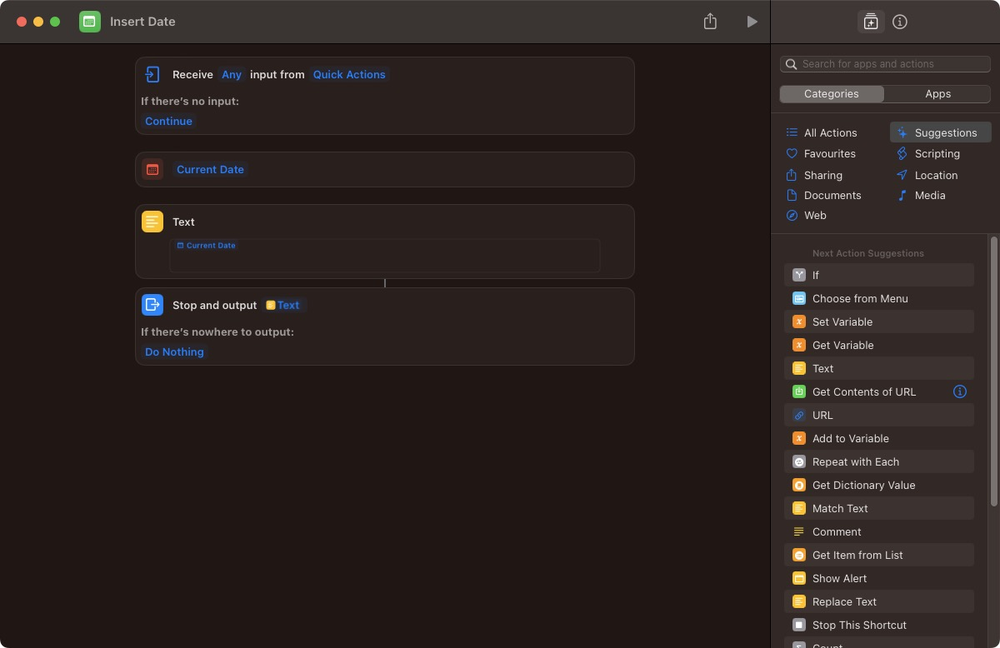
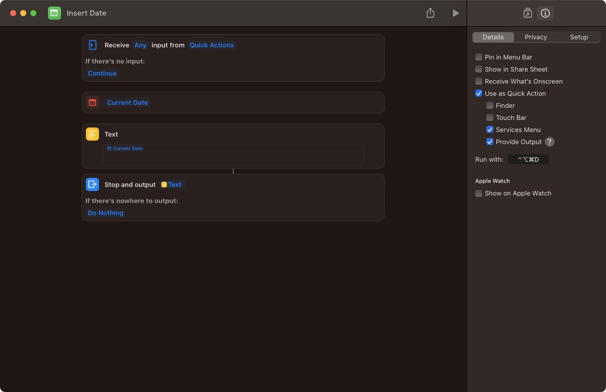
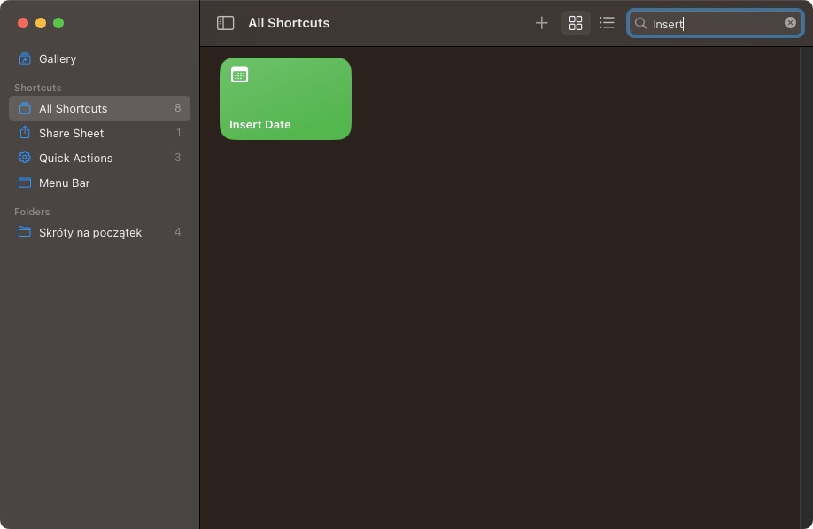

# macOS: Insert current date shortcut with `Shortcuts.app`

`Shortcuts.app` in macOS is a tool for automating repetitive tasks. It has a user-friendly drag-and-drop interface and
supports tasks such as opening apps, copying/pasting text, and sending messages. In this article, I'll demonstrate how
to create a shortcut that inserts the current date into any app, which I use to quickly add dates to my notes, emails or Slack messages.

Here's a step-by-step tutorial on how to create `Insert Date` shortcut using `Shortcuts.app` in macOS:

- Open the `Shortcuts.app` (`⌘ + ␣`, type `Shortcuts`, and press Enter).
- Click on the `+` button in the top right corner to create a new shortcut.
- Give your shortcut a name (e.g. `Insert Date`) and click `Add Action`.
- Search for `Insert Text` in the search bar and select the `Insert Text` action.
- In the `Insert Text` field, type `CurrentDate()`. This will insert the current date in the format of your liking.

- Click on the `Settings` icon in the top right corner of the Shortcuts app. Select `Keyboard` and then `Add Shortcut`.
  Assign the keyboard shortcut you would like to use to trigger the insertion of the current date. I use `⌘ + ⌥ + ⌃ + D` as my shortcut.
- Make sure to check the `Provide Output` checkbox.

From now on, whenever I use `⌘ + ⌥ + ⌃ + D` keyboard shortcut in (almost) any app, the current date will be inserted.

And that's it! Pretty handy.

