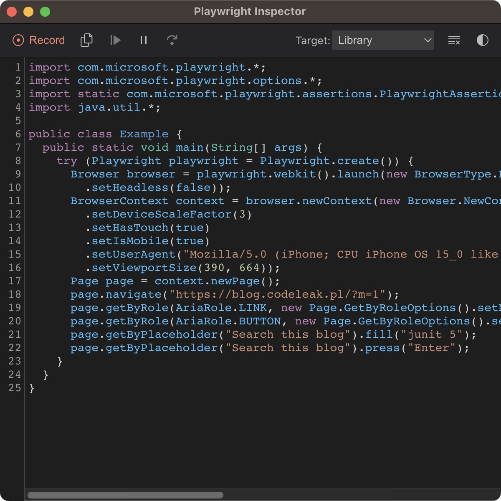
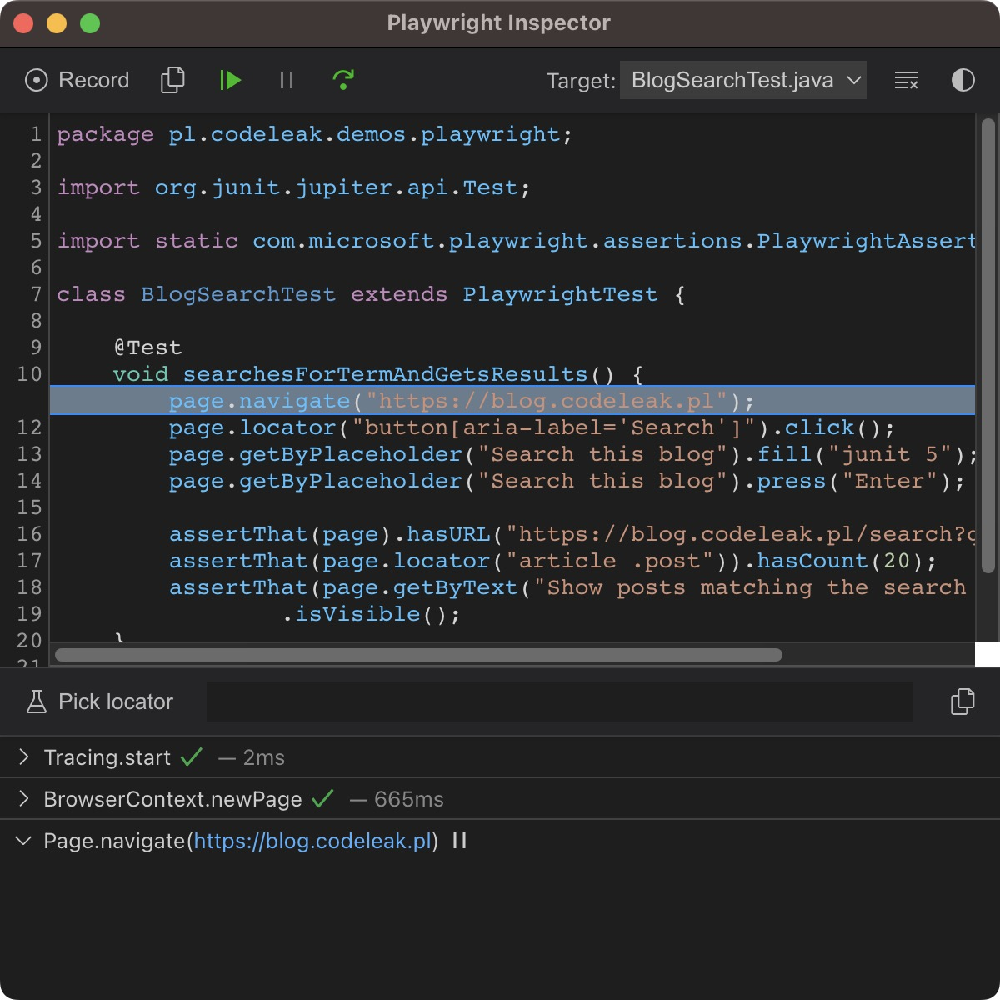
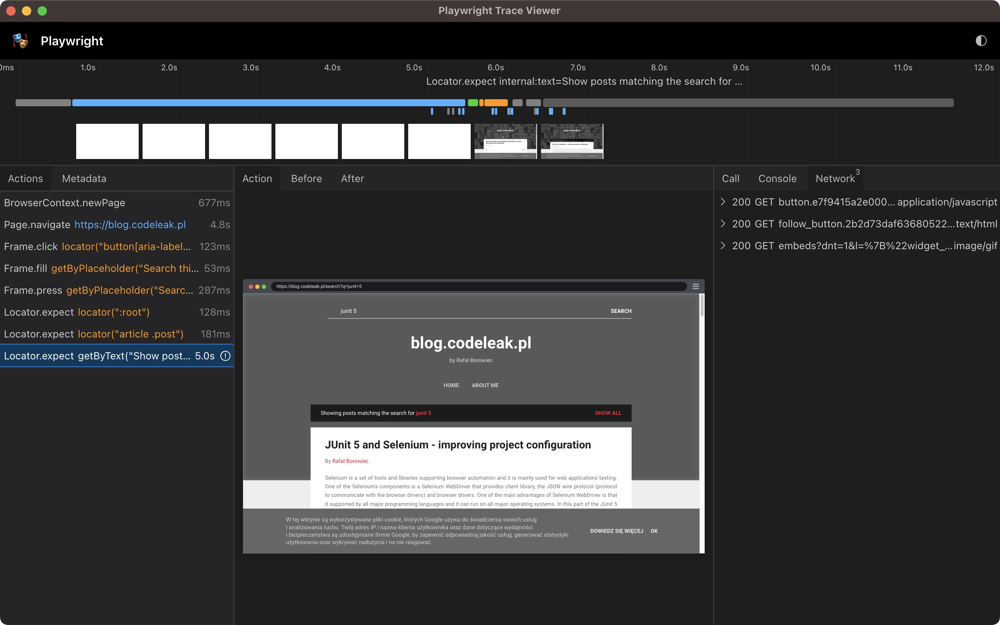
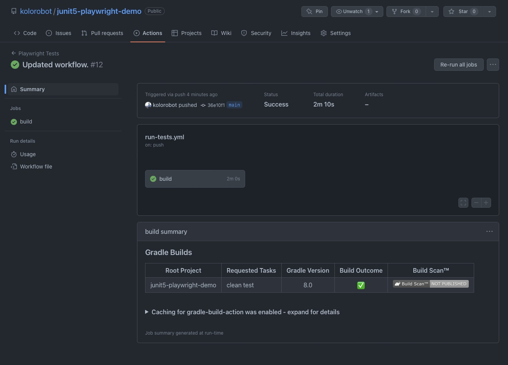

# Playwright meets JUnit 5

`Playwright` is a `Node.js`-based tool for automating browsers. It supports all modern rendering engines including `Chromium`, `WebKit` and `Firefox`. `Playwright` can be used with `JavaScript`, `TypeScript`, `Python`, `.NET` and `Java`. In this tutorial, we will explore the setup of a test automation project using `Playwright` for `Java`, `JUnit 5` and `Gradle`. You will also learn some basics of `Playwright` tools like `codegen`, `Playwright Inspector` and trace viewer. I will also provide some basic setup for `Docker` as well as `GitHub Actions`. Let's get started!

**Table of contents**

- [Introduction](#introduction)
  - [Disclaimer](#disclaimer)
  - [Why `Playwright`?](#why-playwright-)
  - [`Playwright`: `Java` vs `Node.js`](#playwright--java-vs-nodejs)
  - [Why `Playwright` for `Java`?](#why-playwright-for-java-)
- [Source code](#source-code)
- [Prerequisites](#prerequisites)
- [Setting up the project with `Gradle`](#setting-up-the-project-with-gradle)
  - [Adding `Playwright` dependency](#adding-playwright-dependency)
  - [`Playwright` without a test runner](#playwright-without-a-test-runner)
  - [Running `Playwright CLI` tools with Gradle](#running-playwright-cli-tools-with-gradle)
  - [Generate code with `codegen`](#generate-code-with-codegen)
- [`JUnit 5` meets `Playwright`](#junit-5-meets-playwright)
  - [Setting up the base `Playwright` test](#setting-up-the-base-playwright-test)
  - [Creating a first test](#creating-a-first-test)
  - [Debugging the test with `Playwright Inspector`](#debugging-the-test-with-playwright-inspector)
  - [Recording a trace](#recording-a-trace)
  - [Fixing the test](#fixing-the-test)
- [`Page Object` pattern with `Playwright`](#page-object-pattern-with-playwright)
  - [Implementing TodoMVC page API](#implementing-todomvc-page-api)
  - [Creating TodoMVC tests](#creating-todomvc-tests)
  - [Running the tests](#running-the-tests)
  - [Parameterized tests](#parameterized-tests)
    - [Create test data](#create-test-data)
    - [Add dependency](#add-dependency)
    - [Create tests](#create-tests)
    - [Run the parameterized tests](#run-the-parameterized-tests)
  - [Run all the tests](#run-all-the-tests)
- [Parallel tests execution](#parallel-tests-execution)
  - [`Playwright` and thread-safety](#playwright-and-thread-safety)
  - [`JUnit 5` configuration for parallel execution](#junit-5-configuration-for-parallel-execution)
- [Basic `GitHub Actions` workflow](#basic-github-actions-workflow)
- [`Playwright` for `Java` and `Docker`](#playwright-for-java-and-docker)
  - [Running tests in `Docker`](#running-tests-in-docker)
  - [Creating a `Dockerfile`](#creating-a-dockerfile)
- [Conclusion](#conclusion)
- [References](#references)

## Introduction

### Disclaimer

- The project setup presented in this article is based on `Gradle`, but it should be noted that `Playwright` for `Java` is intended to be used with `Maven`, as indicated in the project documentation and source code. If you are considering using `Playwright` for `Java` for your next project, consider using `Maven`.
- The setup presented in this article is a result of my eagerness to learn and experiment with `Playwright` for `Java`. However, please note that some aspects of the setup may not be future-proof. If you have any suggestions or improvements, please feel free to contact me via [Twitter](https://twitter.com/kolorobot), [LinkedIn](https://www.linkedin.com/in/borowiec/), or report an issue in the project repository.
- This article was edited and proofread with the help of `ChatGPT`, to ensure that it is well-written and error-free. However, please note that the content and ideas presented in this article are solely mine, and any opinions expressed are my own. The AI language model was used purely for editing purposes and did not influence the content of this article in any way.

### Why `Playwright`?

I started using `Playwright` (with `Node.js`) in June 2022, and I'm really impressed with this tool. Here are some of the features I find most important about `Playwright`:

- Easy to use: One of the best things about `Playwright` is that it's packaged all in one and easy to set up and use. Unlike with `Selenium`, there's no need to integrate different tools together.
- Multi-language support: `Playwright` supports several programming languages, including `JavaScript`, `TypeScript`, `Python`, `.NET`, and `Java`. While the native `Node.js` version provides the best experience, in my opinion, because of its built-in test runner with powerful configuration and reporting capabilities, `Playwright` makes it easier for developers to write tests in the language they're most comfortable with.
- Multi-browser support: `Playwright` supports `Chromium`, `Firefox`, `WebKit`, and `Opera`. Configuration is easy, and there's no need to install additional drivers or consult third-party documentation. All these browsers' drivers are maintained by the same team.
- Auto-wait functionality: `Playwright` automatically waits for page elements to be visible and interactive before performing actions on them. This helps avoid flakiness in tests and makes them more reliable.
- Page and browser context isolation: `Playwright` allows you to create multiple browser contexts and isolate tests from each other easily. This provides more robustness and stability when running tests.
- Tooling: `Playwright` comes with tools that make it easy to manage and execute tests from the command line, and integrate with build systems and automation tools. Codegen is one such tool that allows you to record your interactions with a web application and generate the code automatically.
- Architecture and limitations: Unlike `Cypress`, which runs tests in the same runtime as the application being tested, `Playwright` runs tests in a separate process. This provides more isolation and avoids potential issues. `Playwright` has no problems with running tests in parallel, which can be an issue with `Cypress` unless you pay.
- Documentation: The `Playwright` documentation is well-organized, easy to navigate, and understand. It contains a lot of examples and code snippets. I found it very helpful and was able to find what I needed without any problems. There are topics thought that are not that well explained or lack information (like for example `Docker` section), but I'm sure it will be improved in the future.

### `Playwright`: `Java` vs `Node.js`

Although I don't have much experience with the `Java` version of `Playwright` yet, I can say that as it goes to the API it is very similar to the `Node.js` version. The main difference is that the `Java` version does not have a built-in test runner, so you have to use a third-party one, such as `JUnit 5`. And `Node.js` built-in test runner provides a lot of useful features such as:

- **Visual testing** out of the box via `expect` API.
- A lot of **configuration options** like timeout, retries, headless mode, browsers, viewports, reporters and much more.
- Easily configurable **tracing** and **video recording**.
- Built-in reporters including the `HTML` reporter.

### Why `Playwright` for `Java`?

Although the `Node.js` version currently appears to be superior to the `Java` version, I believe it is still worthwhile to consider using `Playwright` for `Java`. Here are some reasons why I think it is a relevant option:

- I think that `Playwright` for `Java` can be a modern, reliable, and user-friendly alternative to `Selenium` for end-to-end testing in `Java-based` projects - only if you are ready for some compromises and extra work around configuration.
- I believe that some teams may not be able to use `Node.js` for various reasons, so `Playwright` for `Java` could be a good alternative.
- `Playwright` for `Java` can be used as a tool for automating tasks (like crawling web pages, scraping data, etc.) and not necessary to create end-to-end tests. If so, the lack of a built-in test runner is not a problem.

## Source code

The complete code for this article can be found on GitHub: [junit5-playwright-demo](https://github.com/kolorobot/junit5-playwright-demo).

## Prerequisites

What you need to get started:

- Terminal of your choice
- Git
- Java 17 or higher
- IntelliJ IDEA (or any other IDE of your choice)

> For `Java` I recommend `asdf` version manager. You can find more information about on my blog: [Manage multiple Java SDKs with asdf with ease](../../../2023/01/manage-multiple-java-sdks-with-asdf/index.md).

## Setting up the project with `Gradle`

To speed up the process of setting up the project, I will use the [junit5-gradle-template](https://github.com/kolorobot/junit5-gradle-template) repository. It is a template project for `JUnit 5` and `Gradle` specifically.

> Note: There is also an official starter by `JUnit` team that can be found here: [junit5-jupiter-starter-gradle](https://github.com/junit-team/junit5-samples/tree/main/junit5-jupiter-starter-gradle)

Steps:

- Clone the template repository: `git clone --depth=0 https://github.com/kolorobot/junit5-gradle-template my-playwright-project && cd my-playwright-project`
- Remove the `.git` directory: `rm -rf .git`
- Execute `./gradlew clean test` to verify that everything works as expected
- Import project to your IDE

### Adding `Playwright` dependency

To use `Playwright` with `Java`, we need to add the `playwright` dependency to `build.gradle` file:

```groovy
buildscript {
    ext {
        playwrightVersion = '1.30.0'
    }
}

implementation "com.microsoft.playwright:playwright:${playwrightVersion}"
```

The library is added as `implementation` dependency, so it will be available in the runtime classpath as well. This will allow us to use the library not only in our tests, but also in our application code.

### `Playwright` without a test runner

With dependency added, we can create a simple app that will open a browser and navigate to a website.

- Create a new package in `src/main/java` directory (e.g. `pl.codeleak.demos.playwright`)
- Create a new class `App` in that package and add the following code:

```java
package pl.codeleak.demos.playwright;

import com.microsoft.playwright.Browser;
import com.microsoft.playwright.BrowserType;
import com.microsoft.playwright.Page;
import com.microsoft.playwright.Playwright;

public class App {
    public static void main(String[] args) {
        try (Playwright playwright = Playwright.create()) {
            Browser browser = playwright.chromium().launch();
            Page page = browser.newPage();

            page.navigate("https://blog.codeleak.pl/");
            System.out.println(page.title());
        }
    }
}
```

The above code creates a `Playwright` instance and launches a browser (in this case, `Chromium`) in headless mode and creates a new page.

The page navigates to a website, gets its title and prints it to the console. The code uses a `try-with-resources` statement, which automatically closes the `playwright` object when the try block is finished.

To run the browser in *non-headless* mode, we can modify the code as follows:

```java
package pl.codeleak.demos.playwright;

import com.microsoft.playwright.Browser;
import com.microsoft.playwright.BrowserType;
import com.microsoft.playwright.Page;
import com.microsoft.playwright.Playwright;

public class App {
    public static void main(String[] args) {
        BrowserType.LaunchOptions launchOptions = new BrowserType.LaunchOptions()
                .setHeadless(false);

        try (Playwright playwright = Playwright.create()) {
            Browser browser = playwright.chromium().launch(launchOptions);
            Page page = browser.newPage();

            page.navigate("https://blog.codeleak.pl/");
            System.out.println(page.title());
        }
    }
}
```

To run the app, we can use `run` command, but first we need to modify `build.gradle` file and configure the `application` plugin:

```
plugins {
    id("application")
}

application {
    mainClass = "pl.codeleak.demos.playwright.App"
}
```

Now, we can run the app with `./gradlew run` command.

```
❯ ./gradlew run

> Task :run
blog.codeleak.pl

BUILD SUCCESSFUL in 5s
2 actionable tasks: 1 executed, 1 up-to-date
```

### Running `Playwright CLI` tools with Gradle

`Playwright` comes with a `CLI` tools that can be useful for code generation, running and debugging tests or viewing the traces.

To run `Playwright CLI` with `Gradle`, we need to modify `build.gradle`, add `application` plugin, and create a custom `playwright` task that executes `com.microsoft.playwright.CLI`:

```groovy
apply plugin: 'application'

tasks.register('playwright', JavaExec) {
    classpath = sourceSets.main.runtimeClasspath
    mainClass = 'com.microsoft.playwright.CLI'
}
```

Now, we can run `Playwright CLI` with Gradle:

```
./gradlew playwright --args="--help"
```

### Generate code with `codegen`

As we set up the `Playwright CLI`, we can use it to run `codegen` command. `codegen` is a tool that can generate code snippets for you based on the user interactions with a website using `Playwright Inspector`. It allows you to record your interactions with a web page and then generate code snippets in `Java` that can be used to automate those interactions.

> As per the official documentation, `Playwright Inspector`is a GUI tool that helps writing and debugging Playwright scripts. That's our default recommended tool for scripts troubleshooting.

To learn more about `codegen` tool and its options, we can execute the following command:

```
./gradlew playwright --args="codegen --help"
```

As you observe the output, the `codegen` command provides plenty of options. For example, we can specify the browser to use or the device to emulate, etc. Let's try:

```
./gradlew playwright --args="codegen --browser chromium --device 'iPhone 13' https://blog.codeleak.pl/"
```



Once the above command is executed, two windows will be opened: `Playwright Inspector` and the browser that will be navigated to the specified URL. Now, we can interact with the website and the `codegen` will generate code snippets for us. Once we are done with the interaction, we can copy the code and use it in our scripts.

## `JUnit 5` meets `Playwright`

### Setting up the base `Playwright` test

In the previous section, we learned how to use `Playwright` as browser tool in a simple application. Now, we will learn how to use it with `JUnit 5`.

Let's create a base test class that will be used by all our tests. It will set up `Playwright` and create a browser instance. The base test class will also create a new browser context and a new page for each test method.

```java
@TestInstance(TestInstance.Lifecycle.PER_CLASS)
abstract class PlaywrightTest {

    Playwright playwright;
    Browser browser;

    BrowserContext context;
    Page page;

    @BeforeAll
    void launchBrowser() {
        playwright = Playwright.create();
        browser = playwright.chromium().launch();
    }

    @AfterAll
    void closeBrowser() {
        browser.close();
        playwright.close();
    }

    @BeforeEach
    void createBrowserContext() {
        context = browser.newContext();
        page = context.newPage();
    }

    @AfterEach
    void closeBrowserContext() {
        page.close();
        context.close();
    }
}
```

Let's quickly examine the above code:

- The class is annotated with `@TestInstance(TestInstance.Lifecycle.PER_CLASS)`, which means that only one instance of the test class is created for all test methods, and the same instance is used for all test methods in the class.
- The class has four `JUnit 5` lifecycle methods:
  - `@BeforeAll`: the `launchBrowser` method launches a `Chromium` browser using `Playwright`. It is executed before all test methods in the class.
  - `@AfterAll`: the `closeBrowser` method closes the `browser` and `Playwright` gracefully. It is executed after all test methods in the class.
  - `@BeforeEach`: the `createBrowserContext` method creates a new browser context and a new page object for interacting with a browser. It is executed before each test method in the class.
  - `@AfterEach`: the `closeBrowserContext` method closes the page and context after each test.

To set the default test instance lifecycle to `PER_CLASS` for all tests in JUnit 5, create a file called `junit-platform.properties` in `src/test/resources` with the following content:

```
junit.jupiter.testinstance.lifecycle.default=per_class
```

> `JUnit 5` is the latest version of the popular JUnit testing framework. It is a complete rewrite of the original JUnit 4 framework. `JUnit 5` is the first version of JUnit to support Java 8 features such as lambda expressions and default methods. If you are not familiar with `JUnit 5`, you can check my [JUnit 5 - Quick Tutorial](../../../2017/10/junit-5-basics/index.md) post.

### Creating a first test

Now, we can create our first test. Let's create a test class that extends the `PlaywrightTest` class and create a simple test that navigates to this blog and searches for "junit 5" term. The test class will look like this:

```java
package pl.codeleak.demos.playwright;
import org.junit.jupiter.api.Test;
import static com.microsoft.playwright.assertions.PlaywrightAssertions.assertThat;

class BlogSearchTest extends PlaywrightTest {

    @Test
    void searchesForTermAndGetsResults() {
        page.navigate("https://blog.codeleak.pl");
        page.locator("button[aria-label='Search']").click();
        page.getByPlaceholder("Search this blog").fill("junit 5");
        page.getByPlaceholder("Search this blog").press("Enter");

        assertThat(page).hasURL("https://blog.codeleak.pl/search?q=junit+5");
        assertThat(page.locator("article .post")).hasCount(20);
        assertThat(page.getByText("Show posts matching the search for junit 5"))
                .isVisible();
    }
}
```

Let's quickly examine the above code:

- The test class extends the `PlaywrightTest` class, which means that it inherits all the setup and teardown methods.
- The test method uses the `page` object to navigate to the blog, clicks the search button, fills the search input and press the `Enter` key.
- It uses `Playwright` built-in assertions to check that:
  - the URL contains the search term
  - the search results are displayed and there are 20 of them
  - the search results header is visible

Now, we can run the test and observe the result:

```
./gradlew test --tests BlogSearchTest

> Task :test

BlogSearchTest > searchesForTermAndGetsResults() FAILED
    org.opentest4j.AssertionFailedError at BlogSearchTest.java:19

1 test completed, 1 failed

> Task :test FAILED

FAILURE: Build failed with an exception.

* What went wrong:
Execution failed for task ':test'.
> There were failing tests. See the report at: file:///build/reports/tests/test/index.html
```

Oops, the test failed (at least it should). You can examine the report at `build/reports/tests/test/index.html` to see the details. The reason of failure can be quickly seen in the report:

```
org.opentest4j.AssertionFailedError: Locator expected to be visible
Call log:
Locator.expect with timeout 5000ms
waiting for getByText("Show posts matching the search for junit 5")
```

As you can see, the test failed because the expected search results header is not visible. To fix this we can examine the application by manually executing the scenario, we can debug the test in IDE, or we can run the test in a debug mode with Playwright.

Let's try the last option to learn more about `Playwright Inspector`.

### Debugging the test with `Playwright Inspector`

You are already familiar with `Playwright Inspector` from the previous section. Now, we can use it to debug our test. To do that, we need to run the test in a debug mode:

```
PWDEBUG=1 PLAYWRIGHT_JAVA_SRC=./src/test/java ./gradlew test --tests BlogSearchTest
```

- `PWDEBUG=1` enables the debug mode and starts the browser in headed mode (you may recall that the base class launches the browser in headless mode).
- `PLAYWRIGHT_JAVA_SRC=./src/test/java` tells Playwright to use the source code from the `src/test/java` directory. It is needed to be able to see the source code in the `Playwright Inspector`.



The inspector opens a browser window and highlights elements as the test is being executed. The toolbar provides options to play the test, step through each action using `Step over`, or resume the script. You have access to `Actionability Logs` that provide some useful info about actions being performed. You can also examine the page by using the `Explore` option. Last but not least, you can use the browser developer tools.

### Recording a trace

You can also record a trace of the test execution. To do that, you need to use `BrowserContext.tracing()` API. Modify `@BeforeEach` and `@AfterEach` annotated methods in `PlaywrightTest` as follows:

```java
@BeforeEach
void createBrowserContext() {
    context = browser.newContext();
    context.tracing().start(new Tracing.StartOptions()
            .setScreenshots(true)
            .setSnapshots(true));
    page = context.newPage();
}

@AfterEach
void closeBrowserContext(TestInfo testInfo) {
    var traceName = testInfo.getTestClass().get().getSimpleName() +
            "-" + testInfo.getTestMethod().get().getName() + "-trace.zip";
    context.tracing().stop(new Tracing.StopOptions()
            .setPath(Paths.get("build/reports/traces/" + traceName)));

    page.close();
    context.close();
}
```

Once you re-run the test, you will find the trace in the `build/reports/traces` directory. You can open it in the `trace-view` tool like this:

```
./gradlew playwright --args="show-trace build/reports/traces/BlogSearchTest-searchesForTermAndGetsResults-trace.zip"
```



### Fixing the test

Since we located the reason test was failing, we can fix it by modifying the last assertion (the text should be: *"Showing posts matching the search for junit 5"*:

```java
assertThat(page.getByText("Showing posts matching the search for junit 5"))
        .isVisible();
```

## `Page Object` pattern with `Playwright`

Once the first test is passing, we can move on to the next one. This time will be creating tests for TodoMVC Vanilla.js-based application available here: <http://todomvc.com/examples/vanillajs>. The application is a `Single Page Application` (`SPA`) and uses local storage as a task repository. The possible scenarios to be implemented include adding and editing todo, removing todo, marking single or multiple todos as done. The implementation will be done using `Page Object` pattern`aka`POP`.

The goal of `POP` is to abstract the application pages and functionality from the actual tests. `POP` improves re-usability of the code across tests and fixtures but also makes the code easier to maintain.

Let's create an interface with the methods that represent scenarios that we will be automating:

```java
package pl.codeleak.demos.playwright;

import java.util.List;

interface TodoMvc {
    void navigateTo();
    void createTodo(String todoName);
    void createTodos(String... todoNames);
    int getTodosLeft();
    boolean todoExists(String todoName);
    int getTodoCount();
    List<String> getTodos();
    void renameTodo(String todoName, String newTodoName);
    void removeTodo(String todoName);
    void completeTodo(String todoName);
    void completeAllTodos();
    void showActive();
    void showCompleted();
    void clearCompleted();
}
```

### Implementing TodoMVC page API

We will create a class `TodoMvcPage` that will implement the `TodoMvc` interface:

```java
package pl.codeleak.demos.playwright;

import com.microsoft.playwright.Locator;
import com.microsoft.playwright.Page;

import java.util.List;
import java.util.Objects;

public class TodoMvcPage implements TodoMvc {

    private Page page;

    public TodoMvcPage(Page page) {
        Objects.requireNonNull(page, "Page is required");
        this.page = page;
    }

    @Override
    public void navigateTo() {
        page.navigate("https://todomvc.com/examples/vanillajs");
    }

    public void createTodo(String todoName) {
        page.locator(".new-todo").type(todoName);
        page.locator(".new-todo").press("Enter");
    }

    public void createTodos(String... todoNames) {
        for (String todoName : todoNames) {
            createTodo(todoName);
        }
    }

    public int getTodosLeft() {
        return Integer.parseInt(page.locator(".todo-count > strong").textContent());
    }

    public boolean todoExists(String todoName) {
        return getTodos().stream().anyMatch(todoName::equals);
    }

    public int getTodoCount() {
        return page.locator(".todo-list li").count();
    }

    public List<String> getTodos() {
        return page.locator(".todo-list li")
                .allTextContents();
    }

    public void renameTodo(String todoName, String newTodoName) {
        Locator todoToEdit = getTodoElementByName(todoName);
        todoToEdit.dblclick();
        Locator todoEditInput = todoToEdit.locator("input.edit");
        todoEditInput.clear();
        todoToEdit.type(newTodoName);
        todoToEdit.press("Enter");
    }

    public void removeTodo(String todoName) {
        Locator todoToRemove = getTodoElementByName(todoName);
        todoToRemove.hover();
        todoToRemove.locator("button.destroy").click();
    }

    public void completeTodo(String todoName) {
        Locator todoToComplete = getTodoElementByName(todoName);
        todoToComplete.locator("input.toggle").click();
    }

    public void completeAllTodos() {
        page.locator(".toggle-all").click();
    }

    public void showActive() {
        page.locator("a[href='#/active']").click();
    }

    public void showCompleted() {
        page.locator("a[href='#/completed']").click();
    }

    public void clearCompleted() {
        page.locator(".clear-completed").click();
    }

    private Locator getTodoElementByName(String todoName) {
        return page.locator(".todo-list li")
                .all()
                .stream()
                .filter(locator -> todoName.equals(locator.textContent()))
                .findFirst()
                .orElseThrow(() -> new RuntimeException("Todo with name " + todoName + " not found!"));
    }
}
```

First, we navigate to the application using `navigate` method. Elements on that page are located using the `locator` method of the `Playwright`s `Page` object. This method takes a selector (in this case `CSS` selector) as an argument and returns a `Locator` object that represents the set of elements matching that selector. The returned `Locator` object provides methods to interact with the located elements, such as `count` (returns the number of elements), `textContent` (returns the text content of the first element), `allTextContents` (returns a list of text contents of all elements), `click` and `dbclick` (simulates a click event on the first element), `clear` (clears the content of the first element), and `type` (types text into the first element).

> Read more about locators in the `Playwright` documentation [here](hhttps://playwright.dev/java/docs/locators) and [here](https://playwright.dev/java/docs/other-locators), and about actions [here](https://playwright.dev/java/docs/input).

### Creating TodoMVC tests

Before creating actual tests, let's add `AssertJ` to our project. We will use it to make assertions in our tests.

Add the following dependency to `build.gradle`:

```groovy
buildscript {
    ext {
        assertJVersion = '3.21.0'
    }
}

dependencies {
    testImplementation "org.assertj:assertj-core:${assertJVersion}"
}
```

Now, we are ready to create the test class. Let's see the code:

```java
package pl.codeleak.demos.playwright;

import org.junit.jupiter.api.*;

import static org.assertj.core.api.Assertions.assertThat;
import static org.junit.jupiter.api.Assertions.assertAll;

@DisplayName("Managing Todos")
class TodoMvcTests extends PlaywrightTest {

    TodoMvc todoMvc;

    private final String buyTheMilk = "Buy the milk";
    private final String cleanupTheRoom = "Clean up the room";
    private final String readTheBook = "Read the book";

    @BeforeEach
    void navigateTo() {
        todoMvc = new TodoMvcPage(page);
        todoMvc.navigateTo();
    }

    @Test
    @DisplayName("Creates Todo with given name")
    void createsTodo() {
        // act
        todoMvc.createTodo(buyTheMilk);
        // assert
        assertAll(
                () -> assertThat(todoMvc.getTodosLeft()).isOne(),
                () -> assertThat(todoMvc.todoExists(buyTheMilk)).isTrue()
        );
    }

    @Test
    @DisplayName("Edits inline double-clicked Todo")
    void editsTodo() {
        // arrange
        todoMvc.createTodos(buyTheMilk, cleanupTheRoom);
        // act
        todoMvc.renameTodo(buyTheMilk, readTheBook);
        // assert
        assertAll(
                () -> assertThat(todoMvc.todoExists(buyTheMilk)).isFalse(),
                () -> assertThat(todoMvc.todoExists(readTheBook)).isTrue(),
                () -> assertThat(todoMvc.todoExists(cleanupTheRoom)).isTrue()
        );
    }

    @Test
    @DisplayName("Removes selected Todo")
    void removesTodo() {
        // arrange
        todoMvc.createTodos(buyTheMilk, cleanupTheRoom, readTheBook);
        // act
        todoMvc.removeTodo(buyTheMilk);
        // assert
        assertAll(
                () -> assertThat(todoMvc.todoExists(buyTheMilk)).isFalse(),
                () -> assertThat(todoMvc.todoExists(cleanupTheRoom)).isTrue(),
                () -> assertThat(todoMvc.todoExists(readTheBook)).isTrue()
        );
    }

    @Test
    @DisplayName("Toggles selected Todo as completed")
    void togglesTodoCompleted() {
        todoMvc.createTodos(buyTheMilk, cleanupTheRoom, readTheBook);

        todoMvc.completeTodo(buyTheMilk);
        assertThat(todoMvc.getTodosLeft()).isEqualTo(2);

        todoMvc.showCompleted();
        assertThat(todoMvc.getTodoCount()).isOne();

        todoMvc.showActive();
        assertThat(todoMvc.getTodoCount()).isEqualTo(2);
    }
    
    // The rest of the tests omitted for brevity.
}
```

Let's examine the code a bit:

- The `navigateTo` method will be called before each test, but after lifecycle methods defined in the base class. It will create a new instance of `TodoMvcPage` class and navigate to the TodoMVC application.
- The `@DisplayName` annotation is used to provide a more descriptive name for the test. It will be displayed in the test report.
- The `assertAll` method is used to group assertions. It will fail the test if any of the assertions fails. This is JUnit 5 feature.
- The `assertThat` method is used to make assertions. It is provided by `AssertJ` library. No `Playwright` built-in assertions are used as we want to keep the test code independent of the underlying implementation.

> Note: `TodoMvc` interface as well as the test was adopted from the code I created for my Selenium and JUnit 5 tutorial. The tutorial can be found [here](../../../2019/10/junit-5-and-selenium-using-selenium/index.md) and the source code [here](https://github.com/kolorobot/junit5-selenium-todomvc-demo).

### Running the tests

To run the tests, execute the following command:

```
./gradlew test --tests TodoMvcTests

> Task :test

Managing Todos > Creates Todo with given name PASSED
Managing Todos > Creates Todos all with the same name PASSED
Managing Todos > Edits inline double-clicked Todo PASSED
Managing Todos > Removes selected Todo PASSED
Managing Todos > Toggles selected Todo as completed PASSED
Managing Todos > Toggles all Todos as completed PASSED
Managing Todos > Clears all completed Todos PASSED

BUILD SUCCESSFUL in 9s
```

### Parameterized tests

The general idea of parameterized unit tests is to run the same test method for different test data. To create a parameterized test in `JUnit 5` you annotate a test method with `@ParameterizedTest` and provide the argument source for the test method. There are several argument sources available including:

- `@ValueSource` - provided access to array of literal values i.e. `shorts`, `ints`, `strings` etc.
- `@MethodSource` - provides access to values returned from factory methods
- `@CsvSource` - which reads comma-separated values (CSV) from one or more supplied CSV lines
- `@CsvFileSource` - which is used to load comma-separated value (CSV) files

#### Create test data

In our example, we will use CSV file as a source of test data with the following content:

```csv
todo;done
Buy the milk;false
Clean up the room;true
Read the book;false
```

Add this file to the `src/test/resources` directory.

#### Add dependency

To use parameterized tests, we need to add the following dependency to the `build.gradle` file:

```groovy
testImplementation "org.junit.jupiter:junit-jupiter-params:${junitJupiterVersion}"
```

#### Create tests

To create a parameterized test, we need to annotate the test method with `@ParameterizedTest` and provide the argument source. The complete source code of the `TodoMvcParameterizedTests` class is shown below:

```java
package pl.codeleak.demos.playwright;

import org.junit.jupiter.api.BeforeEach;
import org.junit.jupiter.api.DisplayName;
import org.junit.jupiter.params.ParameterizedTest;
import org.junit.jupiter.params.provider.CsvFileSource;

import static org.assertj.core.api.Assertions.assertThat;
import static org.junit.jupiter.api.Assertions.assertAll;

class TodoMvcParameterizedTests extends PlaywrightTest {

    TodoMvcPage todoMvc;

    @BeforeEach
    void navigateTo() {
        todoMvc = new TodoMvcPage(page);
        todoMvc.navigateTo();
    }

    @ParameterizedTest
    @CsvFileSource(resources = "/todos.csv", numLinesToSkip = 1, delimiter = ';')
    @DisplayName("Creates Todo with given name")
    void createsTodo(String todo) {
        todoMvc.createTodo(todo);
        assertSingleTodoShown(todo);
    }

    @ParameterizedTest(name = "{index} - {0}, done = {1}")
    @CsvFileSource(resources = "/todos.csv", numLinesToSkip = 1, delimiter = ';')
    @DisplayName("Creates and optionally removes Todo with given name")
    void createsAndRemovesTodo(String todo, boolean done) {

        todoMvc.createTodo(todo);
        assertSingleTodoShown(todo);

        todoMvc.showActive();
        assertSingleTodoShown(todo);

        if (done) {
            todoMvc.completeTodo(todo);
            assertNoTodoShown(todo);

            todoMvc.showCompleted();
            assertSingleTodoShown(todo);
        }

        todoMvc.removeTodo(todo);
        assertNoTodoShown(todo);
    }

    private void assertSingleTodoShown(String todo) {
        assertAll(
                () -> assertThat(todoMvc.getTodoCount()).isOne(),
                () -> assertThat(todoMvc.todoExists(todo)).isTrue()
        );
    }

    private void assertNoTodoShown(String todo) {
        assertAll(
                () -> assertThat(todoMvc.getTodoCount()).isZero(),
                () -> assertThat(todoMvc.todoExists(todo)).isFalse()
        );
    }
}
```

#### Run the parameterized tests

To run the tests, execute the following command:

```
./gradlew test --tests TodoMvcParameterizedTests

TodoMvcParameterizedTests > Creates and optionally removes Todo with given name > pl.codeleak.demos.playwright.TodoMvcParameterizedTests.createsAndRemovesTodo(String, boolean)[1] PASSED

TodoMvcParameterizedTests > Creates and optionally removes Todo with given name > pl.codeleak.demos.playwright.TodoMvcParameterizedTests.createsAndRemovesTodo(String, boolean)[2] PASSED

TodoMvcParameterizedTests > Creates and optionally removes Todo with given name > pl.codeleak.demos.playwright.TodoMvcParameterizedTests.createsAndRemovesTodo(String, boolean)[3] PASSED

TodoMvcParameterizedTests > Creates Todo with given name > pl.codeleak.demos.playwright.TodoMvcParameterizedTests.createsTodo(String)[1] PASSED

TodoMvcParameterizedTests > Creates Todo with given name > pl.codeleak.demos.playwright.TodoMvcParameterizedTests.createsTodo(String)[2] PASSED

TodoMvcParameterizedTests > Creates Todo with given name > pl.codeleak.demos.playwright.TodoMvcParameterizedTests.createsTodo(String)[3] PASSED

BUILD SUCCESSFUL in 8s
```

> Read also: [Cleaner Parameterized Tests with JUnit 5](../../../2017/06/cleaner-parameterized-tests-with-junit-5/index.md)

### Run all the tests

Up to now, we have quite some tests. Let's run all them and see how long it takes:

```
./gradlew clean test

BUILD SUCCESSFUL in 17s
```

Pretty long. Can we speed it up?

## Parallel tests execution

`JUnit 5` has built-in support for parallel tests execution but by default tests are executed sequentially. To change this, we need to provide several properties, but we also need to make sure that our `Playwright` based tests can be executed in parallel.

### `Playwright` and thread-safety

`Playwright` for Java is not thread-safe, meaning that its methods, as well as the methods of objects created by it (such as `BrowserContext`, `Browser`, `Page`, etc.), should only be accessed on the thread where the `Playwright` object was created, or proper synchronization must be put in place to ensure that only one thread is accessing `Playwright` methods at a time.

Given that using the same `Playwright` objects across multiple threads without proper synchronization is not safe, it is recommended to create a separate `Playwright` instance for each thread and use it exclusively on that thread.

As you may recall, our `PlaywrightTest` base class is annotated with `@TestInstance(TestInstance.Lifecycle.PER_CLASS)` to make sure that the `Playwright` instance is created only once for the lifecycle of that class. This little trick does the job. At least, part of it. We still need to configure JUnit to run tests in parallel.

### `JUnit 5` configuration for parallel execution

To enable parallel execution, we need to set several properties. We can provide the properties on the command line or via `junit-platform.prperties` file.

For that, create `junit-platform.properties` file in the `src/test/resources` directory and add the following properties to it:

```
junit.jupiter.execution.parallel.enabled=true
junit.jupiter.execution.parallel.mode.classes.default=concurrent
junit.jupiter.execution.parallel.config.dynamic.factor=0.5
```

What it does, is that it enables parallel execution of separate test classes (test methods in each class are executed sequentially) and dynamically uses up to `50%` of the available CPU cores.

Let's see if it works:

```
./gradlew clean test

5 actionable tasks: 5 executed
❯ ./gradlew clean test
<===========--> 87% EXECUTING [5s]
> :test > 0 tests completed
> :test > Executing test pl.codeleak.demos.playwright.TodoMvcParameterizedTests
> :test > Executing test pl.codeleak.demos.playwright.BlogSearchTest
> :test > Executing test pl.codeleak.demos.playwright.TodoMvcTests

BUILD SUCCESSFUL in 11s
```

It works! The tests are executed in parallel, and it took only 11 seconds to run all of them. You might have noticed that all 3 classes were executed in parallel.

> Read more about parallel execution of tests in [JUnit 5 User Guide](https://junit.org/junit5/docs/current/user-guide/#writing-tests-parallel-execution)

## Basic `GitHub Actions` workflow

Setting up a basic `GitHub Actions` workflow is pretty straightforward. One important part to remember is that `Playwright` download all the browsers on each run (*~300 MB*) so it would be a good idea to use cache. This may slightly improve the performance of the subsequent workflow runs. `Gradle` build action supports caching its dependencies by default, but with `Playwright` we need to do it manually.

Let's create a new workflow file called `run-tests.yml` in the `.github/workflows` directory:

```
name: Playwright Tests

on: 
  workflow_dispatch:
  push:
    branches:
      main
  
jobs:
  build:
    runs-on: ubuntu-latest

    steps:
      - name: Checkout
        uses: actions/checkout@v3

      - name: Set up JDK 17
        uses: actions/setup-java@v3
        with:
          java-version: '17'
          distribution: 'temurin'

      - name: Validate Gradle wrapper
        uses: gradle/wrapper-validation-action@v1

      - name: Setup Gradle
        uses: gradle/gradle-build-action@v2
        
      - name: Playwright cache
        uses: actions/cache@v3
        with:
          path: |
            ~/.cache/ms-playwright
          key: ms-playwright-${{ hashFiles('**/build.gradle') }}

      - name: Run tests
        run: ./gradlew clean test
```

This workflow will run on every push to the `main` branch and on demand (`workflow_dispatch). It will checkout the code, setup JDK 17, validate` Gradle`wrapper, setup`Gradle`and cache`Playwright`'s` ms-playwright` directly. Finally, it will run all the tests.

👉 *No-cache run:*



👉 *With-cache run:*


You may further analyze the results in the `Actions` tab of your repository.

Please note, this is really simple setup, and it does not cover all the possible scenarios. For example, it does not run tests on multiple browsers as the project itself is not prepared for that.

## `Playwright` for `Java` and `Docker`

Official `Docker` image can be found [here](https://hub.docker.com/r/microsoft/playwright). It contains all the necessary dependencies to run `Playwright` for `Java` tests which are `Java`, `Maven` and the browsers. No `Gradle` is pre-installed, but since we are using `Gradle Wrapper`, we don't actually need it.

### Running tests in `Docker`

Let's get started with pulling the image and running tests manually. In order to that, run the following commands inside the project directory:

```
docker pull mcr.microsoft.com/playwright/java:v1.30.0-focal
docker run -it --rm --ipc=host -v $PWD:/tests mcr.microsoft.com/playwright/java:v1.30.0-focal /bin/bash
```

The above commands will pull the image and run a container with the image. The container will be removed after it exits. The `--ipc=host` flag is used to share the host's IPC namespace with the container, and it is recommended for `Playwright` to work properly. The `-v $PWD:/tests` flag is used to mount the current directory as a volume inside the container. The volume is mounted to the `/tests` directory inside the container.

Once the container is running, we can run the tests:

```
root@0644b3386f94:/# cd tests/
root@0644b3386f94:/tests# ./gradlew clean test
Downloading https://services.gradle.org/distributions/gradle-8.0-bin.zip

Welcome to Gradle 8.0!

Starting a Gradle Daemon (subsequent builds will be faster)
Invalid Java installation found at '/usr/lib/jvm/openjdk-17' (Common Linux Locations). It will be re-checked in the next build. This might have performance impact if it keeps failing. Run the 'javaToolchains' task for more details.

> Task :test

<===========--> 87% EXECUTING [13s]
> :test > 11 tests completed
> :test > Executing test pl.codeleak.demos.playwright.TodoMvcParameterizedTests
> :test > Executing test pl.codeleak.demos.playwright.TodoMvcTests

BUILD SUCCESSFUL in 51s
5 actionable tasks: 5 executed
```

> Note: As it goes to *Invalid Java installation found* error, there seem to be solution in the next version of Gradle: <https://github.com/gradle/gradle/pull/23643>

### Creating a `Dockerfile`

So, we confirmed the image can be used to run the tests, but we still need to create a `Dockerfile` to build our own image. Let's create a `Dockerfile` in the project directory:

```
# Extend official Playwright for Java image
FROM mcr.microsoft.com/playwright/java:v1.30.0-focal

# Set the work directory for the application
WORKDIR /tests

# Copy the needed files to the app folder in Docker image
COPY gradle /tests/gradle
COPY src /tests/src
COPY build.gradle /tests
COPY gradle.properties /tests
COPY gradlew /tests
COPY settings.gradle /tests

# Install dependencies to speed up subsequent test runs
RUN ./gradlew --version
```

This `Dockerfile` extends the official `Playwright` for `Java` image and sets the working directory for the `tests`. It copies the necessary files to the `app` and installs the dependencies to speed up subsequent test runs.

Now, we can build the image:

```
docker build -t playwright-java-tests .
```

And run tests in the container:

```
docker run -it --rm --ipc=host playwright-java-tests ./gradlew clean test
```

## Conclusion

I believe that `Playwright` for `Java` is a modern and developer-friendly alternative to `Selenium` and `Selenium-based` tools and frameworks for end-to-end testing in `Java-based` projects. However, using `Playwright` for `Java` may require some compromises and extra work for proper configuration. It's important to note that the `Node.js` version of `Playwright` is powerful enough to handle complex end-to-end testing.

Although I currently consider the `Node.js` version of `Playwright` to be superior, I still believe that the `Playwright` for `Java` option is worth considering for a few reasons. Firstly, for teams that are unable to use `Node.js`, `Playwright` for `Java` provides a viable alternative for end-to-end testing. Secondly, it can also be used for automating tasks such as crawling web pages and scraping data or even `Robotic Process Automation` (`RPA`) and not just for creating end-to-end tests.

If you have any suggestions or improvements, please feel free to contact me via [Twitter](https://twitter.com/kolorobot), [LinkedIn](https://www.linkedin.com/in/borowiec/), or report an issue in the project repository.

## References

- [Playwright](https://playwright.dev/)
- [Playwright for Java](https://playwright.dev/java/docs/intro/)
- [Playwright for Java GitHub](https://github.com/microsoft/playwright-java)
