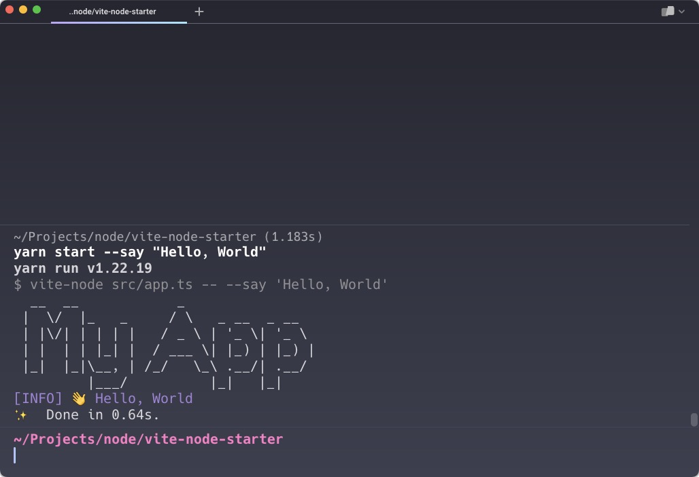

# Starter template for prototyping and building CLI tools with Node.js and TypeScript

- [Why another starter template?](#why-another-starter-template)
- [Code](#code)
- [Getting started](#getting-started)
- [Adding new scripts](#adding-new-scripts)
- [Dependencies](#dependencies)
  - [Foundation](#foundation)
  - [Support and utilities](#support-and-utilities)
  - [How to update dependencies?](#how-to-update-dependencies)
- [Alternatives - `Deno`](#alternatives---deno)

# Why another starter template?

I created this template to help myself to build some simple tools and prototypes while learning `Node.js`, `JavaScript`
and `TypeScript`. There are many guides on the web that show how to build a CLI tool with `Node.js` and `TypeScript`.
However, I found them to be too complex for my needs.

That this template does not provide a way to bundle the app for distribution. It is meant to be
used for learning and prototyping or for building tools that are not meant to be distributed.

> Note: If you are looking for even better and more developer's friendly way to develop simple tools and prototype check out [Alternatives - Deno](#alternatives---deno) section of this article.

# Code

The code is available on GitHub: <https://github.com/kolorobot/vite-node-starter>

# Getting started

- Clone the repository: `git clone https://github.com/kolorobot/vite-node-starter`
- Install dependencies: `yarn`
- Run sample app:
  - `yarn start --say "Hello, World!"`, or
  - `npx vite-node src/app.ts --say "Hello, World!"`
- Results:



# Adding new scripts

- Add script(s) to `src` directory. It can be `TypeScript` or `JavaScript` files.
- Add any tests to `tests` directory.
- Run the script using `npx vite-node src/my-script.ts`.

That's it!

# Dependencies

The project was created using `Vite` (`yarn create vite` ) and later modified to use `Vite-Node` and `Vitest` (and other dependencies).

## Foundation

- [Vite](https://google.com) - a new generation build tool that significantly improves the development experience.
- [Vite-Node](https://github.com/vitest-dev/vitest/tree/main/packages/vite-node#readme) - to run files on `Node.js` using Vite's resolvers and transformers. The engine also powers `Vitest`.
- [Vitest](https://github.com/vitest-dev/vitest) - a test runner. Much like `Jest`, but with a focus on simplicity and speed.
- [TypeScript](https://www.typescriptlang.org) - a typed superset of JavaScript that compiles to plain `JavaScript`.
- [ESLint](https://eslint.org) - a pluggable and configurable linter.
- [Prettier](https://prettier.io) - an opinionated code formatter.

## Support and utilities

- [dotenv](https://github.com/motdotla/dotenv#readme) - load environment variables from a `.env` file into `process.env`.
- [chalk](https://github.com/chalk/chalk#readme) - a library that provides a set of tools for styling strings in the terminal.
- [commander](https://github.com/tj/commander.js#readme) - a library for building interactive command line tools.
- [inquirer](https://github.com/SBoudrias/Inquirer.js#readme) - a collection of common interactive command line user interfaces.
- [figlet](https://github.com/patorjk/figlet.js#readme) - a library that renders ASCII art from text.

## How to update dependencies?

- Check which dependencies are outdated - `yarn outdated`
- Update dependencies interactively - `yarn upgrade-interactive --latest`

# Alternatives - `Deno`

[Deno](https://deno.land) is a free, open-source `JavaScript` and `TypeScript` runtime environment built on top of `V8 JavaScript` engine.
It was created as an alternative to `Node.js` and aims to provide a more secure and efficient runtime experience for developers.
Unlike `Node.js`, `Deno` does not require a package manager for installing third-party modules and includes built-in
support for modern web development tools such as `WebSockets`, `HTTP/HTTPS` servers, and testing frameworks.
Additionally, `Deno` aims to address some of the security concerns present in `Node.js` by offering a more secure sandboxed environment for executing scripts.

`Deno` can run `JavaScript` or `TypeScript` out of the box with no additional tools or config required. Here are the steps to get you started:

- Install `Deno` runtime. I recommend using [asdf](../../../2023/01/manage-multiple-java-sdks-with-asdf/index.md) to install it: `asdf plugin add deno && asdf install deno 1.30.0`
- Create a new directory for your project: `mkdir my-app && cd my-app`
- Create a new file: `touch app.ts`
- Add the following code to the file:

```typescript
const name = Deno.args[0] || "World";
console.log(`Hello, ${name}!`);
```

- Run the app: `deno run app.ts "John Doe"`
- Bundle for `Deno` runtime: `deno bundle app.ts app.bundle.js`
- Run the bundled app: `deno run app.bundle.js "John Doe"`

Note, to support `Deno` in your IDE, such as `Visual Studio Code` or `IntelliJ IDEA`, you need to install appropriate extension:

- `Visual Studio Code` - <https://marketplace.visualstudio.com/items?itemName=denoland.vscode-deno>.
- `IntelliJ IDEA` - <https://plugins.jetbrains.com/plugin/14382-deno>.
